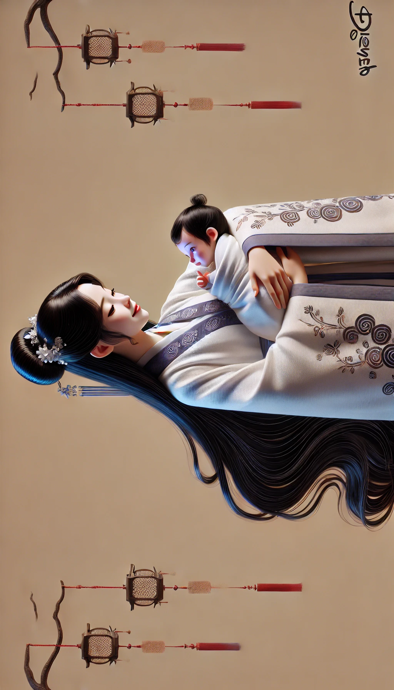

# 【随笔】看什么都泪目，我建议你去挂眼科

昨天看到和菜头的《[我不理解](https://mp.weixin.qq.com/s/lf8sStlMOUP_PPVzFBDgxA)》，不由得跟着动了情绪，一口气发了好几条回复消息。其中有一条是回复在一位叫Burger的网友评论之后：

> 多年前有次出差结束，疲惫不堪登上北京回重庆的飞机，没想到边上坐一位抱着几个月大婴儿的女士。起飞后全程小孩的哭声就没停过，一开始我整个人非常崩溃，可是又没啥办法，只好干瞪着眼睛看窗外的流云。飞到中途的某一刻，我内心突然一下就平静了下来，因为发现那位母亲的宽慰声其实也一直没有停过。想到了我在那毫无自我意识的年纪，我的母亲应该也如她这般温柔。

我说：

> 竟然看到泪目[抱抱]

是真的，当时泪水盈眶。等今天再翻开菜头的公众号，发现他竟然针对Burger的评论，专门又写了一篇长文——《[一转念之间](https://mp.weixin.qq.com/s/4FL869tf_ysm2qDwVtZB_Q)》，好家伙，这篇文章竟然让我一而再、再而三的让泪水在眼眶里打起转来。我趴在手机前，认认真真地又开始回复：

> 看那条留言时就泪水盈眶，看这篇文章又一而再，再而三……原来心底的柔软与慈悲一直都在。那种子自久远以前或许被自己的母亲、家人、孩子、朋友、陌生人一次又一次种下，然后此刻被陌生人的一段文字惊醒，饮几滴从天而降的甘露。终有一天，它们会破开那厚重的尘埃与泥土，变成一株又一株欣欣向荣的嫩芽🌱

敲到一半，又修改，改了一次、两次，终于觉得无力更准确地表达，只得就此打住。正在这时，微信推送来一条消息，有人在我昨天的留言下回复了一句话：

> 看什么都泪目，我建议你去挂眼科

我忍不住扑哧笑出声来，好吧，这次是差点笑成「泪目」了！

不过是一转念，再转念罢了！

很喜欢菜头用MJ画的画，可是用DALL•E画，就总是差那么点意思，横过来就算了，角上那写的都是啥呢？

说到这儿，索性试一下[Flux](https://flux-ai.io)吧，看这幅[《怀抱》](https://flux-ai.io/flux-ai/1828817002205622273/)的效果，果然牛！

