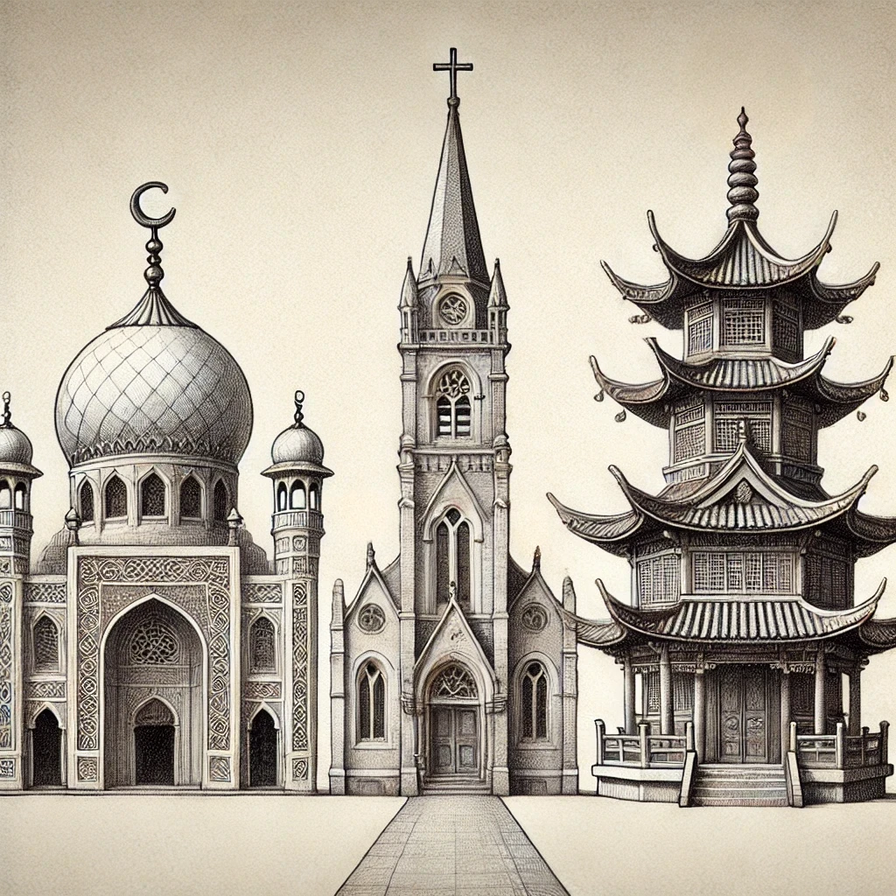

# 【生命⋅修行】失义而后礼

每天五次，窗外总会定时传来嘹亮的祈祷唱诵的声音。几乎所有的宗教，都有自己仪轨。从行为准则，到衣着，乃至场所布置与建筑，只为了能够将那神秘的神圣感，传递到每一个信徒心里。

有时正好安静无事，那猛然划破寂静的诵经声一下子穿过鼓膜，直击心中，不由得震撼不已。却让我想起道德经里的那句话来：

> 故失道而后德，失德而后仁，失仁而后义，失义而后礼。夫礼者，忠信之薄，而乱之首也。

到了「礼」，已经几乎是人类的最后一道防线了。虽然细究起来，礼之后还有「法」，但那已经是惩「乱」时不得已的手段了。

回到自己身上，想要把失去的「道」、「德」、「仁」、「义」一步一步找回来，「礼」应该也是一个非常必要的手段吧。做不到像小婴儿那样，饥来食饭困来眠，便只好到点睡觉，到点吃饭；做不到随心所欲快乐自在，就把每天想要做的，那些能让自己快乐的事情一条条地列在小本本上，又一条条地在完成后划去；被外在的诱惑与胁迫乱了心，而遭受痛苦与烦恼，就一日三省吾身，甚至五省、六省，一点点地远离那些会影响自己的人、事、物与环境……

对我而言，这样的「礼」可能是最后的救生圈吧，只希望能借着这救生圈的帮助，一点点长养「浩然正气」，由礼而义，由义而仁，由仁而德，终于能不失于道吧！

这样想来，小孩子真的是上天派来的天使。他们让我们看到自己在成长中已经失去了的那些宝贵的东西，然后，我们或有机会重新在自己内心深处把这些宝贵的东西再一一找回来……

霍华德•瑟曼说：

> 不必问世界需要什么，问自己什么事让你变得生机勃勃，充满活力，然后就大胆去做。因为世界需的正是生机勃勃，充满活力的人。

萨古鲁说：

> 我没有对任何事物的特殊爱好，我只是充满激情。因为，我们所说的生命，本质上是生命对自身的渴望。生命总是渴望更多的生命！

我也想要这种能让生命力持续绽放的生活……

「礼」也好，身体与头脑也好，都是生命的工具，而不是桎梏！