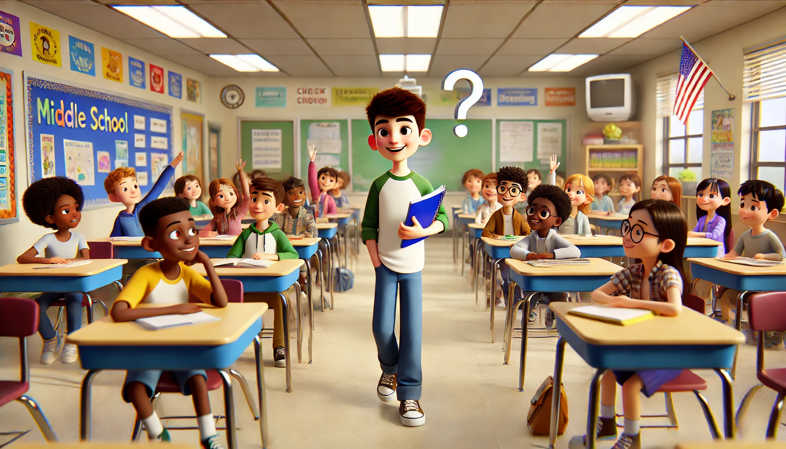

# 【生命•故事】（120）信任的力量

我们初中的生物老师是一位刚毕业的女大学生，她同时也是我们地理老师的女朋友（如果没记错的话，后来他们俩应该是在我们毕业前就结婚了）。

不知道是随机选择的还是怎么着，她让我当了生物课代表。关于生物课和这位生物老师，我至今还依稀记得两三个有趣的片段。

一开始，她让我报名去参加生物竞赛，估计初赛后成绩还不错吧。为了准备后续的复赛之类，她专门让我课后留下来给我辅导。临走时，她送我走出校门，记不清是在教学楼的走廊上，还是在学校门房附近的走廊上，她告诉我说：

>  你家里不是有一套《十万个为什么》吗？你只管把那套书中关于《植物》的两本读熟了，应付这种竞赛绰绰有余。

我这才知道，这套书竟然有如此巨大的威力。而且，从她的表情和语气中，我感受到了那种对我完全的信任与相信。于是乎，我听话地仔仔细细把她说的那两本书读了又读。果然，如果没记错的话，那次生物竞赛的结果还算蛮不错的。

有一次期末考试、或着是期中考试的复习。她给全班同学布置了几十、上百道题目，作为重点内容让大家复习。当时，我手头有一个巨大的笔记本，于是就在左边把题目一一抄下来，然后再后面的几页里写上答案。然后在自习课上，我作为生物课代表，开始随机地点同学来回答这些题目。如果答错了，我就当场告诉他们正确答案。由于之前抄写了一遍，我已经几乎记下了所有问题的答案，所以大部分时候我并不需要翻书、也不需要去翻看答案就能指出同学的错误。

至今还记得，这个小秘密被某些同学发现时，他们的惊讶和佩服，以及我内心的得意洋洋。当然，这也种下了「自以为聪明」的坏种子，直到很多很多年后才真正意识到这种「自以为是」以及关于「聪明」的虚荣所带来的副作用。

初一的生物课是《植物》，初二是《动物》，到了初三就变成了《生理卫生》。青春期的男生们不满足于《生理卫生》课本上介绍的那点知识，早就开始私下里传看讲解更为透彻的一些知识读本。但那时候整个氛围还是非常保守的，生物老师上课时常常被那些调皮男生问得面红耳赤，满脸羞得通红，只管低着头勉强读读课本，或者干脆就让我们自己看书。

估计是有些时候太过分，地理老师还专门来替她出头，狠狠敲打过我们，让我们注意一点……

仅仅是因为被任命为生物课代表，自己的生物成绩就从来没有差过。我能清晰地感觉到，这个信任的力量，在其中起了多么强大的作用。

