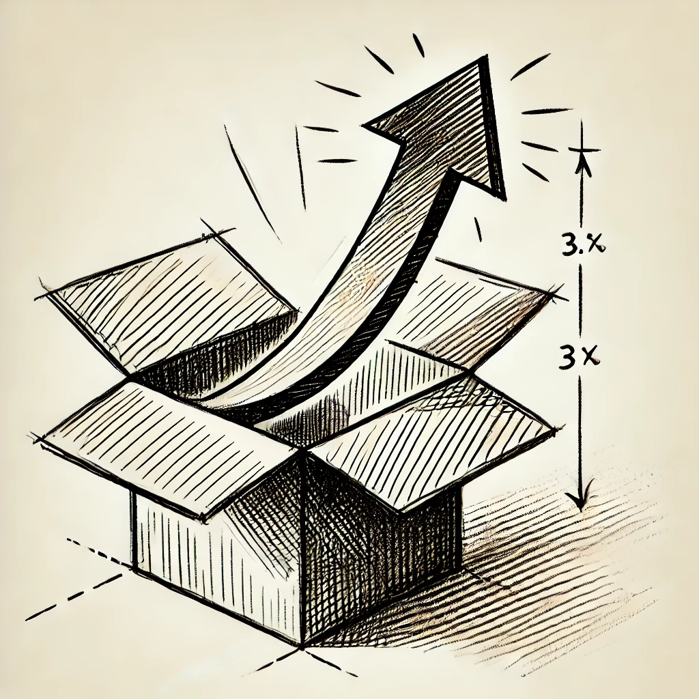
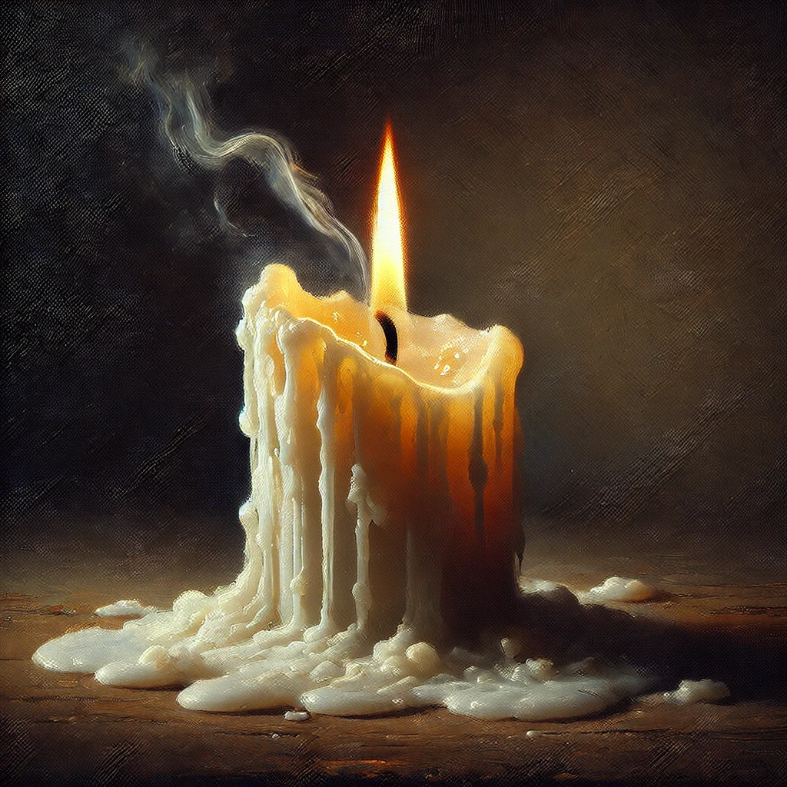

# 【随笔】虚幻的无限增长

本来刚过10点就进了卧室，想象着看两页书，吹吹尺八就早早睡觉。拿起Kindle，发现一本翻了开头10%，却一直没有读完的书《[生活在极限之内——生态学、经济学和人口禁忌](https://book.douban.com/subject/2068662/)》。点开后，发现自己对于已经读过的那一点竟然毫无印象，于是乎又翻到开头看了起来。

一个小时、两个小时、三个小时就这么过去了。从打算看两页就睡觉，到看一个小时就睡觉，到看一半就睡觉，到最后竟然一直读完，直到凌晨两点。

### 总体 🌟🌟🌟🌟4星

这本书在[得到](https://www.dedao.cn/ebook/detail?id=DGgybmrKYXmzPQ5bgJEjMdeOxDlyn0MLJDw2GaRN8k4p6B1oArL9Z7qvVRp8O126)和[微信读书](https://yd.qq.com/web/reader/cc4322207182db17cc4a8f9)都有电子版。已经记不得当时是因为谁推荐而买的，也许是芒格？放了这么久没看完，很大程度上是因为相对晦涩的翻译文笔。然而，在适应了那有点难受的翻译之后，会感受到强烈的思想冲击，这也是为什么，昨晚拿起之后，情愿熬夜到凌晨也难以放下的原因吧。

### 好看 🌟🌟🌟2星

首先，翻译的文笔确实不够流畅，有可能正如作者本人所说，这本书本质上就是一篇巨大的论文吧，很多地方特别**诘屈聱牙**（jié qū áo yá，我第二次想到用这个词，还得求助GPT才知道怎么写怎么读）。但总体而言，这种文字表面的不顺畅是可以适应并穿透的。

### 启发 🌟🌟🌟🌟4星

作者本质上的观点，一言以蔽之，增长是有极限的，无限复利必然是假象。然而，在他一层又一层抽丝剥茧中，会感受到巨大的冲击。因为，这其中很多过去我以为正确、想当然的观点，他提出了反对意见，并且给出了翔实、清晰的论证。

这种大脑冲击，伴随着整个阅读过程，一次又一次，让人欲罢不能。想必我阅读这本书，是一次非常有意思的大脑神经元的重组实践。

读完整本书，我一些固有的观念被冲击得七零八落，这我想起有人提过法国哲学课的思辨过程：不一定要先有观点再进行论证与思辨，也不一定最后非得达成什么观点。虽然，[加勒特·哈丁](https://zh.wikipedia.org/wiki/%E5%8A%A0%E5%8B%92%E7%89%B9%C2%B7%E5%93%88%E4%B8%81)本人其实一直理性固守着他从1968年的《[公地悲剧](https://www.garretthardinsociety.org/articles/art_tragedy_of_the_commons.html)》到1974年的《[救生艇伦理](https://in.ncu.edu.tw/~phi/NRAE/newsletter/no25/10.pdf)》中提出的观点。但对于我而言，却刚好完成了「支离其德」的奇妙之旅。

那些书中提到，我依然相信，却充满矛盾的观点如下：

* [热力学第一定律](https://zh.wikipedia.org/wiki/%E7%83%AD%E5%8A%9B%E5%AD%A6%E7%AC%AC%E4%B8%80%E5%AE%9A%E5%BE%8B)：能量守恒！
* [热力学第二定律](https://zh.wikipedia.org/wiki/%E7%83%AD%E5%8A%9B%E5%AD%A6%E7%AC%AC%E4%BA%8C%E5%AE%9A%E5%BE%8B)：孤立系统必然走向死亡（熵增）！
* 生命整体的繁衍与发展方向即为绝对的「善」
* 对于整体而言，每一个具体的生命更为重要
* 复利是有极限的
* 生命力本质上就是那持续破壳的力量——熵减之力

关乎信仰、物理、人类整体与个体……也许他们之间的矛盾才是正常吧！

强烈推荐一读。

另外，更让人唏嘘的是，[加勒特·哈丁](https://zh.wikipedia.org/wiki/%E5%8A%A0%E5%8B%92%E7%89%B9%C2%B7%E5%93%88%E4%B8%81)和他的太太竟然在2003年，在62周年的结婚纪念日和妻子一同自杀。那一年，他88岁，她81岁。[有人因此想起傅雷夫妇](https://book.douban.com/review/8977041/)，而除了傅雷，我还因此想起了海明威与杨绛。

