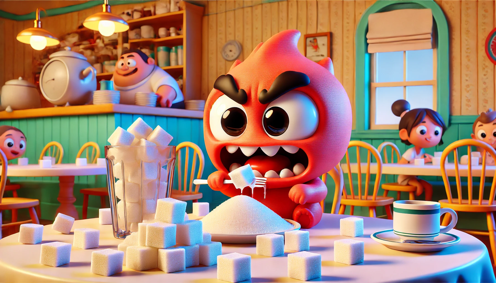

# 【生命⋅修行】还是妥协了

翻看前几天Timeboxing 的计划与执行情况，计划的「方糖」数量连续几天都突破了250，稳稳地待在了270以上。这是怎么发生的呢？

一开始，我在计划中用完250个「方糖」的配额之后，总觉得意犹未尽。于是乎，把记录手机使用时间、练习尺八、练习内观、读Kindle或资治通鉴等依然想做的事情，罗列在重要计划的下面。

但很快我就发现，列在下面那些事情，我大部分时候都会干，反而一天中不能完成的事情都是列在上面的某些——我认为重要，但内心有有那么些抗拒的事项。而且连着两天，我竟然满满地用完了一天的288个方糖。其中一天还进行了所有计划中的事情，而那一天的代价是干到凌晨1点半，也就是说，最后一件事儿用掉了第二天的18个「方糖」。

然后，我就妥协了。接下来的几天里，总是由着性子把所有「想做」的事情计划罗列完，270以上变成了常态。于是乎，有了这么一个发现：

> 1. 每天计划的事情是一定无法全部完成的。
> 2. 手机依然是爱吃「方糖」的魔鬼。
> 3. 大部分重要的大块头事情所花费的「方糖」远远超过预期。
> 4. 涉及沟通的工作事物花费「方糖」也超过预期。
> 5. 被放弃的事情一定是我不那么喜欢做的事情。

而在昨天这样的休息日里，我没有做Time Boxing计划，也没有记录时间消耗，却悠哉悠哉地干了几乎所有重要，想做的事情：

1. 去户外静坐
2. 去户外走路
3. 和大宝聊天
4. 完成每天的写作练习
5. 用Duolingo学一会儿法语 / 阿拉伯语
6. 给自己煮碗河粉吃
7. 练习尺八
8. 睡够8小时并且晚上早早睡觉
9. 读读书（[前一天凌晨读到快两点，看完那本《生活在极限之内——生态学、经济学和人口禁忌》](20240831【随笔】虚幻的无限增长.md)）
10. 当然还包括那些无法避免的日常洗漱活动

所以，看上去，这就是悠哉悠哉的休息日，我所能完成事情的极限了。那么，大问题来了：在工作日里，这些也是我每天想要和需要完成的事情！然后，还有那些工作与学习的事物才是吃方糖的大头怪。

我终于意识到，Timeboxing方法中，有一个核心关键我没有掌握。那就是截止时间！我总是放任一件又一件事情突破截止时间，这是可以改进的关键：

* 要么，那些计划要进入心流状态的工作直接规划更多的整块时间。
* 要么，严格地在截止时间完成工作，不去「精益求精」地多做那么一点点。

以上，再接再厉吧！