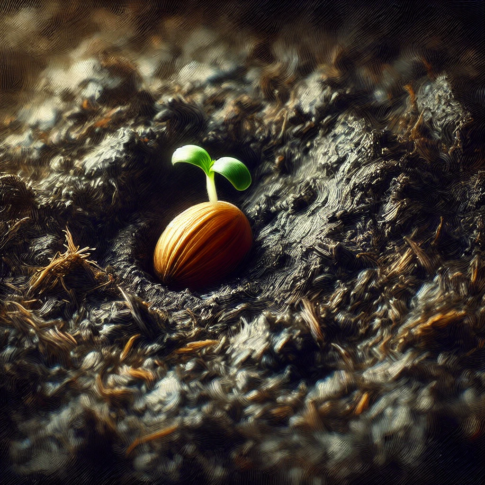
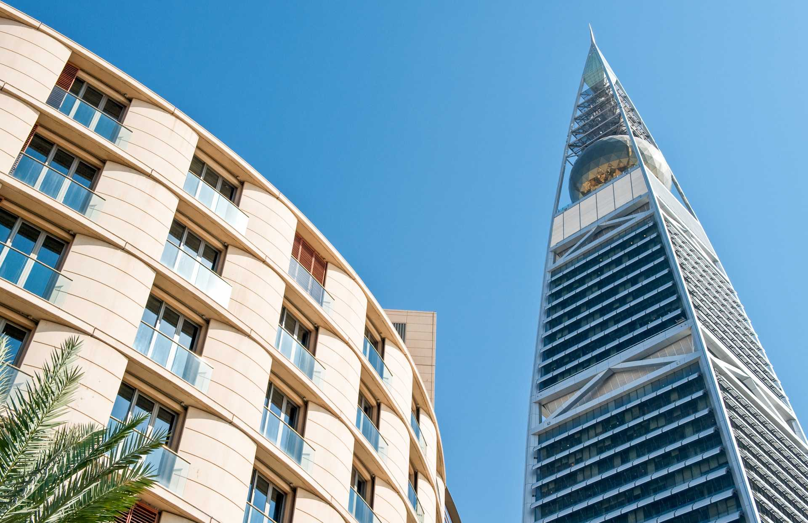

# 【随笔】在黑暗与光明之间徘徊

从睡梦中醒来，依稀听见客厅里手机铃声最后又响了两声，就安静了下来。我记得闹钟设的是6点，想必已经响很久了吧。但是，此时依然困的不行，根本爬不起来。毕竟昨天再一次整到凌晨1点多快两点才睡觉，盘算着今天虽然要去参加展会，但是再睡一个多小时应该还是可以的吧……

这么想着，人继续昏昏沉沉的，也不知是在梦中，还是在半梦半醒之间。感觉头疼了一会儿，接着又不疼了，似乎是在梦中得到了什么启示。但梦与启示的内容却迅速地消散了，抓都抓不住。然后再也想不起来。只觉得，整个人处在一种部分恢复，又不够满血复活的状态中。我忍不住想，晚上拖着不睡，是不是等同于长寿？早上睡不够被迫起床，是不是等同于早产？这两者间有什么因果关系吗？

胡思乱想着，我的大脑就这样从空灵的梦境消散后的睡眠状态，迅速切换到了清醒状态，昨天临睡前所有还在烦恼的种种思绪，如同潮水般涌了上来。那难得几个小时养得的一点点「夜气」，瞬间消失殆尽，心中顿时愁云密布起来。一个转念而已吗？为什么自己一醒来就要给自己背上这么多包袱呢？梦中的启示是与去除这些烦恼相关吗？

所有的烦恼，几乎都是因为「我」而存在。「我」想做这，做不了，烦！「我」不想做那，非得做，恼！可是，如果「我」死了呢？所有这些，对于其他人来说又有什么意义呢？如果「我」马上就要死了，我又何必为「我」做这做那，烦这恼那呢？而我的每一天，每一瞬间，何尝不是一次又一次在死亡，一次又一次在重生呢？我为什么要为这个「我」而烦恼呢？不如抛却，完全「无我」，生活不就简单了吗？

我这么想着，烦恼就莫名散去了一些。感觉到自己又重新退了两步，回到了半梦半醒之间。但是，算算时间，应该不能再睡了。我提醒着自己，勉力爬了起来，接着却又蜷成一团，脸朝下趴倒在床上。

就这样，让自己躲在这黑暗里，似乎有什么力量在默默安抚着我，让我一点一点地更加平静下来。我想起埃里克森在催眠中课中说过，在那最深最深最深的黑暗里，有祖先们为我们留下的礼物。那是我们随时可以与之链接的力量源泉。

或许，那就是土壤之于种子的力量吧。

**地势坤，君子以厚德载物！**

我坐起身，拉开窗帘。阳光径直倾泻而下，不远处Faisaliah Tower的尖角在湛蓝的天空里熠熠生辉。

