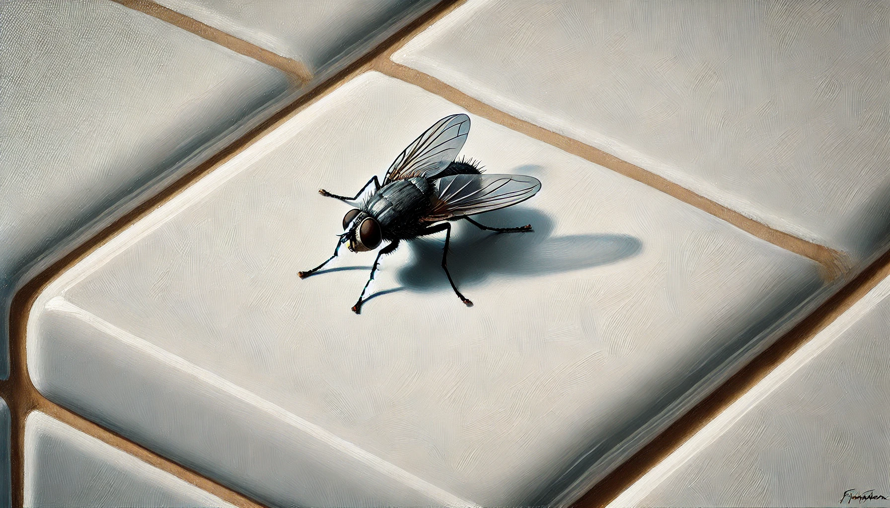

# 【随笔】一只苍蝇

当时我正躺在床上，心里正第二次还是第三次地想着：

> 再睡10分钟，让我默数36次呼吸吧……

左脚内侧忽然感到一阵迅速袭来的瘙痒，然后又迅速消失。我蹭地一下清醒过来，那一瞬间，脑海里似乎已经涌现了千百万个画面。最后留下的判断是：

> 一定是一只苍蝇刚刚在我脚上「bong」了一下，窗户没关，有苍蝇进屋了！（「Bong苍蝇」是武汉话里描述苍蝇在什么东西上飞来飞去，不时停下的说法。实在找不到合适的汉字指代这个方言中的字）

我爬起来，关上窗户。但是并没有见到苍蝇，我开始怀疑，刚刚脑海中的想法，只不过是一个错觉。我下床，进卫生间前看了一下时间，从上床到此刻约莫过去了一小时的时间，计划中15分钟的午觉，显然超时了。我把脑海中直接跳出的，关于「自己天性懒惰」的负面评价摁住；又给自己找了个合理的借口——或许是最近睡眠太不够了吧；但紧接着意识到，所有这些正面、负面的评价都是多余，立即开始下一件要做的事情才是正途。这些想法纷至沓来，只不过一两米的距离，脑海中究竟闪过了多少念头压根数不过来，能记住的却屈指可数。

在步入卫生间的那一瞬间，一个黑影被我的脚步惊动，又及其迅速地从脚边起飞掠过。但这次，我捕捉到了它的轨迹和停留的地方，确实是一只小苍蝇。是那种普通的灰黑色家蝇，小时候见得最多的那种，并不是那种绿头大个、飞起来嘤嘤嗡嗡，动静巨大的苍蝇。只有这么一只的时候，它飞得无声无息，及其敏捷。

看它停在卫生间白色的地板砖上，我开始回忆小时候徒手抓苍蝇的经历，也回忆了一下前几天在老喻公众号里，它分享的徒手抓苍蝇的技巧。犹豫了一会儿，缅怀了一下小时候常用的苍蝇拍，然后放弃了徒手把它抓住的企图。我用脚赶了赶它，看它飞起来，又重新落回到下水道盖子的缝隙边，一副陶醉的样子。心想：

> 真是一只苍蝇，进屋来就直奔卫生间！或者，就把它关在卫生间里，等着它寿命自然终结吧？

我回到书桌边，打开电脑，它却又飞了过来。我试着挥手抓了两次，并没有成功。这时，我又想起很多年前，在菊厂的食堂里，和一只苍蝇对视、沟通的经历。当然，那次的「沟通」感觉，很可能也只是我自己单方面的认知。于是，等它再一次飞回到书桌上时，我仔细看了看它，一边挥手一边默默地对它说：

> 你最好躲起来不要让我看到吧，免得在我眼前骚扰我，惹我起了杀心。
>
> 这样大家都轻松。
>
> 虽然，我也不见得能抓住你！

或者，它要是足够聪明，而且并不忌惮窗外猛烈的阳光，它也可以飞回窗户边，等到我发现的时候就再放它出去好了！

