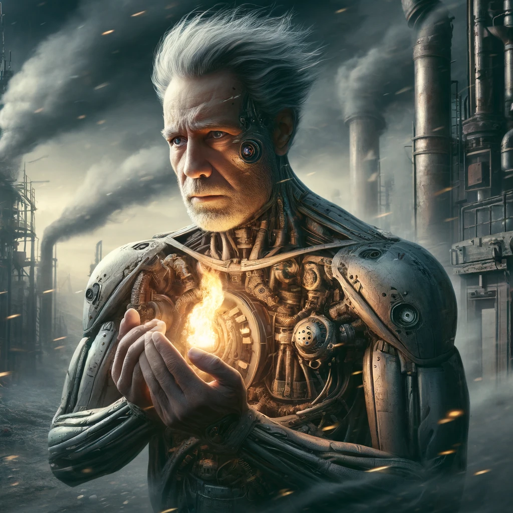

# 【随笔】理想主义的技术乐观派——吴恩达教授谈AI开源

今天看了一段[斯坦福商学院访谈吴恩达教授的视频](https://www.youtube.com/watch?v=yzUdmwlh1sQ)。[吴恩达教授](https://www.andrewng.org/)表现出一如既往的技术乐观派观点。而且显然，他也是一个理想主义者，虽然不是像[Richard Stallman](https://en.wikipedia.org/wiki/Richard_Stallman)那样的激进派。

他不希望政府对AI技术的开源作出限制，这会对AI的发展造成伤害。他再次批评了SB 1047法案，认为这和要求发电机制造商要确保所有用电设备的不得拿来做坏事并且绝对安全一样无理。但没办法，在神奇新技术面前，保守监管者的本能反应就是恐惧和独占垄断宝物的欲望。

不过，他坚信，智能——不管是人类的智能还是人工智能，肯定是越多越好。这和KK关于技术的观点，有那么一点相似。话说，KK一直认为，技术本身是有它自己的生命力的，眼见着「技术」向着「人工智能」一步一步演化，恰恰印证着这个观点。

我想起上一次看吴恩达在斯坦福的演讲已经是一年前的事情了，当时他就认为认为大模型基础领域的创新大厂们会发挥巨大的作用，而在应用领域则是广大初创公司的天地。一年过去了，他不仅依旧是这个观点，而且他的工作室每个月都会创立一家新的公司。这来自硅谷热火朝天的干劲，真的让人羡慕。让我想起了自己所经历与了解过的，那波澜壮阔的PC时代以及互联网时代的故事。

最好的种树时机，是10年前，其次就是现在。虽然这一年已经有些荒废地度过去了，但依然，最好的时机还是现在！毕竟，有芒格、巴菲特这样的脑力工作者，能够一直干到90岁还不停歇的例子在前，自己又怎能轻易放弃内心依然跳动着的那些小火苗呢？奔着再折腾50年去好好努力吧……

----

以下是访谈的原文与翻译，供大家取用

**Open Source AI 开放源代码的人工智能** 

Open-source AI models are a key building block for AI and basic research today. Many AI models are only accessible through proprietary web interfaces, where you can call someone else’s proprietary model and get a response back, turning it into a black box. This makes it much harder for teams to study or use in specific ways.

开源AI模型是今天AI和基础研究的关键组成部分。许多AI模型只能通过专有的网络接口访问，你只能调用别人的专有模型并得到一个回应，这让它变成了一个黑盒。这使得很多团队很难研究或以某些方式使用这些模型。

In contrast, open models are released in a way that allows anyone to download, customize, and use them to innovate or build new applications, or conduct academic studies. This makes open models an invaluable and important part of how AI innovation happens.

与之相比，团队们发布了开放模型，开放的方式允许任何人下载、定制并在其基础上创新，或进行学术研究。这是AI创新的非常宝贵、非常重要的组成部分。

I’ve been surprised by the intensity of lobbying efforts to stifle open-source-based innovations. I think some companies have invested large amounts of money in training proprietary AI models, and understandably, it’s frustrating if someone releases an open-source model that undermines the value of that investment.

我对阻止基于开源的创新的游说强度感到惊讶。我认为有几家公司投入了大量资金来训练专有的AI模型。可以理解的是，如果有人开源一个模型，削弱了这种投资的价值，这对这些公司来说会很烦人。

Over the past year, there have been several lines of attack, such as claims that AI could cause harm or pose safety risks. While I don’t fully relate to the risks being outlined, there have been many attempts to impose burdensome registry, licensing, or reporting requirements on open-source software. If enacted, these requirements would stifle innovation and harm competition.

过去一年里，出现了各种攻击，比如“AI可能会造成伤害”或“出于安全考虑”，我其实并不认同AI的所谓原始风险。有很多针对开源软件的攻击，试图引入非常繁重的注册要求、许可要求、报告要求。如果这些要求真的实施，坦率地说，很多创新将会被扼杀，竞争也会受到损害。

One way to avoid stifling AI innovation is through open-source. Once something is open-source, anyone can use it, which promotes competition. Unfortunately, intense lobbying efforts—and some regulators are taking these seriously—are pushing regulations that would stifle small startups and favor big tech companies that can handle complex compliance requirements.

阻止AI模型扼杀创新的一个方法是开源。因为一旦某些东西开源了，任何人都可以使用它。这大大促进了竞争。我感觉到，很多强烈的游说努力——遗憾的是，一些国际监管者也认真对待了这些努力——实际上是反竞争的，会让小型创业公司停滞不前，从而有利于那些能够应对复杂合规要求的大型科技公司。

I’ve been speaking with some governments that are considering favoring open-source in their procurement processes, which would be a positive step to promote open-source. At this moment, I’d be happy if governments simply didn’t stifle open-source, even if they don’t actively promote it.

我曾与一些政府对话，他们中的一些正在考虑让自己的采购流程更加倾向于开源。我认为这将是一个非常积极的促进开源的举措。不幸的是，在这个时候，我会很高兴如果政府不主动打压开源就已经很好了。

Unfortunately, I’m seeing concerning regulatory proposals. For example, in California, there’s SB 1047, which proposes safety requirements that I think are impossible to meet, and many teams might have no choice but to stop releasing open-source models.

遗憾的是，我看到了一些非常糟糕的监管提案，比如在加利福尼亚提出的SB 1047法案，该法案提出了一些在我看来无法实现的安全要求，很多团队唯一合理的反应就是停止发布开源模型。

One tricky aspect of AI is that it’s a general-purpose technology, useful for many different applications, similar to electricity or an electric motor. An electric motor can be used in a blender, an electric vehicle, a dialysis machine, or even a smart bomb. If you ask an electric motor manufacturer to guarantee their motor won’t ever be used for harmful purposes, they can’t guarantee that. The only thing they could do is make motors so tiny they’re no longer useful for anything—and then we lose blenders, electric vehicles, and dialysis machines.

关于AI有一个棘手的点是，它是一种通用技术，可用于许多不同的应用场景，有点像电动机。电动机可以用来制造搅拌机、电动汽车、透析机，甚至制造智能炸弹。如果你去找电动机制造商，要求他们保证他们的电动机永远不会被用于恶意目的，比如制造智能炸弹，他们根本无法保证。唯一他们能做的就是把电动机做得如此小，以至于什么用途都没有了，而我们也就失去了搅拌机、电动汽车和透析机。

We’re seeing something similar with AI. AI has many beneficial applications, like in healthcare, financial services, and education. But I’m seeing proposals asking AI developers to guarantee their models won’t ever be used for negative purposes. That’s not possible because safety is a function of the application, not the AI technology itself.

现在AI也面临类似情况。AI作为通用技术，有很多有益的使用场景，比如在医疗保健、金融服务、教育等领域。我看到了一些提案，要求AI开发者保证他们的AI永远不会被用于负面用途，但这是不可能的。因为安全性并不是电动机或AI技术的属性，而是应用程序的属性。

I think governments should regulate applications because we want electric vehicles and dialysis machines to be safe. Unfortunately, I’m seeing governments say that’s too hard, and instead, they’re trying to regulate AI itself. This would have anti-competitive and stifling effects.

因此，我认为政府在监管应用方面可以发挥重要作用。我们希望电动汽车是安全的，我们也希望透析设备是安全的。但令人遗憾的是，我看到一些政府觉得这太难了，因此他们选择了监管AI本身，而这将产生非常不利的反竞争和扼杀创新的影响。

AI has tons of good uses and a few negative ones. I often approach this by asking whether more intelligence—whether human or artificial—makes the world better. And my answer is yes. Intelligence can be used for nefarious purposes, and I do worry about disinformation or AI-generated political deepfakes. But overall, society has advanced by becoming more intelligent and educated. More intelligence is a good thing. We should focus on regulating harmful applications rather than slowing the rise of intelligence itself.

AI有大量正面的应用，但也有少数负面的使用案例。对我来说，我常常从这个问题入手：我们是否生活在一个拥有更多智能的世界会更好？无论是人类智能还是人工智能。在我看来，更多的智能是好事。是的，智能可能会被用于恶意目的。我担心大规模的虚假信息传播，我认为AI生成的政治深度伪造可能会成为一个问题。智能可以被滥用，但我也认为，人类社会大体上通过变得更聪明、接受更多教育而不断进步。我认为更多的智能是好的，并且我们应该考虑哪些应用是我们不希望出现的，然后加以监管，而不是监管智能本身。

When new waves of technology emerge, some large incumbent companies thrive, but there are also many opportunities for new entrants and startups. Investors play a crucial role in supporting the entrepreneurial community. Looking at the rise of the internet, some incumbents like Apple and Microsoft did well, and startups like Google, Facebook (Meta), and Amazon also thrived.

每当有新技术浪潮出现时，有些大公司会表现得很好，但它也会为新进入者和初创公司创造很多机会。我认为投资者在支持和分配资本方面发挥着关键作用，尤其是在支持创业社区方面。以互联网的崛起为例，一些老牌公司表现不错，比如苹果和微软，但它们当时并不是互联网公司。而一些初创公司，如谷歌、Facebook（Meta）和亚马逊，最终表现得非常好。

I think the same will happen with AI. Some incumbents will do fine, but many startups will also succeed. We’re not just an investment firm; we actively work with entrepreneurs to build startups, creating one new startup per month. I believe the broader community of investors and builders will pursue new opportunities that incumbents might not be able to handle effectively, which will lead to exciting new applications being developed and made available to people.

AI也将如此，我认为一些现有的大公司会做得很好，这是可以的，但也会有很多初创公司取得成功。我们是一家工作室，我们不仅仅投资于初创公司，还积极与创业者合作创建初创公司。所以我们每个月都会建立一家新公司。我认为更广泛的投资者和建设者社区正在抓住很多新的机会，这些机会是一些大公司由于各种原因没有有效把握的，我认为这将创造大量的价值，开发出许多新的激动人心的应用。

关于AI的另一个棘手问题是它是一种通用技术，意味着它对许多不同的应用都有用。我对AI在医疗保健、教育、物流和金融服务等领域的应用充满了期待。坦白说，我很难想到一个AI不会产生重大影响的行业。事实上，我认为今天所有的知识工作者都可以通过使用生成式AI提高生产力，但识别特定应用仍需要时间和努力。

Another tricky thing about AI is that it’s a general-purpose technology, useful for many different applications. I’m excited about AI’s impact on healthcare, education, logistics, financial services, and more. It’s hard to think of an industry where AI won’t have a significant impact. Today, knowledge workers can boost productivity with generative AI, though it will take time to identify the best applications, whether that’s patient scheduling, financial advice, or personalized education coaching. Both startups and established companies will play a critical role in developing these applications.

关于AI的另一个棘手问题是它是一种通用技术，意味着它对许多不同的应用都有用。我对AI在医疗保健、教育、物流和金融服务等领域的应用充满了期待。坦白说，我很难想到一个AI不会产生重大影响的行业。事实上，我认为今天所有的知识工作者都可以通过使用生成式AI提高生产力，但识别特定应用仍需要时间和努力。无论是帮助患者排班，还是提供更好的财务建议，或是提供个性化的教育辅导，这些具体的应用仍然需要进一步发展和实现。我认为初创公司和现有公司都将在这一过程中发挥重要作用。

I have a lot of respect for the DOJ. The rule of law and justice are precious for democracy. But sometimes, I question certain details. Startups are critical to America’s competitiveness, and I’m encouraged to see the government promoting competition. However, I’m concerned about the impact of blocking acquisitions. While some acquisitions can be anti-competitive, blocking deals like the Figma acquisition or other recent deals in the fashion industry has had a chilling effect on Silicon Valley.

我非常尊重美国司法部（DOJ），我认为法治、正义对民主国家非常宝贵。但有时我会对一些细节感到困惑。对于美国的竞争力来说，初创公司是我们生态系统的关键组成部分。我很鼓舞听到政府在促进竞争方面做出的努力。但有一件事让我有点担心，那就是对收购的限制。我知道，有时收购会是反竞争的，但当比如说Figma的收购被阻止时，或者有时尚行业的交易被封锁时，这在硅谷产生了寒蝉效应。

A lack of liquidity makes it harder for investors to keep investing and driving innovation. Of course, antitrust is important, but not all acquisitions are anti-competitive. I worry we’re leaning too aggressively into blocking acquisitions, which could ultimately damage the entrepreneurial ecosystem.

缺乏流动性使得很多投资者难以继续投资并推动美国创新引擎的运转。当然，反垄断是重要的，但并非所有收购都是反竞争的。我担心的是，我们现在是否在过于激进地阻止这类交易，最终这将对创业生态系统造成损害。

I think the government has an important role in antitrust, but we should take a balanced approach and carefully analyze what is truly pro-competition and what is not.

我认为政府在反垄断方面有重要作用，但我们应该小心采取平衡的方式，分析什么是真正促进竞争的，什么不是。