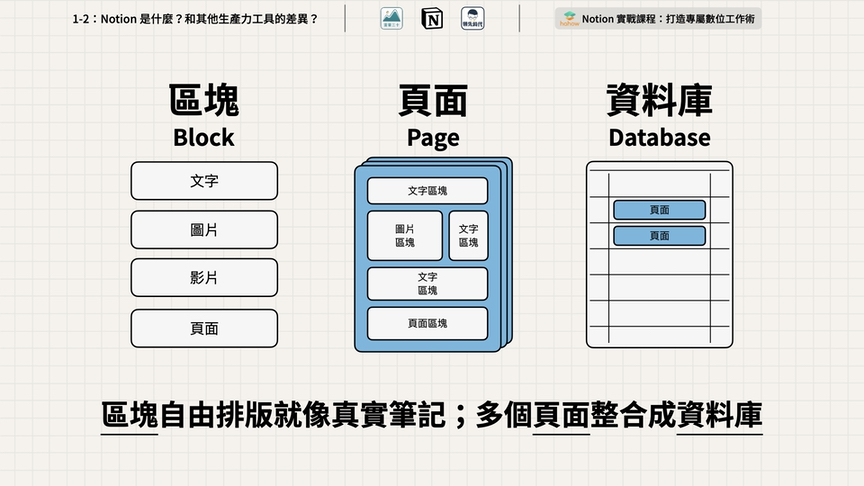
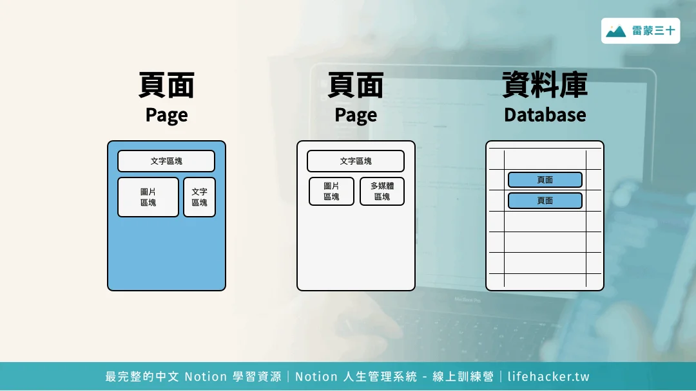

#  【生命⋅修行】试着从底层逻辑去理解新东西

听说Notion其实已经很久了，曾经好几次试图从Evernote 迁移过去，但终究未遂。究其原因，首先是因为笔记并非自己的高频核心诉求，但最重要的恐怕是，Notion太灵活、太复杂了。

就好像是我本想要找一把更趁手的切菜刀，人家递上来一把万能瑞士军刀，你拿到手里，研究半天，终于知道要把折叠刀刃打开来用，结果掰开一看，是一把锯子，勉强能切，但总觉得那里不对。过了一会儿发现这上面还有螺丝刀，有牙签……

但是，我想要切黄瓜片，怎么办，上网去寻找教程，各种个样的教程，比如如何用瑞士军刀修眼镜，如何用瑞士军刀砍木头，如果用瑞士军刀剔牙……切黄瓜片的教程或许有，或许没有，反正不好找！

但一个几乎「万能」的工具，对我这种「工具」控来说，始终有着莫名的吸引力。这天，为了找一个合适的个人 / 小团队项目管理工具，我再次启用了Notion。一年前就因为这个理由启用过一次，后来放弃了。这算是第二次吧！但是，我依旧焦头烂额，因为，我只想轻松搞定我这个「切黄瓜片」的需求，但Notion还是太复杂了，即便是直接使用它的Project模版之后，我依旧困惑不已。我知道他可以的，但就是不知道怎样让他可以起来！

直到，我终于看到了雷蒙十三的这篇《[快速上手 Notion：基本邏輯、區塊結構教學（頁面 Page、資料庫 Database 的差異和應用）](https://raymondhouch.com/lifehacker/digital-workflow/notion-fund/)》，以下的两张图，来自雷蒙的文章，真的是醍醐灌顶：

我终于明白了Notion的产品底层逻辑架构是怎么回事，再回想起Notion的愿景——为人类创造一款能够自由创造任何工具的工具，以及从2013年、2016年到如今一路走来的Notion产品历程，发现这一切终于变得清晰了起来。

关于Notion的产品历史，可以看这篇文章《[Notion 10 年发展史 & 2023 功能现状](https://sspai.com/post/80474)》。

所以，Notion重生之后，首先专注笔记这个细分市场。所以展现出来的是Block和Page。两年后，它放出了Database这个概念，Database就是Page的集合。只不过，微妙和复杂的地方在于，Database同时也能够以Block的模式，成为Page的一部分。正是这个循环引用，带来了强大的创造能力，同时也给我一开始理解Notion带来了巨大的障碍和困扰。

一生二、二生三、三生万物，在此之后，Notion迅速发展成一个如此庞大、适用几乎各种场景的All in One工具，也就显得顺理成章了。

