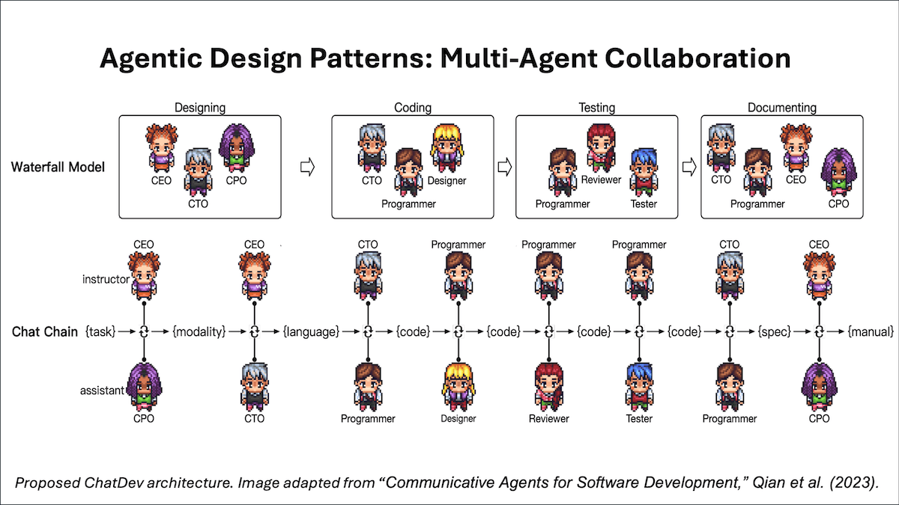
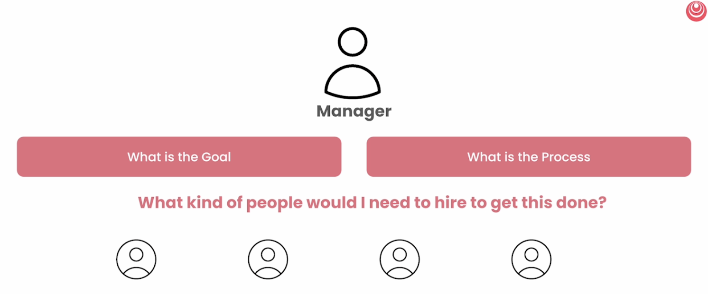
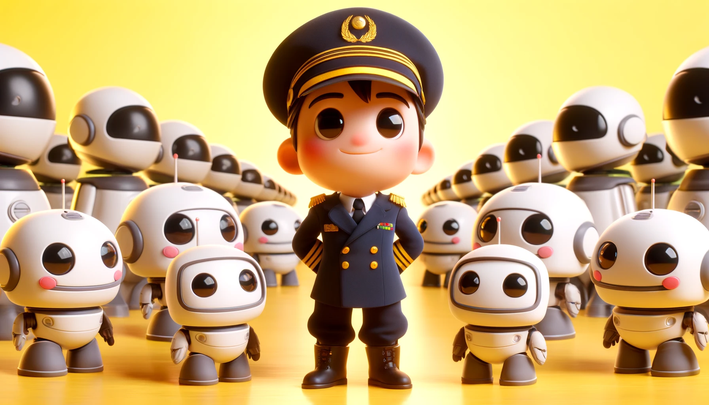

# 【教程】什么是智能体工作流的四大模式

智能体工作流（Agentic Workflow）是吴恩达教授近几个月来一直在推广，并且变得越来越流行的概念。他在[今年3月20号的Weekly信件](https://www.deeplearning.ai/the-batch/how-agents-can-improve-llm-performance/)中总结了关于智能体工作流的四大设计模式：

1. **Reflection 反思**:  The LLM examines its own work to come up with ways to improve it. LLM（大语言模型）会检查自己的工作，寻找改进的方法。
2. Tool Use 工具使用: The LLM is given tools such as web search, code execution, or any other function to help it gather information, take action, or process data. LLM 被提供工具，如网页搜索、代码执行或其他功能，以帮助其收集信息、采取行动或处理数据。
3. **Planning 规划**: The LLM comes up with, and executes, a multistep plan to achieve a goal (for example, writing an outline for an essay, then doing online research, then writing a draft, and so on). LLM 制定并执行一个多步骤的计划以实现目标（例如，为一篇文章写大纲，然后进行在线研究，再撰写草稿，等等）。
4. **Multi-agent collaboration 多智能体协作**: More than one AI agent work together, splitting up tasks and discussing and debating ideas, to come up with better solutions than a single agent would. 多个 AI 智能体共同合作，分配任务，讨论并辩论想法，提出比单一智能体更好的解决方案。

接着，他在后续的每周信件中详细解释了这四者设计模式：

* [Read "Agentic Design Patterns Part 2: Reflection"](https://www.deeplearning.ai/the-batch/agentic-design-patterns-part-2-reflection/?ref=dl-staging-website.ghost.io)

* [Read "Agentic Design Patterns Part 3, Tool Use"](https://www.deeplearning.ai/the-batch/agentic-design-patterns-part-3-tool-use/?ref=dl-staging-website.ghost.io)

* [Read "Agentic Design Patterns Part 4: Planning"](https://www.deeplearning.ai/the-batch/agentic-design-patterns-part-4-planning/?ref=dl-staging-website.ghost.io)

* [Read "Agentic Design Patterns Part 5: Multi-Agent Collaboration"](https://www.deeplearning.ai/the-batch/agentic-design-patterns-part-5-multi-agent-collaboration/?ref=dl-staging-website.ghost.io)

关于这几点，尤其是前面三条，我就不多展开了。即便是直接使用ChatGPT或其他大语言模型的网页对话客户端，也可以利用这几条理念，规划好提示词，让LLM给出的答案更有价值一些。

在最后一封信里，吴恩达引用了论文「[Communicative Agents for Software Development, Qian et al. (2023) (the ChatDev paper)](https://arxiv.org/abs/2307.07924?utm_campaign=The%20Batch&utm_source=hs_email&utm_medium=email&_hsenc=p2ANqtz-8TZzur2df1qdnGx09b-Fg94DTsc3-xXao4StKvKNU2HR51el3n8yOm0CPSw6GiAoLQNKua) 」里的这张图：

看看这张像个小游戏的示意图，你有没有觉得，其实所谓智能体的设计模式，已经和人类的工作模式非常接近，甚至说一模一样了呢？

在[Crew AI](https://www.crewai.com/)与[DeepLearning.AI](https://learn.deeplearning.ai/)合作的课程[**Multi AI Agent Systems with crewAI**](https://learn.deeplearning.ai/courses/multi-ai-agent-systems-with-crewai/lesson/7/mental-framework-for-agent-creation)里，介绍了这样一种创建Agent的思维框架：

说穿了，就是要像一个真正的领导一样思考：我的目标是什么？我怎么达到我的目标？我需要雇什么人来完成这一切？记得在我刚刚经历完电商独立站的创业失败后，请一位老同学搭线介绍，向深圳的一位电商大咖讨教经验。他除了和我郑重其事地强调要「专注」之外，聊起到自己的创业经历。他说，在他开始创业的第二个月，就开始招人来。只要一弄明白某件事情必须要做，以及知道大致要怎么做，就立刻招人来帮他完成这些事情。

正像昨天想到的，底层逻辑是理解一个新事物的关键。而智能体设计的底层逻辑，和人类开始分工合作之后，渐渐发展出来的组织管理逻辑，简直没有任何区别。

1. 针对目标，梳理业务流程；
2. 针对业务流程，构建组织，招聘人员；
3. 为人员提供必要的培训与工具；
4. 下达任务，并辅以规章制度进行日常管理。
5. 反思结果与原来目标的差距，回到1；

公司如此，有了AI之后的个人，也当如此。有了AI之后，整个软件工程，软件架构，必将或者说正在发生巨变！而Agentic Workflow正是这其中非常重要的基础思想。

PS，想深入了解智能体工作流，可以先细读一些上面吴恩达的那5封信以及相关的论文，再学一下Crew AI 的课程，然后动手玩一玩。

再PS，我开始想念王建硕的文章，他去年初提出的LUI概念，以及机器人之间互相交互的场景，现在回头看相当有远见。最近已经很久没有见到他的公众号文章了，刘润说他在硅谷，也不知道正在憋什么大招呢？