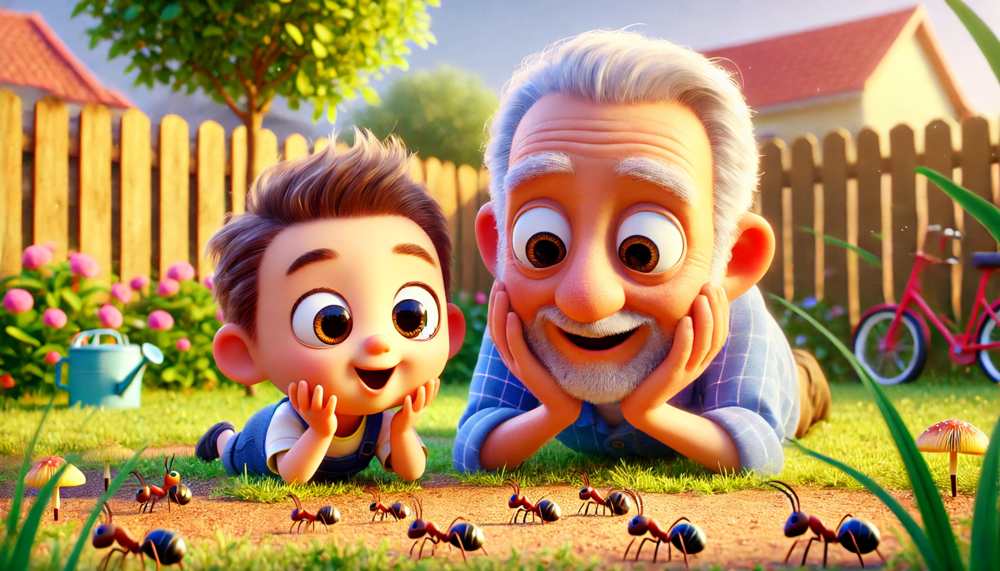

# 【教程】一个人的公司（三）——技能、专长和好奇心

这第三篇文章，让我想起了[《跨越不可能》这本我曾经强烈推荐过的书](20211225【随笔】Super人类成长手册.md)。2021年底，当我读到这本书时，有一种惊为天人的感觉。就好像茫然活了几十年之后，才终于找到了一本我想要的「人类使用说明书」。

当时那兴奋感，真的是持续了好几个月才慢慢消停下来。在短短的几个月内，那本书就被我翻了三遍！

结果这次我又有些兴奋地向大宝推荐Dan的一人公司课程时：

> 你要不要在学习投资的时候，也试试这种方法，边学边教？

却遭到了大宝的强烈反对：

> 不要！

我忍住那强烈地憋闷感（没想到现在只是回忆起那情景，胸腔憋闷的身体感受居然还会重新冒出来），问她为什么。她说：

> 我特别反感教学相长。我就想做我喜欢的事情，实践我现在已经找到的方法！
>
> 你想做的事情，你自己去做，不要让我做！！！

过了一会儿，她又说：

> 我还记得你那时候为了一本书兴奋得不行，搞得我也好奇看了一下。然后实践了其中的一个办法，就是列出25件自己特别感兴趣的事情。然后，就找到了我特别想要做的事情。
>
> 现在，我只想去做好这件事！
>
> 你已经掌握了非常非常多赚钱的方法。而且，我觉得大部分都是正确的，你只需捡起其中一种方法，坚定不移地实践就好了。

我忍不住争辩：

> 但是……

她笑了，说：

> 你看，你也是小克。

我知道她说的是鬼脚七那篇《[我教人如何赚钱，但他不信](https://mp.weixin.qq.com/s/HebiTK1jrXsWg6hzvy-gpw)》后面的评论，不由得惭愧地尬笑起来。

回忆一下我自己的兴趣，断断续续从小持续到现在的，就是写日记了。虽然各种断断续续，但最近读过《写出我心》后重启的写作练习，从最开始的每天5分钟，到现在每天500字以上，不知不觉已经5年多过去了。虽然和别人比，比如鬼脚七老师，这根本算不上「坚持」与「热爱」。但回顾自己这几十年人生的所有经历，写作，再加上电脑，再加上 互联网——明显就是「心头最爱」呀！

我相信不止是我，你也一样，每一个人，都能找到激发自己好奇心的东西，并且都能基于此，开发出相关的技能与专长！

以下是这第三课的原文与翻译，供大家参考。

----

## Skills, Expertise, & Curiosities 技能、专长和好奇心

The effectiveness of your brand, content, and offers are a combination of 3 things:

你品牌、内容和产品的有效性是以下三者的结合：

- Your skills
- Your expertise
- Your curiosities

- 你的技能
- 你的专长
- 你的好奇心

Your skill level determines the quality of the value you deliver, your curiosities give you a unique perspective on certain topics, and your expertise allows you to monetize the attention you are grabbing.

你的技能水平决定了你提供的价值质量，你的好奇心为某些话题提供了独特的视角，而你的专长让你能够将获得的注意力变现。

In [2-Hour Writer](https://2hourwriter.com/), we turn your skills and interests into content you can write about to build an audience. In [Mental Monetization](https://mentalmonetization.com/), we turn them into a product so you can monetize your creative work in the best way.

在[《2小时写作》](https://2hourwriter.com/)中，我们把你的技能和兴趣转化为内容，帮助你建立受众。在[《心智变现》](https://mentalmonetization.com/)中，我们将它们转化为产品，以最佳方式变现你的创造性工作。

For now, I want to plant some seeds of awareness in your head.

目前，我想在你的脑海中植下一些意识的种子。

As you go through this course, I would highly recommend *starting* to read up on the basics, principles, and fundamentals of certain skills.

在你学习这门课程时，我强烈建议你*开始*阅读某些技能的基础、原则和基本知识。

You will not master these all in one go, but simply having the awareness of them will prime your brain for pattern recognition.

你不可能一次性掌握所有这些技能，但简单地了解它们就会让你的大脑为模式识别做好准备。

Building a personal brand on social media gives you a place to practice ALL of these skills.

在社交媒体上打造个人品牌为你提供了一个练习所有这些技能的场所。

This is crucial.

这至关重要。

Rather than endlessly learning and not knowing how to apply your skills — you can start applying what you learn immediately through your content, free products, and brand.

与其不断学习却不知道如何应用你的技能，你可以立即通过内容、免费产品和品牌开始应用你所学的知识。

### Skills That Will Determine Your Success 决定你成功的技能

Fortunately — building a full-fledged personal brand or creator business requires you to learn all of the skills that are necessary for success online.

幸运的是——打造一个成熟的个人品牌或创作者事业需要你掌握在线成功所需的所有技能。

Don't let this overwhelm you. You don't need all of these at the start. You can learn and implement these whenever you see fit.

不要让这些技能让你感到压力重重。你不需要一开始就掌握所有技能。你可以在任何适当的时间学习并应用这些技能。

**The beauty in this:** you have a meaningful project to work on, refine, and iterate for as long as you do this.

**其中的美妙之处在于**：你拥有一个有意义的项目可以不断改进和迭代，只要你在做这件事。

Pursuing an intrinsic hierarchy of goals is a big key to happiness. It is how you reap the benefits of the good dopamine that comes from survival mechanisms in your brain.

追求内在的目标层次是获得幸福的关键之一。它能让你从大脑中的生存机制中获得良好的多巴胺。

Like working on a hobby project that you deeply care about as opposed to a client project that you grow tired of.

就像是你在做一个你深深关心的爱好项目，而不是一个让你感到厌倦的客户项目。

> The mark of a person who is in control of consciousness is the ability to focus attention at will, to be oblivious to distractions, to concentrate for as long as it takes to achieve a goal, and not longer. And the person who can do this usually enjoys the normal course of everyday life. 
>
> 能够自如掌控意识的人，标志在于他们能随意集中注意力，不被干扰，并能专注于一个目标所需的时间而不过度。而能够做到这一点的人通常能够享受日常生活的正常轨迹。
>
> — Mihaly Csikszentmihalyi 米哈伊·契克森米哈赖

**Here are the skills that will boost the impact and income from your online endeavors:**

以下是能提升你线上事业影响力和收入的技能：

- Copywriting (persuasive writing)
- Email marketing (for trust-building and sales)
- Sales (for closing deals and networking properly)
- Web design (for landing pages and a personal website)
- Social media growth (for sending traffic and audience building)
- Graphic design (for visuals and brand assets)
- Marketing & advertising (for getting people to act)

- 文案写作（说服性写作）
- 邮件营销（建立信任和推动销售）
- 销售（达成交易并正确拓展人脉）
- 网页设计（为落地页和个人网站设计）
- 社交媒体增长（为引导流量和建立受众）
- 平面设计（为品牌视觉和资产设计）
- 营销与广告（让人们采取行动）

*You learn these skills best by learning the principles, starting a real world project (a personal brand), and refining your skills with time and experience.*

你最好的学习这些技能的方法是学习原则，开始一个真实的项目（一个个人品牌），并通过时间和经验精炼你的技能。

These can all be freelanced or consulted with once you get the hand of them (and if you want to go that route).

一旦你掌握了这些技能并开始为自己带来成果，你可以选择将这些技能进行自由职业或咨询（如果你想走这条路）。

The more you practice these and get results for yourself — the more you understand the nuance of how these skills interact with a specific business.

你实践得越多，为自己取得的成果越多，你就越能理解这些技能如何与特定业务互动的细微差别。

That is how you develop your own unique system and increase your prices IF you want to freelance or consult with these down the road.

这就是如何开发出你自己独特的系统并提高你的价格的方式，如果你打算将来以自由职业或咨询为职业的话。

**ALL of these skills rely on a set of meta-skills:**

**所有这些技能都依赖于一组元技能：**

- Grabbing and holding attention
- Storytelling & persuasion
- Psychology & human behavior
- Self-awareness and observation
- Philosophy and spirituality

- 吸引和保持注意力
- 讲故事与说服
- 心理学与人类行为
- 自我觉察和观察力
- 哲学与灵性

In other words, you need to understand how humans make sense of and interpret what they see.

换句话说，你需要理解人们如何理解和解读他们所看到的东西。

You need to understand different perspectives and viewpoints so you can navigate topics with expertise.

你需要理解不同的视角和观点，以便能用专长驾驭话题。

You need to structure your message (throughout your entire brand, content, and funnel) in a way that leads readers toward a beneficial desired outcome.

你需要通过整个品牌、内容和销售漏斗，结构化你的信息，以引导读者走向一个有益的预期结果。

None of this will work if you create what you *think* will help others VS what is actually going to help others.

如果你只是创造你*认为*能帮助别人的东西，而不是那些真正能帮助别人的内容，那一切都不会奏效。

> #### Specific Knowledge 特定知识
>
> You don't *have* to do all of these things yourself. You can outsource them.
>
> 你不*必须*亲自完成所有这些事情。你可以外包它们。
>
> But, the process of "figuring it out" is how you acquire specific knowledge. That is how you make new discoveries and help others navigate the path effectively.
>
> 但，"搞清楚"的过程是你获得特定知识的途径。这是你如何做出新发现并有效帮助他人走过这条路的方式。

### **How Your Curiosities Play A Role** 你的好奇心如何发挥作用

One big problem I see all the time is that people don't know how to talk about what they love (while still maintaining authority).

我经常看到的一个大问题是，人们不知道如何在保持权威性的同时谈论自己喜欢的事物。

It's pretty simple, you just have to zoom out.

其实很简单，你只需要拉远视角。

Stop thinking of your content or brand as a static thing from day to day.

不要把你的内容或品牌看作是每天静态的事物。

It grows and evolves over time. Your content doesn't just disappear after you write it. You refine your ideas, post them again, and build a library that displays your authority, interests, and personality.

它会随着时间成长和演变。你的内容在写完之后不会就此消失。你会不断打磨你的想法，再次发布它们，并建立一个展示你权威性、兴趣和个性的内容库。

Some content will stick in people's heads and do well — some content won't. That's how it goes.

有些内容会留在人们的脑海中，表现很好——而有些不会。这就是事情的自然发展。

You incorporate your curiosities by being observant and using them to bring a new perspective to a problem that people face.

通过观察，将你的好奇心融入进来，用它们为人们面临的问题带来新的视角。

Your curiosities intersect with your interests, skills, and expertise — *if and only if you are trying to find a way to connect them.*

你的好奇心与兴趣、技能和专长交叉——*前提是你努力寻找将它们联系起来的方式。*

**Here is a general way to incorporate your curiosities into your brand:**

这里有一个将你的好奇心融入品牌的一般方式：

- Write out 2-3 of your interests (the things you LOVE talking about)
- Write out 2-3 options for eventual monetization (skills or interests like health or performance coaching)
- Think big and small — write out broader interests and skills, then write out niche interests and skill relating to the 2-3 points you wrote out already. This starts to create a web of content ideas and curiosities to pursue
- Keep an eye out for books, content, podcasts, and life experiences that check one of those boxes
- Make a note of it and create some form of content around it

- 写下你感兴趣的2-3件事（你热爱讨论的事物）
- 写下2-3个未来可以变现的选择（技能或兴趣，比如健康或绩效教练）
- 大小皆思考——写下更广泛的兴趣和技能，再写下与前面2-3个点相关的细分兴趣和技能。这开始为你创造了一个内容和好奇心的追求网络
- 留意书籍、内容、播客和生活经验，它们符合其中的某一条
- 记录下来，并围绕它创造某种形式的内容

This is a watered-down version of the system we will be implementing in the Bachelors tier to make this process seamless.

这是一种简化版的系统，我们将在**本科班**级别实施这个过程，使其无缝衔接。

> #### You Are Building A Personal Brand 你正在打造个人品牌
>
> Niche brands have their place, but this is for people that want to harness the internet to do what they love (and pursue their life's work).
>
> 细分品牌有它们的用处，但这适合那些想要利用互联网追求自己热爱的事物（并追求人生事业）的人。
>
> It is difficult to put YOU in a box — if not impossible. You are ALLOWED to try different things and pivot whenever you want. You are a human that evolves with time.
>
> 很难把你装进一个框架——事实上几乎不可能。你有权利尝试不同的事情，并在任何时候调整方向。你是一个随着时间进化的人。
>
> Why would that be any different in a digital reality?
>
> 在数字现实中，这有什么不同吗？
>
> With practice and busting through limiting beliefs, this will become a reality.
>
> 随着练习和打破限制性信念，这将成为现实。

### **Solving Your Own Problems And Selling The Solution 解决自己的问题并销售解决方案**

If you don't yet have a solidified offer to sell — or a skill that you are hell-bent on monetizing — there is another route you can go.

如果你还没有一个明确的产品可供销售——或者一个你坚决想要变现的技能——还有另一条路可以走。

This route is an all-in-one "one-person" business model approach.

这条路是一种“一人企业”的全能商业模式。

You are leveraging your ability to solve your own problems, document the process via content, and create a product that you can sell to your former self.

你依靠的是解决自己问题的能力，通过内容记录这个过程，并创造一个你可以销售给过去的自己的产品。

This is:

这包括：

- Personal growth
- Social media growth
- Authority building
- Market research
- Marketing
- Offer creation

- 个人成长
- 社交媒体增长
- 权威性建立
- 市场调研
- 营销
- 产品创作

All. In. One.

一体化。全在其中。

If you attract people with similar interests as you, educate them, and give them a process that shaves 2-3 years off of their learning time — they will pay you.

如果你吸引了与自己兴趣相似的人，教育他们，并提供一个能让他们缩短2-3年学习时间的流程——他们愿意为此付费。

**For example:** I have been passionate about health for the entirety of my adult life.

**例如**：我从成年开始就一直对健康充满热情。

I have 10 years of experience.

我有10年的经验。

I've tried all of the diets, training programs, and everything else. I have a very unique perspective with results to show for it.

我尝试过所有的饮食、训练计划和其他所有方法。我有一个非常独特的视角，并且有结果可以展示。

Even though I talk about business and self-improvement — I could sell 6 figures worth of a health product in a month or two.

尽管我谈论的是商业和自我提升——但我完全可以在一个月或两个月内通过销售健康产品赚取六位数的收入。

(Of course, this is considering I have an audience and vast marketing knowledge).

（当然，这是考虑到我已经拥有了受众和广泛的营销知识的前提下）。

My point is — my audience likes me for me. Everyone has burning biological problems in the eternal markets. I can create a product on anything I feel like IF I can position it correctly within those markets.

我的重点是——我的受众喜欢的是我。每个人都有迫切的生理问题需要解决，而这些问题存在于永恒的市场中。如果我能正确定位，我可以围绕任何我感兴趣的东西创造产品。

My personal brand is what sets me apart. People will buy my health product over someone else's just because I'm the one that made them aware of their problem and educated them on how to overcome it through my content.

我的个人品牌让我与众不同。人们会购买我的健康产品，而不是别人的，因为是我通过我的内容让他们意识到了问题，并教育他们如何克服这个问题。

> #### The Best Products 最好的产品
>
> The best products solve a problem that impacts a specific person's direct experience in a positive way.
>
> 最好的产品解决的是能够积极影响某个特定人的直接体验的问题。
>
> By solving your own problems, you do this automatically (and in a unique way).
>
> 通过解决自己的问题，你自动做到了这一点（并且以独特的方式）。
>
> This makes it seamless to target a problem in the eternal markets and position it towards a beginner market. Nearly guaranteed sales if you understand the rest of The One Person Business on an experiential level.
>
> 这让你无缝对准永恒市场中的一个问题，并将其定位于初学者市场。如果你在实践中理解了“一人企业”的其他内容，几乎可以保证获得销量。

<待续>