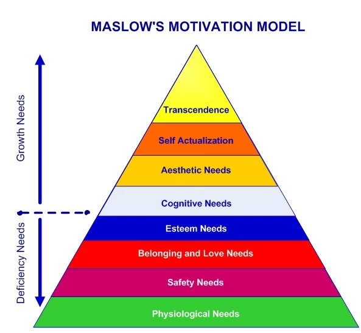
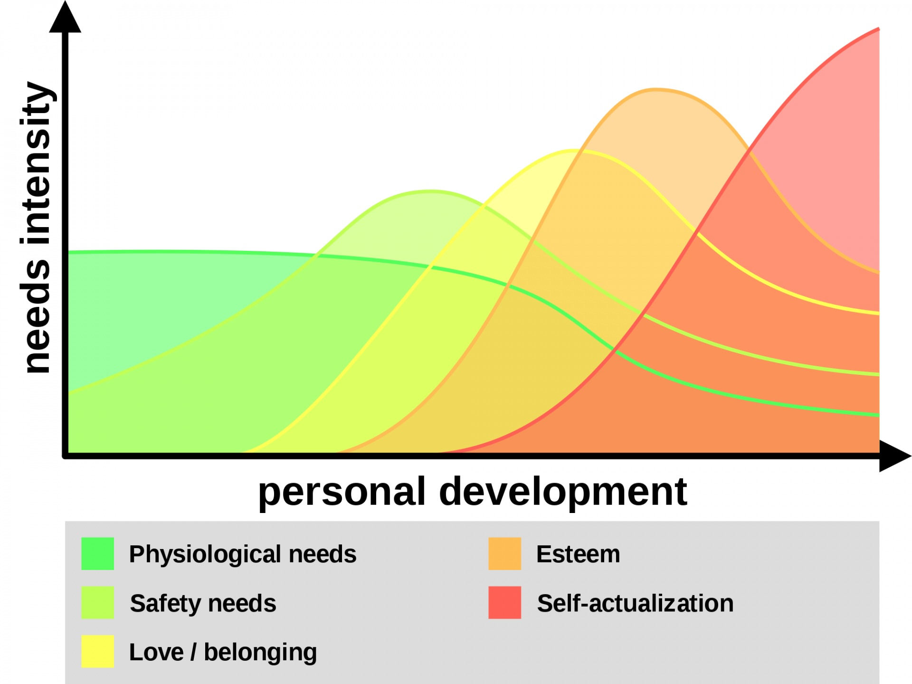

# 【教程】一个人的公司（四）——永恒与长青市场

这是一篇非常非常有价值的干货文章，如果我能早些真正意识到文章里所提到的核心思想，或许我早就财务自由好几遍了。

如果我能早些在日常工作生活的所有领域坚持去应用文章里所提到的核心思想，或许我早就摆脱那些一再困扰我的痛苦了。

为什么说「知行合一」如此重要，当我感觉自己终于听明白这篇文章在说什么的时候，才意识到两件事情：

1. 这些简单的原则，早就已经在我耳边「嗡嗡」很多年了！
2. 这么多年来，我竟然一直持续地还在犯违背这些简单原则的愚蠢错误！

冯唐在讲《资治通鉴》的过程中，反反复复多次讲过沟通的原则。想必大家都记得小学还是初中时所学的那篇课文《触龙说赵太后》吧，那就是一个非常典型的正面沟通技巧！冯唐总结的原则有五条：

1. 真诚：沟通的核心
2. 利他：给他人实实在在的好处
3. 知己知彼：沟通之前做好功课
4. 把握次序：根据对方状态调整谈话节奏
5. 有效反馈：让沟通更加高效迴馈

**除了「真诚」这个核心，重点原则就是「利他」。解决他人的痛苦，给予他人利益！**

第二个重要原则就是要考虑市场的基数。站在教育角度，初学者市场一定是最大的！

第三个重要原则是从第二原则延伸出来的。当你在一个领域深入一段时间之后，不要忘记了，大部分人依然需要你早已了解的那些基本知识和技巧，并且需要从他们的角度去了解。

第四个重要原则是，只教那些自己真正实践过并有所体悟的事情。否则，就是纸上谈兵，毫无益处！

以下是第四课的原文与翻译，供大家参考。

----

## The Eternal & Evergreen Markets 永恒与长青市场

I'm going to save you A LOT of pain.

我要帮你避免大量的痛苦。

But you will have to go through some pain at first (regarding your ego).

但你一开始仍需要经历一些痛苦（关于你的自我）。

*Nobody cares about your skills, interests, what you can build, or what you can help with.*

*没人关心你的技能、兴趣、你能创造什么，或者你能帮助别人做什么。*

**People are selfish.**

**人是自私的。**

They only care about what those skills, interests, and help *can do for them.*

他们只关心这些技能、兴趣和帮助*能为他们做些什么。*

Specifically, what it can do to **impact their direct human experience and quality of life.**

具体来说，就是它能如何**影响他们的直接人类体验和生活质量**。

To do this correctly, you need to understand where all burning, biological, and evergreen problems exist.

要正确地做到这一点，你需要理解那些迫切的、生物性的、以及长青的问题所在。

### **The Eternal Markets 永恒市场**

Health. Wealth. Relationships.

健康、财富、关系。

Those are the eternal markets.

这些就是永恒市场。

Under one umbrella, the main eternal market is Happiness — in more sustainable terms: improving someone's quality of life.

在一个大的范畴下，主要的永恒市场是幸福——用更可持续的方式来讲，就是提升一个人的生活质量。

Drill them into your brain.

将这些概念深深植入你的脑海中。

Stop thinking about your skills and interests.

别再想着你的技能和兴趣。

Start thinking about how your skills and interests help solve problems in the eternal markets.

开始思考你的技能和兴趣如何帮助解决永恒市场中的问题。

How can your skill or interest help someone:

你的技能或兴趣如何帮助某人：

- Make more money
- Free up more time
- Increase their life enjoyment
- End unconscious pains
- Boost their self-esteem

- 赚更多钱
- 腾出更多时间
- 增加他们的生活享受
- 结束无意识的痛苦
- 提升他们的自尊

What is the real-world *utility* behind your ideas.

你的想法在现实世界中的*实用性*是什么？

Do you see where I am going with this?

你明白我的意思了吗？

Leaders are those that help others self-actualize.

领导者是那些帮助他人自我实现的人。

As Ralph Waldo Emerson said in the previous section — “As to methods there may be a million and then some, but principles are few."

正如拉尔夫·沃尔多·爱默生在上一部分中所说：“方法可能有成千上万种，但原则却寥寥无几。”

Solving problems relating to basic human needs and helping them self-actualize is the **principle** in this case.

解决与基本人类需求相关的问题并帮助他们自我实现，就是在这个情况下的**原则**。

Your **method** for solving a problem within one or multiple of those verticals is how you win.

你在这些领域中解决问题的**方法**，就是你获胜的方式。

I have seen too many creators and solopreneurs fail because they cannot practice and internalize this.

我见过太多的创作者和个体创业者失败，因为他们无法实践和内化这一点。

People don't care about the method. If someone wants to make more money within the wealth vertical, they can:

人们不关心方法。如果有人想在财富领域增加收入，他们可以：

- Freelance
- Affiliate marketing
- Consulting
- Take online surveys
- Software development to get a job
- Driving for Uber or Lyft

- 做自由职业
- 做联盟营销
- 做咨询
- 做在线调查
- 学软件开发去找工作
- 为Uber或Lyft开车

I could go on and on. When someone wants to increase their income, they will use your method IF you can provide a compelling argument for it.

我可以一直列举下去。当有人想增加收入时，如果你能为你的方法提供一个有说服力的理由，他们就会使用它。

We will go deeper into this when we talk about influence and persuasion.

我们在谈论影响力和说服力时，会深入讨论这一点。

I would encourage you to think about the millions of methods that can be used to solve problems within each of the health, wealth, and relationships verticals.

我鼓励你思考成千上万种可以用于解决健康、财富和关系领域问题的方法。

Your sole purpose with all of this is to present a persuasive argument as to why your method is best for that person.

你所有的目的就是呈现一个有说服力的论据，解释为什么你的方法对那个人来说是最好的。

> #### Focus On Improvement 专注于改善
>
> Improvement stems from awareness. People cannot improve what they are not aware of.
>
> 改善源于意识。人们无法改善他们尚未意识到的事情。
>
> Your job is to spread seeds of awareness and funnel people into tools that will help them improve that area of their life.
>
> 你的工作就是播下意识的种子，并引导人们使用工具，帮助他们改善生活中的某些方面。

### **Maslow's Hierarchy Of Needs 马斯洛的需求层次理论**

Your content should be positioned in a way that targets a specific **pain** or **benefit** that lies within Maslow's Hierarchy Of Needs.

你的内容应该定位于**马斯洛需求层次理论**中的某个具体的**痛点**或**收益**。

Pains and benefits. Pains and benefits. **PAINS. AND. F\**KING. BENEFITS.**

痛点和收益，痛点和收益。**痛点。和。该死的。收益。**

Act like I'm yelling at you because I am.

想象一下，我是在对你大喊，因为我确实如此。

Do not write a single piece of content, create a product, or pitch a service without having these in mind.

不要在没有考虑这些的情况下写任何一篇内容、创造产品或推销服务。

This does not only apply to content.

这不仅适用于内容。

This applies to every single touchpoint of your brand.

这适用于你品牌的每一个接触点。

- Your social media profile
- Your free lead magnet
- Your email opt-in copywriting
- Your emails themselves
- Your landing pages and sales pages
- Your entire website
- The teachings in your products
- Your content, replies, and anything you post online

- 你的社交媒体简介
- 你的免费引流工具
- 你的电子邮件订阅文案
- 你实际发送的电子邮件
- 你的落地页和销售页面
- 你的网站整体
- 你产品中的教学内容
- 你的内容、回复以及你在网上发布的任何东西

This is the foundation of persuasion and sparking behavior change.

这是说服和引发行为改变的基础。

Behavior change is how you get other's to improve their lives. In turn, they will attribute their success to you. Win-win.

行为改变是你帮助他人改善生活的方式。反过来，他们会将他们的成功归因于你。双赢局面。

**Keep in mind:**

**请记住：**

You have to experience these things before you can teach them to someone that is one step behind you.

你必须亲身体验过这些事情，才能教给那些落后你一步的人。

If you want to make it in business (and the world) you have to pursue continuous personal development — especially in the areas of your interests and expertise.

如果你想在商业（和世界）中取得成功，你必须追求持续的个人发展——尤其是在你感兴趣和擅长的领域。

Treat this as a seed and allow it to be planted in your head.

把这个想法当作一颗种子，允许它在你的脑海中扎根。

> #### Be Mindful 保持警觉
>
> Consider the content or products you have already created (or other's content or products that readers have been exposed to).
>
> 想一想你已经创作的内容或产品（或读者接触过的其他人的内容或产品）。
>
> What stage are they at? What are they aware of? How can you position your message to impact that specific person in their journey?
>
> 他们处于什么阶段？他们意识到了什么？你如何定位你的信息，来影响这个人在他们旅程中的特定阶段？

### **The Beginner Market & Mindset 初学者市场与心态**

One of the biggest mistakes I see creators, solopreneurs, and other online business owners make (again, pertaining to ego):

我看到创作者、个体创业者和其他在线商业人士犯的一个最大错误（还是跟自我有关）是：

(**Side note:** notice how I am introducing this topic with a pain — because it makes you interested and keeps you reading.)

（**顺便说一句**：注意我是通过一个痛点引入这个话题的——因为这样会引起你的兴趣，并让你继续读下去。）

*They refuse to adopt a beginner's mindset.*

他们拒绝采用初学者的心态。

They subconsciously see themselves as "too smart" for posting beginner-level content.

他们潜意识里觉得自己“太聪明”了，不愿意发布初学者水平的内容。

**Newsflash: 90+% of the market are beginners.**

最新消息：市场上90%以上的人都是初学者。

ESPECIALLY those that are on short form, top-of-funnel platforms like:

尤其是那些在短视频、漏斗顶端的平台上，比如：

- Twitter
- TikTok
- Facebook
- Instagram
- LinkedIn (in some regards)

- Twitter
- TikTok
- Facebook
- Instagram
- LinkedIn（某些方面）

These are the easiest platforms to grow on for this reason.

正因为如此，这些平台是最容易增长的。

If you can teach former you (that was a beginner) how to get to where you are now in a streamlined way, you win.

如果你能够教会曾经的你（当时的你是初学者）如何以精简的方式达到你现在的水平，你就赢了。

That is more difficult than it sounds (hence this course), but that is the key to success in a nutshell.

这听起来比实际操作要难（因此有了这门课程），但这就是成功的关键。

This is why beginner products sell the best.

这也是为什么初学者产品最畅销的原因。

Just look at a course website like **Udemy or Skillshare.**

只需看看像 **Udemy 或 Skillshare** 这样的网站。

(**Seriously, go look at beginner products in an area you think you could teach.** Buy one of the courses for cheap. If you used that product as inspiration to create one for your own brand, you could charge more and sell it to the loyal audience you build. **Remember**: saturation doesn't exist when you are selling from a unique perspective to your Niche Of One audience. People buy from you because it's you, not a huge centralized platform that they aren't even aware of.)

（**说真的，去看看你认为可以教授的领域里的初学者产品**。购买其中一个便宜的课程。如果你用那个产品作为灵感，为你自己的品牌创建一个课程，你可以收取更高的费用，并将其出售给你建立的忠实受众。**记住**：当你从独特的视角向你的单一细分受众销售时，市场饱和是不存在的。人们因为是你而购买，而不是因为那些他们可能根本不知道的巨大中心化平台。）

This is why beginner content goes viral.

这也是为什么初学者内容容易走红的原因。

Just look at Twitter platitudes.

看看Twitter上的那些陈词滥调就知道了。

The problem with all of this is "standing out" from the crowd — which is where an impeccable personal brand, novel perspectives, and an education-based content ecosystem comes into play.

问题在于如何“脱颖而出”——这就是一个无可挑剔的个人品牌、新颖的视角和基于教育的内容生态系统的作用所在。

When those come together as you go through the course, you will win in the sea of creators that have no idea what they are doing in regards to marketing (in other words, they are beginners, you instantly surpass 90+% of your competitors.)

当这些随着你在课程中的进展融合在一起时，你将在充满茫然创作者的海洋中脱颖而出（换句话说，他们是初学者，你立即超越了90%以上的竞争对手）。

Here is a general, foolproof process for making a solid income:

以下是一个普遍且可靠的赚钱流程：

- Post beginner and intermediate level content from your unique perspective (based on research and experience)
- Educate people and **go more in-depth** with longer-form emails, articles, and a lead magnet to raise them up Maslow's Hierarchy of Needs (THIS is where you can show how smart you are and build a deeper connection without having to worry about the algorithm).
- Sell a beginner level product to filter out buyers from free-loaders
- Again, you are educating them to the point of being a fit for your other products or services (creating your own customers in a sense).
- Upsell another product, membership, or freelance / consulting service to those that purchased your product.

- 从你独特的视角发布初学者和中级内容（基于研究和经验）
- 通过更深入的长篇邮件、文章和引流工具教育人们并将他们提升到马斯洛的需求层次（这时你可以展示你的聪明才智，并与他们建立更深的联系，而无需担心算法的影响）。
- 出售一个初学者水平的产品，以筛选出买家和免费搭便车的人
- 再次强调，你正在将他们教育到适合你其他产品或服务的阶段（某种意义上，你是在创造自己的客户）。
- 向那些购买了你的产品的人追加销售其他产品、会员或自由职业/咨询服务。

It is not optimal to build everything out in that order... but that's up to you to discover by trying it out.

按这个顺序构建一切并不是最理想的……但这取决于你通过尝试来发现。

When in doubt — go beginner level.

当你不确定时——选择初学者水平的内容。

> #### You Probably Have Enough Experience 你可能已经有足够的经验
>
> Don't sell yourself short. If you are taking this course, I'm sure you've improved certain areas of your life.
>
> 别小看自己。如果你正在参加这门课程，我相信你已经在生活的某些方面取得了进步。
>
> Reflect on those times — did you know *anything* similar to what you know now?
>
> 回想一下那些时刻——你当时是否知道现在所知道的一切？
>
> Would your seemingly "basic" advice help your former self? Yes? Then it will help others. Zoom out.
>
> 你看似“基础”的建议会帮助曾经的你吗？会的？那么它也会帮助别人。拉远视角看问题。

<待续>