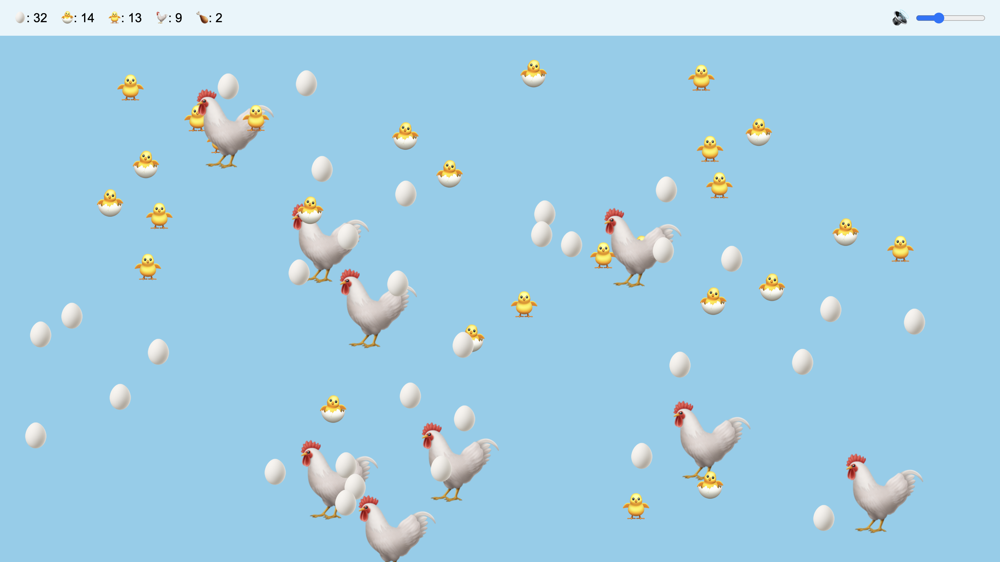

# 【教程】怎样让Cursor写孩子们喜欢的游戏

那天在用GPT o1写了一个俄罗斯方块以后，我兴奋地告诉大宝。大宝留言告诉我说：

> 孩子们说想玩小猪佩奇里面的快乐小鸡游戏。

哦？我想，那不如试试看？我先问了问GPT，可是他一直纠结于我提到过《小猪佩奇》后的版权问题。虽然，GPT o1 左思右想，但最后依然只是给出了一个设计概念和框架代码：

> 好的，让我们一起设计和开发一个**操作非常简单**、**适合儿童**、**可爱卡通画风**的 H5 网页游戏。游戏的主要玩法是：**玩家点击屏幕即可让小鸡下蛋，游戏没有固定的关卡或模式，玩家可以一直点击屏幕让小鸡下蛋**。
>
> ---
>
> ## **一、游戏概念设计**
>
> ### **1. 游戏名称**
>
> - **快乐小鸡下蛋**（您可以根据喜好取名）
>
> ### **2. 游戏玩法**
>
> - **核心机制**：玩家通过点击屏幕，让小鸡下蛋。
> - **目标**：收集尽可能多的鸡蛋，可能设定一些收集目标或计时挑战。
> - **特色**：
>   - 每次点击，小鸡都会下一个蛋，并伴有可爱的动画和音效。
>   - 累计下蛋数量，达到一定数量后，可以触发特殊效果或奖励。
>
> ### **3. 画面风格**
>
> - **角色设计**：一只可爱的小鸡，形象友好，适合儿童。
> - **背景设计**：明亮的农场、草地或蓝天白云，营造轻松愉快的氛围。
> - **色彩**：使用鲜艳的色彩，吸引儿童的注意力。
>
> ### **4. 音效和音乐**
>
> - **背景音乐**：轻松愉快的旋律。
> - **音效**：小鸡下蛋时的声音，点击时的反馈音等。
>
> ---
>
> ## **二、技术实现**
>
> ### **1. 技术选型**
>
> - **HTML5 和 Canvas**：用于绘制游戏画面和处理交互。
> - **JavaScript**：实现游戏逻辑。
> - **CSS3**：美化游戏界面。
>
> ### **2. 项目结构**
>
> - **index.html**：游戏的主页面。
> - **style.css**：样式文件，定义游戏的外观。
> - **script.js**：包含游戏逻辑的脚本。
>
> ---
>
> ## **三、开发步骤**
>
> ### **1. 创建基本的 HTML 页面**
>
> **`index.html`**：
>
> ```html
> <!DOCTYPE html>
> <html lang="zh-CN">
> <head>
>     <meta charset="UTF-8">
>     <title>快乐小鸡下蛋</title>
>     <link rel="stylesheet" href="style.css">
> </head>
> <body>
>     <canvas id="gameCanvas" width="800" height="600"></canvas>
>     <div id="eggCounter">鸡蛋数量：<span id="eggCount">0</span></div>
>     <script src="script.js"></script>
> </body>
> </html>
> ```
>
> ### **2. 定义样式**
>
> **`style.css`**：
>
> ```css
> body {
>     margin: 0;
>     padding: 0;
>     background-color: #8fd0f5; /* 天空蓝色背景 */
>     display: flex;
>     justify-content: center;
>     align-items: center;
>     flex-direction: column;
> }
> 
> #gameCanvas {
>     background-color: #fff;
>     border: 1px solid #000;
> }
> 
> #eggCounter {
>     margin-top: 20px;
>     font-size: 24px;
>     color: #333;
> }
> ```
>
> ### **3. 准备资源**
>
> - **小鸡形象**：您可以绘制一只可爱的小鸡，或者从**无版权限制的素材网站**下载。
> - **鸡蛋图片**：同样，可以自行绘制或下载。
> - **音效**：小鸡下蛋的声音，点击声音等。
>
> ### **4. 编写游戏逻辑**
>
> **`script.js`**：
>
> ```javascript
> const canvas = document.getElementById('gameCanvas');
> const ctx = canvas.getContext('2d');
> 
> // 加载图片资源
> const chickenImg = new Image();
> chickenImg.src = 'images/chicken.png'; // 确保路径和文件名正确
> 
> const eggImg = new Image();
> eggImg.src = 'images/egg.png';
> 
> // 定义小鸡的位置
> const chicken = {
>     x: canvas.width / 2,
>     y: canvas.height / 2,
>     width: 200,
>     height: 200,
> };
> 
> // 鸡蛋数组
> const eggs = [];
> 
> // 鸡蛋计数
> let eggCount = 0;
> 
> // 添加背景音乐和音效
> const bgMusic = new Audio('audio/background.mp3'); // 背景音乐
> const eggSound = new Audio('audio/egg.mp3'); // 下蛋音效
> 
> // 背景音乐设置为循环播放
> bgMusic.loop = true;
> 
> // 等待图片加载完成后开始游戏
> let assetsLoaded = 0;
> chickenImg.onload = () => {
>     assetsLoaded++;
>     if (assetsLoaded === 2) {
>         startGame();
>     }
> };
> 
> eggImg.onload = () => {
>     assetsLoaded++;
>     if (assetsLoaded === 2) {
>         startGame();
>     }
> };
> 
> // 绘制小鸡
> function drawChicken() {
>     ctx.drawImage(
>         chickenImg,
>         chicken.x - chicken.width / 2,
>         chicken.y - chicken.height / 2,
>         chicken.width,
>         chicken.height
>     );
> }
> 
> // 绘制鸡蛋
> function drawEggs() {
>     eggs.forEach(egg => {
>         ctx.drawImage(eggImg, egg.x, egg.y, egg.width, egg.height);
>     });
> }
> 
> // 更新鸡蛋位置（下落效果）
> function updateEggs() {
>     eggs.forEach(egg => {
>         egg.y += egg.speed;
>     });
>     // 移除超出画布的鸡蛋
>     eggs = eggs.filter(egg => egg.y < canvas.height);
> }
> 
> // 更新鸡蛋计数显示
> function updateEggCount() {
>     document.getElementById('eggCount').innerText = eggCount;
> }
> 
> // 游戏主循环
> function gameLoop() {
>     ctx.clearRect(0, 0, canvas.width, canvas.height);
>     drawChicken();
>     drawEggs();
>     updateEggs();
>     requestAnimationFrame(gameLoop);
> }
> 
> // 处理点击事件
> canvas.addEventListener('click', () => {
>     // 播放下蛋音效
>     eggSound.play();
> 
>     // 在小鸡下方生成一个鸡蛋
>     eggs.push({
>         x: chicken.x - 25,
>         y: chicken.y + chicken.height / 2 - 20,
>         width: 50,
>         height: 70,
>         speed: 2 + Math.random() * 3, // 随机下落速度
>     });
> 
>     // 增加鸡蛋计数
>     eggCount++;
>     updateEggCount();
> });
> 
> // 开始游戏
> function startGame() {
>     // 播放背景音乐
>     bgMusic.play().catch(error => {
>         console.error('背景音乐无法播放:', error);
>     });
> 
>     gameLoop();
> }
> ```
>
> ### **5. 添加音频文件**
>
> - **background.mp3**：轻松的背景音乐。
> - **egg.mp3**：小鸡下蛋的音效。
>
> 将音频文件放在项目的 `audio` 文件夹中，并确保路径正确。
>
> ### **6. 添加图片文件**
>
> - **chicken.png**：小鸡的图片。
> - **egg.png**：鸡蛋的图片。
>
> 将图片文件放在项目的 `images` 文件夹中，并确保路径正确。
>
> ---
>
> ## **四、测试与优化**
>
> ### **1. 测试游戏**
>
> - 打开 `index.html`，确保游戏能够正常运行。
> - 点击 Canvas，小鸡应当下蛋，鸡蛋从小鸡下方落下。
> - 鸡蛋数量应当正确累加并显示。
>
> ### **2. 优化体验**
>
> - **动画效果**：可以为小鸡添加简单的动画，例如在下蛋时抖动或眨眼。
> - **鸡蛋下落速度**：调整鸡蛋的下落速度和方向，使之更自然。
> - **背景设计**：添加一个美丽的背景图片或绘制一个农场场景。
>
> ### **3. 兼容性测试**
>
> - 在不同的浏览器和设备上测试游戏，确保兼容性。
>
> ---
>
> ## **五、增加游戏功能（可选）**
>
> ### **1. 添加特效**
>
> - 当鸡蛋下落到地面时，生成一个破碎的动画或特效。
>
> ### **2. 增加挑战**
>
> - 设置一个计时器，玩家需要在限定时间内下尽可能多的蛋。
> - 添加意外事件，例如偶尔出现的金蛋，点击时获得更多奖励。
>
> ### **3. 社交分享**
>
> - 添加分享功能，让玩家可以将自己的鸡蛋数量分享到社交媒体。
>
> ---
>
> ## **六、注意事项**
>
> ### **1. 资源合法性**
>
> - 确保使用的图片和音频资源没有版权问题。
> - 可以使用免费商用的素材，或者自行绘制。
>
> ### **2. 适合儿童**
>
> - 内容健康，无不良信息。
> - 操作简单，界面友好。
>
> ---
>
> ## **七、资源推荐**
>
> ### **1. 图片素材网站**
>
> - [OpenGameArt](https://opengameart.org/)
> - [Kenney.nl](https://kenney.nl/)
> - [Pixabay](https://pixabay.com/)
>
> ### **2. 音频素材网站**
>
> - [Freesound](https://freesound.org/)
> - [Bensound](https://www.bensound.com/)
> - [Free Music Archive](https://freemusicarchive.org/)
>
> ---
>
> ## **八、完整的代码示例**
>
> 由于篇幅限制，这里提供核心部分的代码。如果您需要更详细的代码，请告诉我。
>
> ---
>
> ## **九、结语**
>
> 通过以上步骤，您可以制作一个简单有趣的 H5 游戏，适合小朋友们玩耍。游戏的核心玩法是通过点击屏幕让小鸡下蛋，操作简单，画面可爱。
>
> 如果您在开发过程中遇到任何问题，或者需要进一步的帮助，请随时告诉我！

----

因此，我决定再试试用Cursor。于是乎，我打开Cursor，在对话框里输入：

> 新建一个项目，一个非常简单的H5游戏，小猪佩奇里的那个快乐小鸡游戏。游戏操作非常简单,只需点击屏幕即可让小鸡下蛋。适合各年龄段儿童玩耍,尤其是低龄宝宝。游戏没有固定的关卡或模式,玩家可以一直点击屏幕让小鸡下蛋。左上角有计数器记录下蛋数量,玩家可以尽情下蛋。游戏采用可爱的卡通画风,与《小猪佩奇》动画片风格一致。小鸡和鸡蛋可以用Emoji里的图片。在网上找一个轻松快乐无版权限制的背景音乐和搞笑的下蛋音效。

Cursor 倒是不说二话，直接给出了答案与代码，全部在一个index.html里搞定：

> 好的,我理解您想要创建一个简单的H5游戏,类似于小猪佩奇里的快乐小鸡游戏。我会为您提供一个基本的HTML5游戏框架,使用JavaScript和CSS来实现游戏功能。以下是游戏的基本结构:
>
> ```html:index.html
> <!DOCTYPE html>
> <html lang="zh">
> <head>
>     <meta charset="UTF-8">
>     <meta name="viewport" content="width=device-width, initial-scale=1.0">
>     <title>快乐小鸡下蛋游戏</title>
>     <style>
>         body {
>             display: flex;
>             justify-content: center;
>             align-items: center;
>             height: 100vh;
>             margin: 0;
>             background-color: #87CEEB;
>             font-family: Arial, sans-serif;
>         }
>         #game-container {
>             text-align: center;
>         }
>         #chicken {
>             font-size: 100px;
>             cursor: pointer;
>         }
>         #egg-count {
>             font-size: 24px;
>             margin-top: 20px;
>         }
>     </style>
> </head>
> <body>
>     <div id="game-container">
>         <div id="chicken">🐔</div>
>         <div id="egg-count">鸡蛋数量: 0</div>
>     </div>
>     <audio id="background-music" loop>
>         <source src="path/to/background-music.mp3" type="audio/mpeg">
>     </audio>
>     <audio id="egg-sound">
>         <source src="path/to/egg-sound.mp3" type="audio/mpeg">
>     </audio>
>     <script>
>         const chicken = document.getElementById('chicken');
>         const eggCount = document.getElementById('egg-count');
>         const backgroundMusic = document.getElementById('background-music');
>         const eggSound = document.getElementById('egg-sound');
>         let count = 0;
> 
>         chicken.addEventListener('click', () => {
>             count++;
>             eggCount.textContent = `鸡蛋数量: ${count}`;
>             layEgg();
>             playEggSound();
>         });
> 
>         function layEgg() {
>             const egg = document.createElement('div');
>             egg.textContent = '🥚';
>             egg.style.position = 'absolute';
>             egg.style.fontSize = '40px';
>             egg.style.left = `${Math.random() * 80 + 10}%`;
>             egg.style.top = `${Math.random() * 40 + 50}%`;
>             document.body.appendChild(egg);
>             setTimeout(() => egg.remove(), 2000);
>         }
> 
>         function playEggSound() {
>             eggSound.currentTime = 0;
>             eggSound.play();
>         }
> 
>         document.body.addEventListener('click', () => {
>             backgroundMusic.play();
>         }, { once: true });
>     </script>
> </body>
> </html>
> ```
>
> 这个基本框架包含了以下功能:
>
> 1. 一个可点击的小鸡emoji (🐔)
> 2. 点击小鸡时会生成一个鸡蛋emoji (🥚)
> 3. 左上角显示鸡蛋数量的计数器
> 4. 背景音乐和下蛋音效的支持 (需要您提供音频文件)
> 5. 简单的卡通风格背景 (浅蓝色)
>
> 要完成游戏,您需要:
>
> 1. 找到合适的背景音乐和下蛋音效,并将文件路径更新到HTML中的audio标签里。
> 2. 可以根据需要调整CSS样式,使游戏更符合《小猪佩奇》的画风。
> 3. 如果需要,可以添加更多的动画效果或游戏元素。
>
> 这个简单的框架应该能满足您描述的基本需求。您可以根据需要进一步完善和定制游戏。

游戏一开始运行，我就冒出了个各种修改主意，当然，也发现了各种Bug，于是乎经过一个多小时的持续折腾（由于Cursor几乎每次都为我重新写了全部的代码，这里只列出我说过的话，让大家感觉一下）：

> 怎么控制背景音乐的音量呢

> 那么CSS 怎么调整才能看到这个🥤控制开关

> 把音量控制挪到屏幕旁边去。小鸡的位置是随机出现的。

> 运行时报错

> Uncaught ReferenceError: chicken is not defined
>     at index.html:68:9Understand this error

> 逻辑不对：1. 屏幕中间的鸡还在。2.随机出现的小鸡点一下就不见了，需要它一直在

> 1. 音量控制又跑到中间去了，把几分和音量控制都挪到最上面。2.生成的鸡蛋不要马上消失。等5秒钟再消失

> 1. 和2. 的修改在哪里，为什么没生效？

> 连续点击小鸡时，为什么没有连续随机在屏幕上出现鸡蛋？

> 一开始只出现三只小鸡。点击🥚后，鸡蛋变成🐣点击🐣，🐣变成🐥，点击🐥，🐥变成🐓。

> . 成年鸡要大一点。2.点击成年鸡要在随机位置生成鸡蛋

> 点击成年鸡现在会在随机位置生成鸡蛋，而不是在鸡的位置。我们修改了 layEgg 函数，使其在随机位置生成鸡蛋。——这个好像不对，再检查一下。而且，开始时从一只成年鸡开始，在哪里修改

> 点小鸡不会变大

> 标题不要改，保留”快乐小鸡下蛋游戏“，把下单声音和长大声音分开，每个阶段声音不一样

> evolution-sound.mp3:1 
> 报错，检查一下哪里声音没改过来？

> 1.成年鸡大小不对，要画大一些，至少现在3个这么大。2. 然后，小鸡数量（🐣🐥），大母鸡（🐓）数量，鸡蛋（🥚'）数量都统计

> 数量显示不要换行，怎么改一下

> 大母鸡每下一个蛋就随机走开一段距离。下10个蛋后大母鸡就会消失

> 再修改一下，改成🐥 🐓都每秒随机移动 

> 小鸡数量变成负数了

> 还有大母鸡消失了，数量也没有变。鸡蛋数量也没有显示当前屏幕上真实的鸡蛋数量。有时候点击鸡蛋，变成了小鸡，但鸡蛋并没有消失。你再检查检查这个evlove函数。另外，增加一个计数，消失的大母鸡，🍗加1

> 注意计数还是不对，干脆🐣🐥两个阶段分开吧，不容易出错。鸡蛋又减成负数了。

> 再检查一下evolve 函数，🐣 点了以后不见了！

> 🐥 点击后又不见了？

> 还是不对，请检查

> 注意，如果我点击飞快，就会出现计数错误。意味着比如大母鸡还没消失时，我点了很多次，然后等它消失后，计数就错了。

> 改出问题了，鸡蛋再也点不动了

> 你再思考一下，检查evlove 和点击部分，确保行为和计数符合预期

> 现在是🐣点不动了

> 还是点不动，哪里逻辑不对？

> 注意，新出现的大母鸡不动了！

> 请注意，鸡蛋不要跑！再检查一下，只有小鸡和大母鸡会随机移动。

> 请仔细检查一下，出现严重BUG：1. 小鸡依然不会移动。2. 新变成的大母鸡大小不对。3. 有一只鸡蛋变成了3倍大！！！

> 继续检查，有时候🐣不动。🐥都不会动！新变成的🐓也不会动。请仔细检查，并想我解释代码逻辑。发现错误后再做修改

> 好，先这么修改

> 改了吗？

> 再检查一下Envlove函数，现在又这个 log ：Evolving from 🐣 to 🐣，显然不符合我的要求

> 你再仔细检查一下，本来应该长大的。为什么没长大？哪里错了？

……

就这样，仅仅是我动口，然后运行测试，cursor 不停地刷新代码……经过这么几十轮的对话，增加功能，修改Bug，一个几十行的HTML变成了几百行的带着Javascript 和 CSS的HTML。

我把他扔给两个小孩子试了试，居然8岁的阿宝和4岁的大鱼都玩得不亦乐乎！哈哈，身为爸爸的新成就感成功解锁！



最终版的完整HTML代码如下（背景音乐和音效是另外的文件，有需要的可以发微信找我）：

```html
<!DOCTYPE html>
<html lang="zh">
<head>
    <meta charset="UTF-8">
    <meta name="viewport" content="width=device-width, initial-scale=1.0">
    <title>快乐小鸡下蛋游戏</title>
    <style>
        body {
            margin: 0;
            padding: 20px;
            background-color: #87CEEB;
            font-family: Arial, sans-serif;
            overflow: hidden;
        }
        #top-bar {
            position: fixed;
            top: 0;
            left: 0;
            right: 0;
            display: flex;
            justify-content: space-between;
            align-items: center;
            padding: 10px 20px;
            background-color: rgba(255, 255, 255, 0.8);
            z-index: 1000;
        }
        #stats {
            font-size: 18px;
            display: flex;
            gap: 20px;
        }
        #volume-control-container {
            display: flex;
            align-items: center;
        }
        #volume-control {
            width: 100px;
            margin-left: 10px;
        }
        #volume-icon {
            font-size: 24px;
        }
        .creature {
            position: absolute;
            font-size: 40px;
            cursor: pointer;
            transition: all 0.5s ease;
        }
        .adult-chicken {
            font-size: 120px;
        }
    </style>
</head>
<body>
    <div id="top-bar">
        <div id="stats">
            <div>🥚: <span id="egg-count">0</span></div>
            <div>🐣: <span id="chick-count">0</span></div>
            <div>🐥: <span id="young-chick-count">0</span></div>
            <div>🐓: <span id="adult-count">1</span></div>
            <div>🍗: <span id="roast-count">0</span></div>
        </div>
        <div id="volume-control-container">
            <span id="volume-icon">🔊</span>
            <input type="range" id="volume-control" min="0" max="1" step="0.1" value="0.3">
        </div>
    </div>
    <audio id="background-music" loop>
        <source src="background-music.mp3" type="audio/mpeg">
    </audio>
    <audio id="egg-lay-sound">
        <source src="egg-lay-sound.mp3" type="audio/mpeg">
    </audio>
    <audio id="hatch-sound">
        <source src="hatch-sound.mp3" type="audio/mpeg">
    </audio>
    <audio id="chick-grow-sound">
        <source src="chick-grow-sound.mp3" type="audio/mpeg">
    </audio>
    <audio id="adult-chicken-sound">
        <source src="adult-chicken-sound.mp3" type="audio/mpeg">
    </audio>
    <script>
        const eggCount = document.getElementById('egg-count');
        const chickCount = document.getElementById('chick-count');
        const youngChickCount = document.getElementById('young-chick-count');
        const adultCount = document.getElementById('adult-count');
        const roastCount = document.getElementById('roast-count');
        const backgroundMusic = document.getElementById('background-music');
        const eggLaySound = document.getElementById('egg-lay-sound');
        const hatchSound = document.getElementById('hatch-sound');
        const chickGrowSound = document.getElementById('chick-grow-sound');
        const adultChickenSound = document.getElementById('adult-chicken-sound');
        let eggs = 0;
        let chicks = 0;
        let youngChicks = 0;
        let adults = 1;
        let roasts = 0;

        backgroundMusic.volume = 0.3;
        eggLaySound.volume = 0.7;
        hatchSound.volume = 0.7;
        chickGrowSound.volume = 0.7;
        adultChickenSound.volume = 0.7;

        function createRandomChicken() {
            const chicken = document.createElement('div');
            chicken.textContent = '🐓';
            chicken.className = 'creature adult-chicken';
            chicken.style.left = `${Math.random() * 80 + 10}%`;
            chicken.style.top = `${Math.random() * 70 + 20}%`;
            chicken.dataset.eggCount = 0;
            chicken.dataset.lastClickTime = 0;
            document.body.appendChild(chicken);

            chicken.addEventListener('click', () => {
                if (canClick(chicken)) {
                    layEgg(chicken);
                    playSound(eggLaySound);
                }
            });

            startMoving(chicken);
        }

        function startMoving(creature) {
            // 清除可能存在的旧的移动间隔
            stopMoving(creature);
            
            // 设置新的移动间隔
            creature.moveInterval = setInterval(() => moveCreature(creature), 1000);
        }

        function stopMoving(creature) {
            clearInterval(creature.moveInterval);
        }

        function layEgg(chicken) {
            const egg = document.createElement('div');
            egg.textContent = '🥚';
            egg.className = 'creature';
            egg.style.left = chicken.style.left;
            egg.style.top = chicken.style.top;
            document.body.appendChild(egg);

            eggs++;
            updateDisplay();

            egg.addEventListener('click', () => {
                evolve(egg, '🐣');
                playSound(hatchSound);
            });

            chicken.dataset.eggCount = parseInt(chicken.dataset.eggCount) + 1;

            if (parseInt(chicken.dataset.eggCount) >= 10) {
                chicken.style.pointerEvents = 'none';
                stopMoving(chicken);
                setTimeout(() => {
                    chicken.remove();
                    adults--;
                    roasts++;
                    updateDisplay();
                }, 1000);
            }
        }

        function evolve(element, nextStage) {
            const currentStage = element.textContent;
            
            // 检查是否是有效的进化
            if ((currentStage === '🥚' && nextStage === '🐣') ||
                (currentStage === '🐣' && nextStage === '🐥') ||
                (currentStage === '🐥' && nextStage === '🐓')) {
                
                console.log(`Evolving from ${currentStage} to ${nextStage}`);

                // 停止当前的移动
                stopMoving(element);

                // 更新元素内容和类
                element.textContent = nextStage;
                if (nextStage === '🐓') {
                    element.className = 'creature adult-chicken';
                } else {
                    element.className = 'creature';
                }

                // 更新计数
                if (currentStage === '🥚' && nextStage === '🐣') {
                    eggs--;
                    chicks++;
                } else if (currentStage === '🐣' && nextStage === '🐥') {
                    chicks--;
                    youngChicks++;
                } else if (currentStage === '🐥' && nextStage === '🐓') {
                    youngChicks--;
                    adults++;
                    element.dataset.eggCount = 0;
                }

                // 移除旧的事件监听器并添加新的
                element.removeEventListener('click', element.clickHandler);
                element.clickHandler = () => {
                    if (canClick(element)) {
                        if (element.textContent === '🐣') {
                            evolve(element, '🐥');
                            playSound(chickGrowSound);
                        } else if (element.textContent === '🐥') {
                            evolve(element, '🐓');
                            playSound(adultChickenSound);
                        } else if (element.textContent === '🐓') {
                            layEgg(element);
                            playSound(eggLaySound);
                        }
                    }
                };
                element.addEventListener('click', element.clickHandler);

                // 开始移动（除了鸡蛋）
                if (nextStage !== '🥚') {
                    startMoving(element);
                }

                updateDisplay();
                console.log(`Evolution complete. New stage: ${nextStage}`);
            } else {
                console.error(`Invalid evolution: from ${currentStage} to ${nextStage}`);
            }
        }

        function canClick(element) {
            const now = Date.now();
            if (now - element.dataset.lastClickTime < 1000) {
                return false;
            }
            element.dataset.lastClickTime = now;
            return true;
        }

        function moveCreature(creature) {
            const currentLeft = parseFloat(creature.style.left);
            const currentTop = parseFloat(creature.style.top);
            
            let newLeft = currentLeft + (Math.random() - 0.5) * 10;
            let newTop = currentTop + (Math.random() - 0.5) * 10;
            
            newLeft = Math.max(0, Math.min(90, newLeft));
            newTop = Math.max(10, Math.min(90, newTop));
            
            creature.style.left = `${newLeft}%`;
            creature.style.top = `${newTop}%`;
        }

        function playSound(sound) {
            sound.currentTime = 0;
            sound.play();
        }

        function updateDisplay() {
            eggCount.textContent = Math.max(0, eggs);
            chickCount.textContent = Math.max(0, chicks);
            youngChickCount.textContent = Math.max(0, youngChicks);
            adultCount.textContent = Math.max(0, adults);
            roastCount.textContent = roasts;
        }

        createRandomChicken();
        updateDisplay();

        const volumeControl = document.getElementById('volume-control');
        volumeControl.addEventListener('input', (e) => {
            const volume = e.target.value;
            backgroundMusic.volume = volume;
            eggLaySound.volume = volume;
            hatchSound.volume = volume;
            chickGrowSound.volume = volume;
            adultChickenSound.volume = volume;
        });

        document.body.addEventListener('click', () => {
            backgroundMusic.play();
        }, { once: true });
    </script>
</body>
</html>


```

然后，大宝问我，能不能把这个游戏搬到微信上去直接运行呢？

阿宝问我，可不可以把我画的彩色大母鸡放上去呢？还有头顶顶着蛋壳的小鸡？

大鱼问我，可不可以做一个小汽车的游戏，能够上坡下坡的那种？

我不禁开始设想，如果能够把程序细节的那些问题再藏起来，是不是可以为小孩子们提供一个只用对话和画画就能自己制作自己喜欢的游戏的工具呢？

值得期待和尝试！