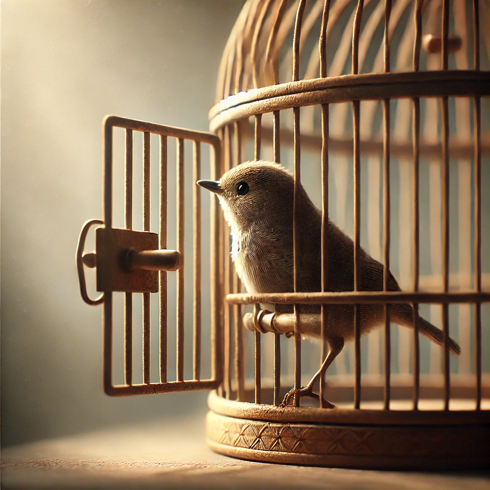

# 【生命⋅修行】自由、限制、疲惫与幸福

在 [Pieter Levels: Programming, Viral AI Startups, and Digital Nomad Life | Lex Fridman Podcast #440](https://www.youtube.com/hashtag/440) 的这个访谈中，Pieter Levels就提到过他经过27岁迷茫期之后的一个发现：

> 虽然人们通常把「自由」与「幸福」联系在一起，但我发现——自由并不必然带来幸福。相反，限制反而会给我带来幸福感。

当时我是在YouTube看的视频版访谈，我留意到Lex Fridman有点反对的表情，但最终欲言又止。我似乎有点理解Lex的那种感觉——你说的对，但我并不完全赞同；但如果我此时表达反对或只是提出自己的看法，却极大可能会造成更复杂的曲解。

早上，大宝又一次聊起她面对不得不照顾孩子们时的那种复杂情绪。那种完全不得休息的疲惫，持续6、7年必须照顾孩子们、一刻不得放松的疲惫；但同时也觉得自己也是爱孩子们的，但还是无法摆脱那种疲惫感；面对我时，由于意识到可能把这担子扔给我几天，反而更加迫切地想要逃离，却变得更加疲惫与颓废。

我甚至都不知道该怎么描述这种情绪，在我试图理解大宝的过程中，有那么一刹那，我意识到自己也处在「手停口停」，而且是「一旦手停」就「全家人口停」的状态中；而与此同时，大宝这么一个简单合理的期望，我却好像不能替她实现；自己此刻无力改变家庭目前所面临的这个现状，不得不继续陷在这个「状态」中……

这种「被困住」的感觉刚刚一冒头，就有一股巨大的疲惫感将我裹挟起来。这种「疲惫」把握吓坏了，连忙下意识地把引发这「疲惫感」的念头扫到一边。

我想，大宝无法摆脱的疲惫感可能正是类似我刚刚在那一瞬间所感受到的一切吧。应该只会更强烈才对。

或许，这正是Lex欲言又止的那部分想法。更或许，因为他们都没有孩子，他们其实根本理解「困住」大宝的痛苦是什么。

但痛苦也就那么几种——「生」、「老」、「病」、「死」、「求不得」、「爱别离」、「怨憎会」；想要去除痛苦，拥抱幸福，究极之道怕也只能靠自己心的觉察与转念。

无论是自由、还是限制，真正带来幸福的，其实在他们之外，或者说在他们之上吧！

