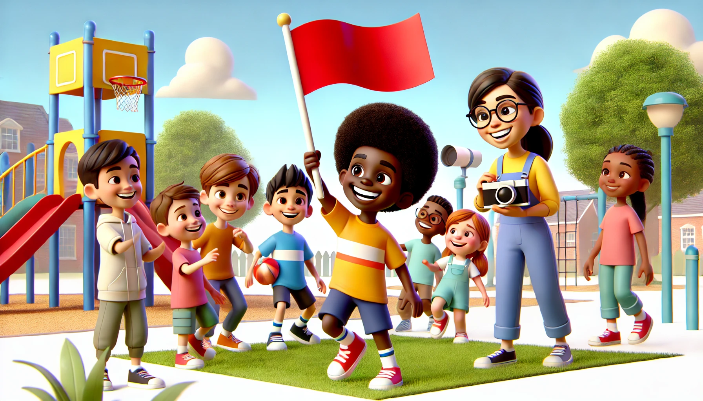

#  【生命•故事】（121）共青团活动

「题外话」——阿宝喜欢上听我讲自己小时候的故事，得益于这几年来断断续续的回忆和记录，每次都能想起几个自己的故事讲给阿宝听。后来，她告诉我奶奶也给她讲过一些我的故事，还有些她奶奶记得，但是我记不住的细节。

比如，我敲煤球那次，是钻进了邻居收藏煤球的柜子，一个个弄出来踩碎或敲碎，弄得自己浑身上下黑黢黢。

还有一些我不记得的事情，比如奶奶的同事，给我在地上用粉笔画一个小女孩，然后哄我去地上亲亲这个「小女孩」的脸……

回忆过往还是个有趣的事情，要是能有更好、更方便的办法，把我爸爸、妈妈脑海中的回忆也倒出来，记录整理就好了。关键还是得有时间与精力！

----

这次提笔，想起的是初中时那次共青团的活动。我和时任值周班长的ZK听说，共青团有活动经费，便筹划了一次班级的共青团活动。我们以班级团支部的名义组织了所有团员去青少年宫玩，邀请了学校的团委书记蒙老师——一个小个子，戴眼镜的，头发有点卷的年轻女老师，同时也邀请了班上所有的非团员。

于是，那天热热闹闹地打着团旗就出发了。ZK「颇有心机」地一直打着团旗（这是他后来告诉我，他特意这么干的），于是乎，包括自由活动的大部分时候，蒙老师也一直和我们几个在一起，为我们留下了不少照片。我记得其中的两张：

一张是全体同学和老师的合影，ZK帅气地挥舞着团旗站在队伍前面，我蹲在队伍中间，个子小小，顶着一个爆炸头（可能是头一晚洗过头，导致头发全都竖起来），怎么看都不像是带队的团支部书记。我还记得拍照时，使劲挥舞红旗的ZK，以及被红旗挡住脸的同学不开心的小情绪。

另一张是我们5、6个人，在一个叫做宇宙飞船的游乐设施上，举着鲜艳的红旗，坐在「飞船」上，在高速旋转中意气风发，手中红旗招展。

那天还玩了什么项目，一点都不记得了。似乎中间还有过几次争执和分歧（这与事后ZK为之得意的、夺取红旗的心机似乎有些相关），但具体是什么事情，以及和我们闹分歧的对象是谁，我都已经记不清了。只有这两张照片，在后来慢慢长大的日子里常常被我从相册中翻出来，于是最终只记得，那天以共青团的名义，全班都玩得很开心！

