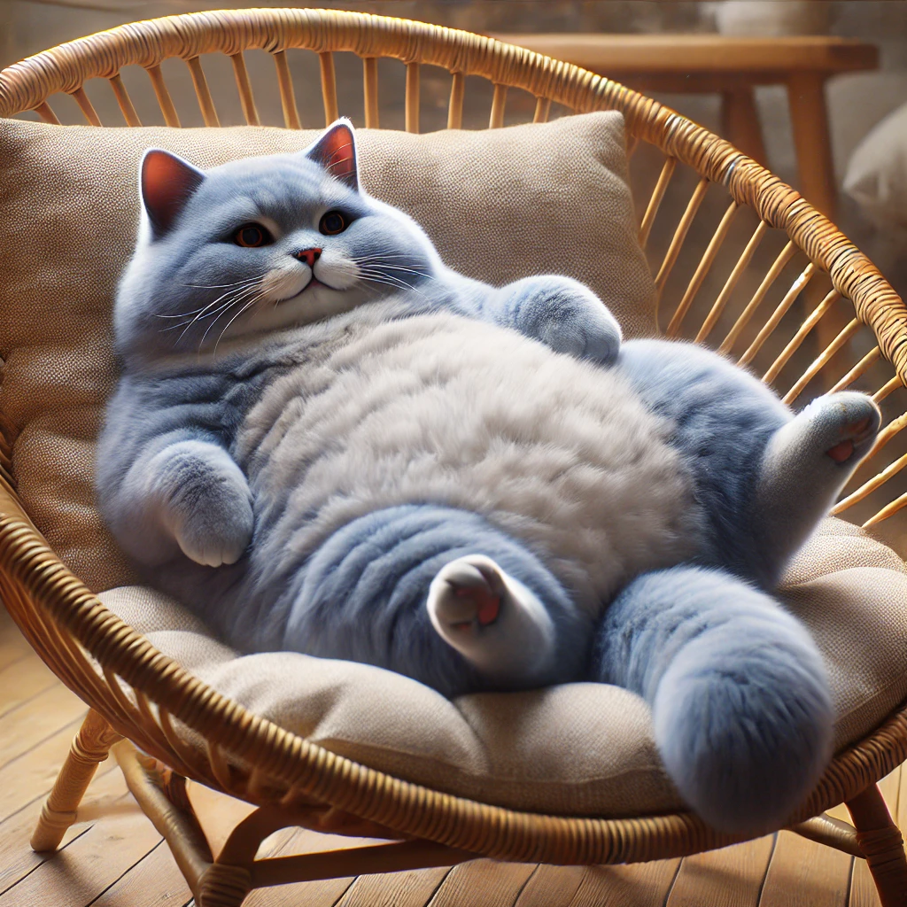

# 【随笔】一手猫毛

晚饭是粥和烙饼，对于我这样的南方人来说，拿饼当主食有种正餐吃零食的快感。加上大宝做的这饼又香又甜，根本停不下来，不知不觉，就把肚子吃撑了。

虽然已经用餐结束，但是我坐在餐椅上一点都不想动。正在这时，我发现Cup猫从厨房柜子下面的缝隙里「流淌」出来——之所以用流淌这个词，实在是因为柜子底部其实只有3、5公分高，而Cup是一只胖胖的巨大蓝猫。

只能说，蓝猫也是猫，同样也是液体属性。

我瞪大眼睛看着它，叫了一声「Cup」，Cup停下脚步，眯缝着眼睛看着我。然后过了一会儿，蹭地跳上我旁边的空椅子，仰起脑袋，意思是让我好好摸摸它。我一面摸着它的脑袋，一面和大宝感慨：

> 时间过得真快啊！
>
> 不知不觉，我们结婚就到了第八年……

大宝揶揄到：

> 而且，我们竟然还没有离婚？

我说：

> 不是啊！ 
>
> 我是指，竟然养了两个娃，变成了一大家子。就连你送给我的这只小猫Cup都变成了中年油腻老猫……

Cup显然很满意我的抚摸，从站着变成蹲着，从蹲着变成趴着，最后软绵绵地完全平摊在椅子上，舒服地闭着眼睛享受着。

大宝笑着说：

> 吃完了还不去收拾碗筷，竟然还坐在这里撸猫！

Cup 发出轻轻的呼噜声，我低头一看，它大腿上已经攒了一大团浮毛。这家伙，怎么这么能掉毛啊！我把这些毛拢了拢，团成一团，捡起来扔到垃圾桶里。这才发现自己不止手上，连手臂上都沾满了猫毛。

无奈，只好起身去卫生间，仔仔细细冲了个干净。

等我再回到餐桌边，Cup已经不知去向！