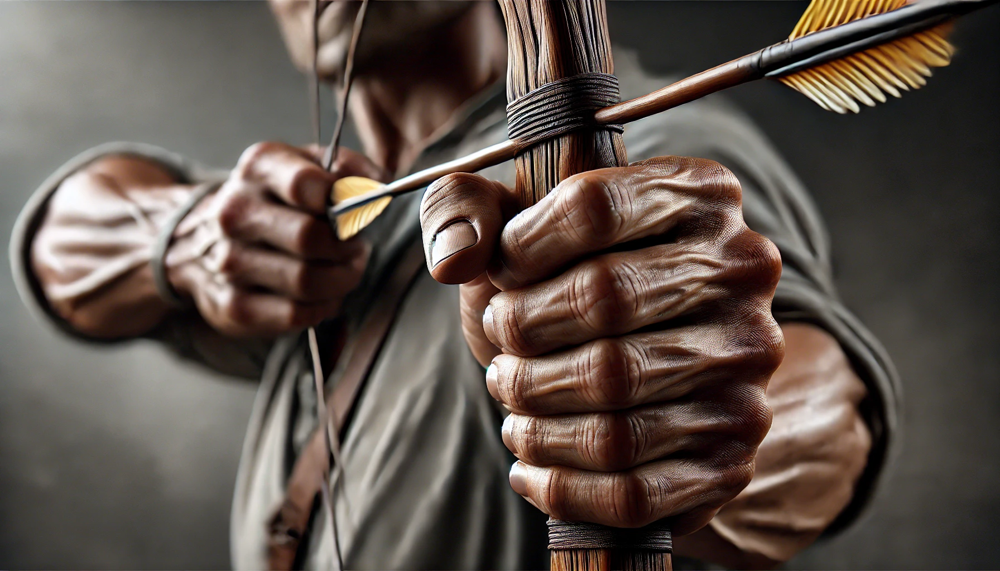

# 【生命⋅修行】行动的智慧

前几天，大宝把抖音、小红书等杀时间的软件都卸载了，然后告诉我，现在只剩下「视频号」会不留神抓住她的注意力。于是乎，我抽了个时间，帮她把微信里视频号的入口也都关闭了。

然后她开心地拿着手机，点开微信的「发现」页，得意地向我炫耀那只剩下「扫一扫」的空荡荡页面。

她告诉我说，之前发现看网络小说会影响心情，所以卸载了会推送小说广告的「手机百度」，然后就再也没有像之前那样被网络小说困扰了。

接着呢，她说自己一直以来都是用刷手机来放松自己，然而最近仔细观察了一下。连续两次——一次是我父母在这边的时候，一次是我回来的时候，明明有时间，经过了充分刷手机的「放松」之后，反而更容易焦躁、发脾气、吼孩子。相反，如果是用整块时间读书学习，人整个的心情都会好很多。

然而手机上那些短视频软件，确实设计精巧、算法独特，有十足的诱惑力，只要你拿起手机，它就能把你的「精神」牢牢抓住。最终只有彻底删除，在拿起手机的第一秒找不到它们，才能不被接下来的陷阱层层限制住。

所以，她就把这些软件全部删除了！

我有些惊讶于她的行动力，这让我想起了之前看的那篇克里希那穆提的访谈——发现看视频、刷手机这事儿不对，就结束了。

看小说时不纠结，停下来时也毫不犹豫；刷手机视频也坦然，删除视频软件也毫不手软。这让我深深感触，在行动的智慧上，大宝真是我的好榜样。

她说，接下来的10年，要专心学习实践投资。我能感觉到她的那股劲儿，有这股力量在，万事能成！

----

说到手机，看过之前采访Pieter Levels的[Lex Fridman的作息表](https://mp.weixin.qq.com/s/jfutA1S0ihPtAsvkHORQGg)，真的是「卷王之王」，让人叹为观止。

每天3 x 4小时的深度工作时间，再加上1～2小时的锻炼（跑6英里+力量训练），然后是两个小时的阅读（一小时论文，一小时文学作品）。

每天只查看一两次社交媒体，只在需要发布帖子的时候去查看，每次不超过10分钟。电子邮件也一样，最多三次！

猛一看，真的只能惊呼「不可能」，可是细细琢磨，发现这些都是《跨越不可能》这本书中所强调的基本作息原则！

这些都是很好的参考，自己在行动中好好调整吧！

PS. 啥时候，GPT的DALL•E 能把画真实照片的能力进化一下呢！