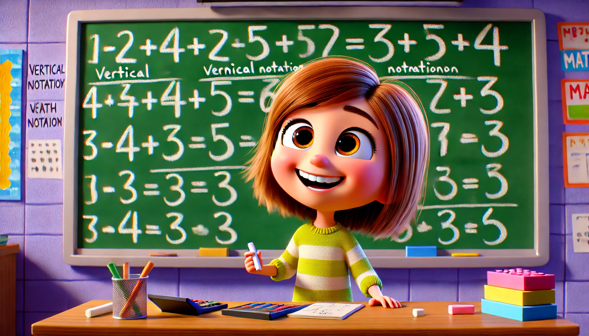

# 【随笔】闲聊孩子的教育

昨天不知怎么的，和老同事LZ聊起孩子的数学教育问题。他说发现中国小孩在大部分数学的教育上，犯了急功近利的错误。他们花了太多时间在解题技巧上，不仅仅是提前学习，更多的是直接总结、记忆各种快速的解题套路。就好像在那已知的一亩三分地，记忆各种各种捷径，以便能更快、更好地应付考试。但怎么探索这一亩三分地之外的新路径，却从来不涉及。

所以看起来，中国人普遍的数学能力比普通欧美人要强，其实只是因为我们背熟了九九乘法表而已。但是，因为大部分孩子忙于记忆那些「捷径」，反而根本没有时间做真正的思考，于是数学思维、逻辑思维的训练反而严重不足。等到了真正需要把数学用起来，或者进入更深入的研究领域时，那些思考训练不足的中国孩子大部分就茫然了。

到了今天，非常神奇地，我另一个老同事，大宝做阿胶的师傅M今天找她，送了些小孩子们的玩具过来。大宝向她请教最近特别困惑教育的问题，阿宝的作业越来越多、越来越慢、越来越不喜欢做作业，尤其是数学。M向大宝介绍了另一个妈妈的故事。她说，总结下来，那个妈妈有三点特别厉害的地方：

1. 孩子不喜欢的话，她可以帮孩子做作业。
2. 保护孩子的兴趣，让孩子一直能够有时间按自己喜欢的节奏，做自己喜欢的事情。
3. 不被老师的教学方法和节奏限制，自己带着孩子进行各种「项目式」的学习。

大宝感慨不已，虽然第三点可能很难做到，因为我们自己也不知道怎么顺着孩子的兴趣进行「项目式」的学习。但或许可以先做到第一和第二？

M说，核心原则就是：父母要帮助孩子成就自己！

接着，M又分享了自己教育孩子时的一些经历，讲述她的孩子从曾经「自闭」的边缘，到现在10几岁就能独自安排全家人的出国旅行、包括与大使馆等各种机构打电话、协调、沟通甚至吵架等等……知道这背后她的用心与如今的成果，让我们佩服不已！

----

道理是明白了！然而真正实践时会遭遇怎样的困扰，要怎样突破那些社会「规约」以及内心「恐惧」的阻挠，怕是还有很多坎需要一步一步跨过吧！

具体而言，大宝曾经在保护阿宝写字的兴趣与激情上，获得了成功。类似的原则，也能在数学上再次尝试一下吧。

