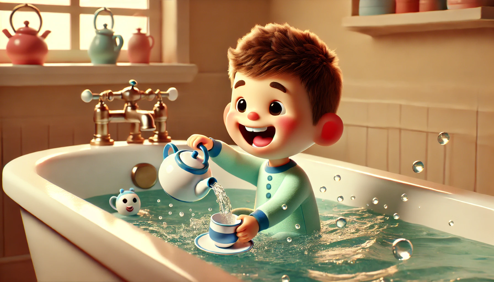

# 【生命⋅修行】永远有一个家在爱你

吃过晚饭，大鱼又拿着我的茶壶到处跑。我警告他，你可别把爸爸的茶壶摔了，不然看爸爸把你屁股打成四瓣。大鱼嚷嚷着说：

> 那不行！

阿宝接茬道：

> 那你说让爸爸怎么打你呢？要不然把你赶出家门去。

我一听，赶紧圆场说：

> 那倒不至于，打碎个茶壶可不至于要赶出家门。

等到了洗澡时间，我负责带大鱼去洗澡。大鱼当然不愿意去，只想在客厅玩耍。我拿出昨天管用过的老招式，说：

> 妈妈已经放好水了，昨天玩过的黄色杯子也还在卫生间，我们一起准备好，过去玩吧？

他拿起我的茶壶，说：

> 我要拿这个去玩！

那可是我泡茶用的，怎么能拿去洗澡盆里玩水？我这么想着，坚决不同意。大鱼开始发犟脾气，看着他捧着我的茶壶开始满屋奔走，我有点担心他因此摔了我的茶壶，便一把夺走。不管他嗷嗷大哭，径直回到卧室，把茶壶放回抽屉里。大宝远远地跟我说：

> 你就让他拿茶壶去洗澡嘛！

阿宝说：

> 爸爸可不让他拿茶壶去洗澡！

我也没搭理，然后，在卧室等了一会儿，听到大鱼没哭了，我就出来带他到了卫生间。谁知道，刚刚把他脱到光溜溜，他就指着澡盆告诉我说：

> 我是不会直接进去的……

我还没明白什么意思，他就开始往卫生间外跑。我左拦右挡，他光溜溜地左冲右突，最后硬是从我脚下钻了出去。看他往客厅跑，我就再次郁闷地回到卧室床上，打算躺下放弃几分钟。谁知道，他又光溜溜地折回卧室，熟练地打开我放茶壶的抽屉，拿出茶壶，屁颠屁颠地又跑了出去。

很快，就听见阿宝告状：

> 爸爸，弟弟又拿你的茶壶要去洗澡了！

我无奈地回答：

> 算了，我放弃了，让他拿吧！

阿宝这个听话的孩子，每次看到大鱼这么不听话，自然会非常生气。有时候，我们不得不告诉她，其实你也可以像弟弟一样，不必那么听话的。

晚上，我和大宝聊起这件事。我说，你还记得我给你发过一个蔡志忠的访谈视频嘛？我真希望能做到像蔡志忠那样，让家庭成为给孩子无条件包容与爱的地方。大宝笑我：

> 那你还浪费那么多时间，不让大鱼拿你的茶壶去洗澡！

我说，是啊，想想看，自己太多余了！我一定要再好好看看蔡志忠是怎么说、怎么做的。做不到他父母和他那么厉害，努力向他看齐也是好的。于是，今天早上起来，我再看了一遍这个两分钟的视频。蔡志忠在这个访谈中说到：

> 你真心爱一个孩子让他感受到，家永远是你最后的后盾。
>
> 1966年5月1号，因为台湾的政府不让漫画出版，所以要审查，所以文昌出版社要结束，所以我就回去乡下。我平常回去乡下都三天到七天。那次回去两个月，我爸爸跟我妈妈偷偷地说：
>
> > 看起来好像很严重诶，连唱机唱片全部都带回来了。
>
> 那我们隔壁的太太们就问我妈妈，这是后来姐姐讲的，说：
>
> > 哎，你们志忠怎么这次回来这么久。一个月都还没回台北画漫画。
>
> 我妈妈说：
>
> > 人家读书人……
>
> 我妈妈不认识字的，她认为认识字就叫读书人。她说：
>
> > 人家读书人做什么必有他的道理。
>
> 没有问我。就是家是你永远的家，爱住多久，住一辈子都是你的权利。连问都没有问。
>
> 所以我基于就像我爸爸对我的好处，妈妈对我的好处，给了我的女儿。
>
> 所以我的女儿结婚的时候，我单枪上阵。我一个人上去就讲这件事。我所有来自于我的父母对我的教导，就是你生而为主，你就是家庭的一份子，永远的支持。就像数学考0分还请吃牛排。家永远是你最后的后盾。
>
> 爱，爱是什么意思。
>
> 你真心爱一个孩子，让他感受到。他到外面就敢于面对任何挫折。勇于面对任何困难。让他知道永远有一个家在爱你，在支持你，没有条件的。
>
> 所以我说以心传心，我要把这一套交给我的女儿。无论她犯了多大的错误，永远地支持。
>
> 所以我相信她对她的女儿、子女一样。希望能够继续传承下去。
>
> 事实上我的女儿已经生了两个女儿。她也是做了最好的妈妈

----

说起来很简单，就像这样，让「爱」满家，并且**让每一个家庭成员都能感受到家中这无条件的爱**，并且传承下去，这就是「齐家」的最高原则与境界了！但是，要努力做到呀，加油吧！