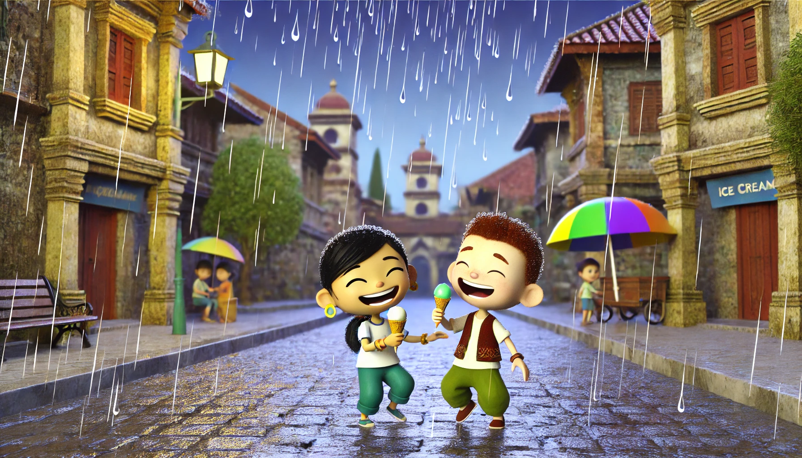

# 【随笔】冰淇淋与大雨

孩子们想要去中山公园玩，早上出门时太阳猛烈，大宝嘱咐我把一把太阳伞塞进包里——后来才知道，幸好如此！

在中山公园玩了一会儿，阿宝决定要出发去找她早就惦记着的那家冰淇淋，而大鱼已经累得不愿意走路了，一直嚷嚷着要抱。我们勉强挪到南头古城边，却怎么也没找到上次给阿宝买冰淇淋的地方。地图上能搜到的冰淇淋店一家叫「叻冰」、一家叫「酷矿」，可是打开店家的照片给孩子们看，他们都纷纷摇头，说不是上次吃的那家。可是他们也没法带着我找到上次那家店，只说记得上次吃过榴莲冰淇淋，并且店门口有一个甜筒冰淇淋模型。

这时，大鱼再也坚持不住，我只好把他抱了起来，然后把三条街都走了一段，却怎么看也不像。我说服大鱼在「叻冰」买了一个他想吃的巧克力冰淇淋，但阿宝却坚持必须找到上次买冰淇淋的那家店。无奈，我们再次回到靠近中山公园的门口，街角边正好社区在搞活动。一个女孩子看我带着两个小孩，主动过来对我们说：

> 我们现在搞社区活动，去三个地方打卡，就可以回来给孩子们领一份他们喜欢的礼品。你们要参加吗？

阿宝坚决地摇头。我便问那个女孩子：

> 我们在找一家冰淇淋店，孩子们上次吃过的，这次找不到了。

她问：

> 是「叻冰」吗？

我摇摇头。她说，古城东门旁边，刚进门处有一家冰淇淋店，只不过那家就是冰淇淋有点贵。

靠近门口，还有点贵？我暗自揣测，莫非就是这家？我狐疑地问：

> 那家冰淇淋店有点贵？

她说：

> 也还好啦，二、三十块，正常价格咯……

我心里更觉得这家靠谱，问过了详细路线，抱起大鱼，牵上阿宝就往那边出发了。

等我们吭哧吭哧走到古城东门旁，发现这家开在门口的冰淇淋店就是「酷矿」，冰淇淋看起来很好看、很好吃的样子。可是阿宝坚决地摇头，说不是这家。话说，我也知道不是，但还是尝试着劝说了一下阿宝，想让她要不试试新的口味？但阿宝非常坚决，无论如何不肯妥协。

说话间，忽然下起了大雨。我有些烦躁，走几步看雨越下越大，就把他们带到路边一个屋檐下躲了起来。可是，大鱼不干了，开始哇哇大哭。

一时间，太阳还照着大地，雨水却哗哗地，扯天扯地的落下来。大鱼也毫不客气，在雨声中放声大哭着，就是要出去，走到雨里去，丝毫不理会我的劝说。我也只好放弃不劝了。旁边有位阿姨看不过去，还一直尝试哄着大鱼：

> 不哭了，小弟弟。你看下大雨了，出不去啊！
>
> 你哭爸爸就不带你出来玩咯？
>
> 你看姐姐乖，爸爸带姐姐出来玩。
>
> ……
>
> 你看那边那个小哥哥多乖啊……

显然，这些招一点都不管用。大鱼自顾自地继续大哭着。我忽然意识到，刚刚转过这个屋檐下时，大鱼就立刻不乐意了。他不喜欢这里——这是一个神位，一边是关帝爷的神像，另外一边好像还有一个土地龛，地上积满了香灰，看起来应该是个香火蛮旺的地方。但不知道为什么大鱼害怕这里。

好在，雨已经渐渐小了，我赶紧撑起雨伞，抱起大鱼，牵着阿宝走回街上，果然大鱼就不哭了。

然而，刚刚的雨太大，地上早已积水成河，我的鞋子瞬间就被打湿了。湿就湿吧，我这么想着，决定重新走回中山公园的入口，然后再一个店铺一个店铺地搜索一遍。一抬头，却发现早就至少经过了一次的那家乐凯撒门口，赫然摆着一个巨大的甜筒冰淇淋模型。

我笑着招呼阿宝：

> 你看，竟然是这家店！我们刚才从这里过都没认出来……

阿宝说：

> 是啊，刚才我也没看到这个冰淇淋！

……

终于，两个孩子都能吃上自己想要的冰淇淋了！但是话说回来，我觉得其实「叻冰」的冰淇淋和「乐凯撒」的没啥区别，而且还会便宜一些。至于据说「有点贵」的「酷矿」，我自己还真想有机会去品尝一下呢。

