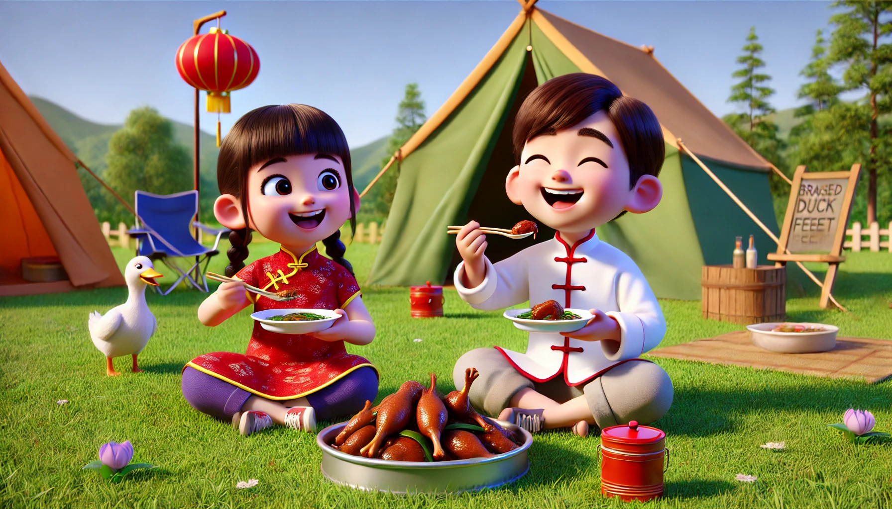

# 【随笔】怎么完全没有肉——大鱼趣事儿

早上起来，我感觉有很多事情想做，但是时间太有限，不知如何取舍。于是向大宝求助，大宝说：

> 随机安排吧！
>
> 优先做我想你做的事情，然后响应孩子们的需求，再有空就做你想做的工作或者事情……

于是乎，一家人吃过早饭，又磨磨叽叽各种收拾之后，决定拿上帐篷去海边公园的草地上露营喝茶。我兴致勃勃地收拾了一套茶具，拿上了一枚小青柑，孩子们各自拿了两个小玩具，大宝则带上了她正在钻研的《彼得•林奇的成功投资》。

没想到这个国庆节，深圳湾公园竟然有活动，平时大家露营的草坪上，早已被各种商家的帐篷占得满满当当，有卖牛奶的、卖饮料的、卖烤生蚝、烤肠还有各色美食的。于是乎，我们经不住诱惑，买了两盒酸奶，以及一包绝味家的麻辣鸭掌。做活动的商家占据了整整两大块草坪，我们一直走到里面才找到一小块空地，终于把帐篷搭了起来。

两个孩子看大宝和我一边喝茶，一边啃着麻辣鸭掌，津津有味不亦乐乎的样子，不由得跟着口水直流。可是，他们实在没有勇气尝试辣味，便强烈要求我再去给他们买一盒不辣的五香味鸭掌回来。

无奈，我只好又跑了一趟。他们开心地戴上手套，一人拿了一只鸭掌，开始啃起来。这才刚啃一口，就听见大鱼一声惊呼：

> 怎么完全没有肉！

大宝和我乐坏了，闹了半天，大鱼小朋友还以为我们刚刚吃的啥大肉呢。阿宝也乐了，告诉大鱼：

> 鸭掌就是吃这个皮的呀，很好吃的！

大鱼非常苦恼，又咬了两口，一副吃不到任何东西的表情。打算放下这个鸭掌，去盒子里再取一个新的出来咬咬看。

阿宝可舍不得，连忙把盒子端到自己身后，说：

> 所有的鸭掌都是这样的，只有皮。你吃完你这个，才能再拿下一个！

我只好仔细地指导大鱼，每一次在哪里下嘴，如何一点一点把那美味，但是没多少的筋肉吃到嘴里。于是，就见大鱼吧嗒着嘴，把咬到的鸭掌咽下去，再仔细把骨头吐出来。接着就举着鸭掌问我：

> 接下来呢？

我就用手指着告诉他：

> 咬这里，使劲扯下来，对了，把肉吃掉，骨头理出来！

大鱼吐掉骨头：

> 那再接下来呢？

就这样，不知不觉，他竟然也啃完了两三个鸭掌。一盒鸭掌吃完，他俩完全不满足，又逼着我再去买了一盒五香味的鸭脖子，接着是饮料，接着是玩具……

呼呼～

看来如今只要出门，就是自投商家的罗网呀……

