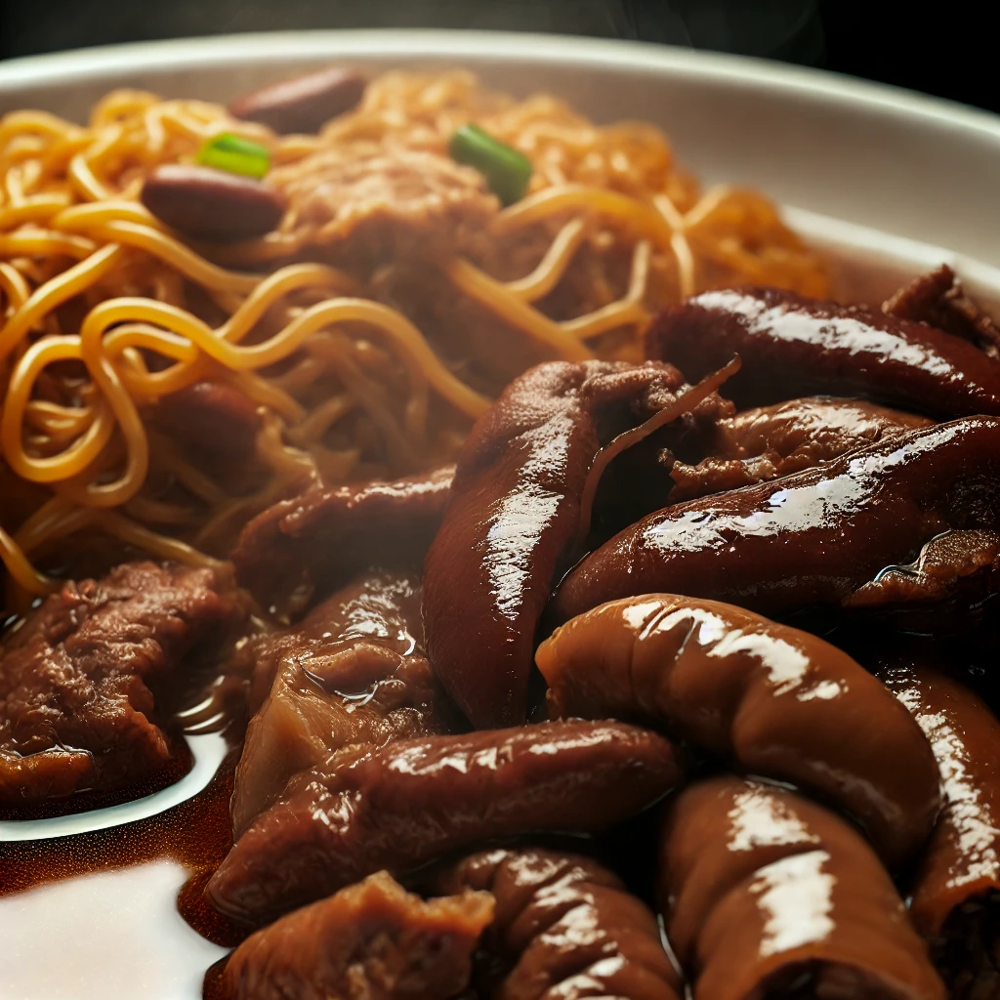

# 【随笔】澳门的小美食（续一）

吃过葡式蛋挞，在渔人码头摆拍了许多照片之后。在小红书上随意一搜，说是澳门的美食都在大三巴附近。看了看导航，徒步大约是50分钟的路程。那就上路吧……

从渔人码头出来的小巷子里，有一家网红冰淇淋店，门口贴着大大的招贴告示，说是只要在小红书晒照片，就能得到免费明信片和冰箱贴，看来小红书已经成了事实上的流量高地，开实体店所不能忽略的揽客渠道。阿宝却对明信片、冰箱贴等免费小玩意儿一概不感兴趣，只一心想要买一个芒果味的冰淇淋。

可是，咳嗽的大鱼也想要吃冰淇淋……为了避免激化矛盾，我只好把自己的馋嘴心思藏进肚子里，强忍着没有买99元10个球的蛋筒，只给阿宝买了一个冰淇淋球球，就拉着大鱼出发了。

走过人行天桥，路边发现一个小店，广式汤面的招牌，我们忍不住停了下来。热情地店家赶紧招着把我们迎进去，找了个凉快地方坐了下来，一面逗着大鱼，一面问我们要不要给小家伙弄个BB凳。这是一家典型的广东茶餐厅，墙上贴着免费WiFi的密码，还有各种特色吃食的介绍。店家阿姨特别热情，打开厚厚的菜单，告诉我们那个猪肝粉肠是许多人专门来这里必点的美食，另外还有卤鸡爪拌面，各种粥都很不错。

大鱼执着惦记着姐姐的冰淇淋，什么也不想吃。于是乎大宝和我完全按照自己的喜好点了两个店家推荐的招牌菜。果然，猪肝粉肠味道好极了，卤鸡爪也极其软嫩入味。他们家的面，再拌上桌上自制的辣椒酱，就那种香味多过辣味的广式辣椒酱，恰到好处。

我打开谷歌地图，想要记录下这个地方，环顾四周却看不到店名。店家阿姨过来告诉我说：

> 我们家叫「食得是福」！

唔，好名字，好地方！

<待续>