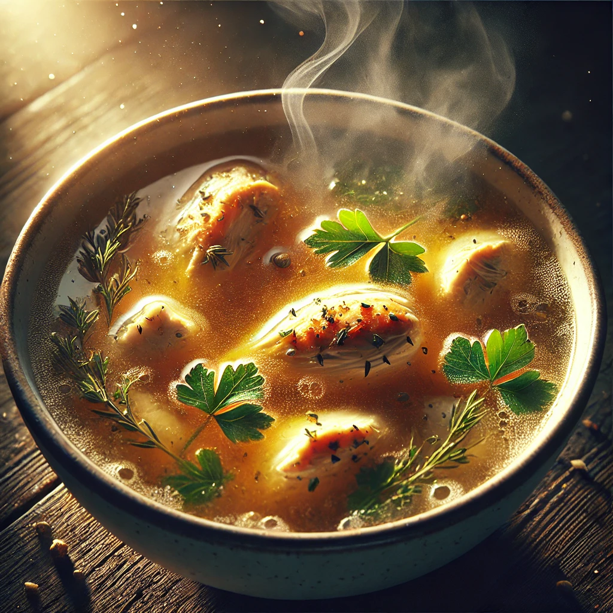

# 【随笔】澳门的小美食（续二）

吃饱喝足，继续徒步。

看地图还以为需要翻过一座山，等走到跟前才发现是一条行人隧道——松山行人隧道。隧道里一路都是自动扶梯，于是乎轻轻松松就走过了这四、五百米的路程。据说如果没有这个隧道，翻山绕行至少是一公里的路途。

不知不觉，就靠近了我们的目的地——大三巴。游人明显多了起来，不时会有举着小旗的导游，带着一大众游客迎面从我们跟前走过。等到绕过大三巴牌坊遗址，站在楼梯前，我们才真正地见识到这「热门旅游景点」的庐山真面目。

牌坊前的楼梯上坐满了人，而楼梯下的街道上，则是更加密密麻麻的人群。街道两旁的商店，几乎全都是卖澳门特产的商铺，店员们挥舞着手里的肉脯和剪刀，卖力地试图拦住每一个路过的游客……

> 我们去哪里买猪肉脯呢？

大宝问我，我也没主意：

> 应该任何一家都一样吧！

于是乎，我抱着大鱼，她护着阿宝，我们一头砸进人海之中，顺着人潮往前挪动起来。我们被游客挤着向前，经过一个商铺，又一个商铺。终于，一位大叔把我们拦住了，给我们一人手里塞了一大块猪肉脯，砸吧砸吧嘴，这味道还真不错！按阿宝的说法：

> 又香又软又厚！

大叔告诉我们，这是黑猪肉的。说着，看孩子们已经吃完了手里的肉脯，就又给他们剪下一大块。这么热情，可真不好意思空手离开，于是乎我们就在这里买了一大块黑猪肉的肉脯。

没走太远，另一位热情的大叔又说服我们买下了一大块猪颈肉脯。

这时，一个小哥向我们推荐他们家的葡式蛋挞。要25元两个。我很纳闷，问为什么别处都是10元一个，他这里的却要贵些。小哥指着他们家的蛋挞说，你看这层层酥皮，别人家做不到这么漂亮的酥皮。要做成这样，可是要花不少手工呢！

被小哥说服，我们又掏钱买了两个蛋挞。

太阳渐渐西斜，我们也渐渐地走出了人潮，但阿宝依然不可坐车，我们只好掉头从另外一个方向往码头走去。

……

在等船的时候，我看到有对情侣在那里吃着蛋挞，不由得嘴馋起来。于是给大家一人分了一块肉脯，一边吃一边和大宝说：

> 后悔了，应该多买些葡式蛋挞的。

大宝表示同意：

> 是的，刚出码头那家酒店的蛋挞最好吃。大三巴那家虽然贵，也不如酒店那家蛋挞好！
>
> 可惜，现在来不及再去买了！

就这样，带着些小小的遗憾，回到家时已经是快夜里11点了。

大宝把早上煮好的鸡汤重新加热，给大家各自盛了一碗汤。不用放盐，鸡汤也依然香甜可口，清爽宜人。这才发觉，其实最最美味的美食，原来还是在自己家中啊。

