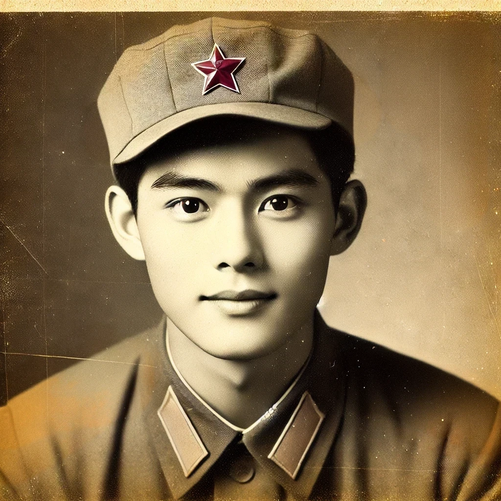
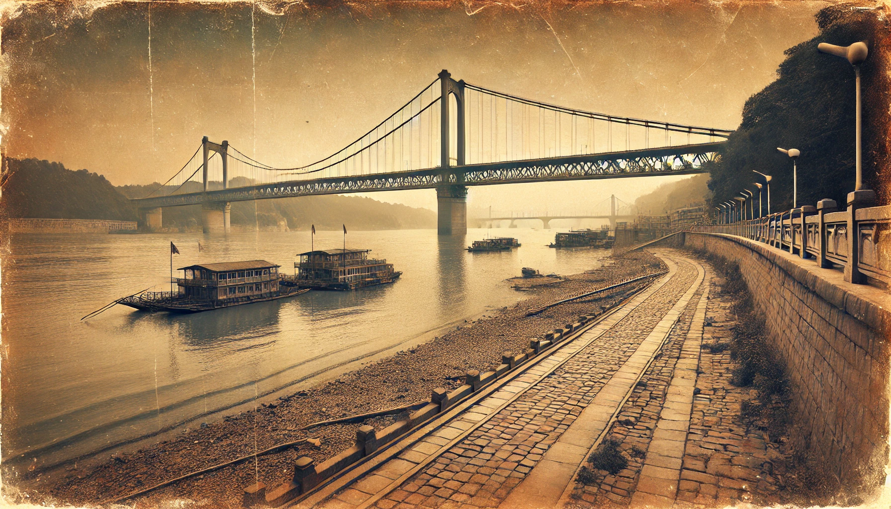

# 【生命⋅修行】向前看莫回头

那天阿宝把她奶奶的珍藏的各种宝贝全都翻了出来，其中包括奶奶的几本老相册。她兴致勃勃地一边翻看，一边帮奶奶把旧照片重新粘好。相册里有我小时候和年轻时的各种老照片，有奶奶知识青年时期和小时候的一些老照片，还有和爷爷谈恋爱时候的几张照片。其中有一张爷爷的当兵时的单身照。照片里的爷爷穿着军装，戴着军帽，英姿飒爽，眼神清亮，脸上甚至还有着尚未褪去的稚气与还藏在腮间的胶原蛋白。

我和大宝都猜着，这一定是爷爷给奶奶的相亲照吧，想必是刚当兵时拍的，算算年纪，当年应该是才刚刚十八、九岁的时候吧。

大宝拉着我进到屋里，有些不开心地说：

> 我认识你时，你就已经大约是现在这个样子了。翻了翻老照片才意识到，你也有年少轻狂的年纪，可是我却没能在你年轻时遇到你……

我抱了抱她，不知该如何安慰……

她又说：

> 你看阿宝爷爷当兵时的照片，多么年轻潇洒的小解放军啊！再看看爷爷现在，志气被消磨殆尽，衰老的样子。简直无法相信，一个意气风发的年轻人，会被岁月打磨着这般模样……

我笑了笑，说：

> 是啊，我爸爸年轻时，可比我帅多了。要不凭啥「欺骗」了我妈妈五十多年呢？

之后很久……（我的意思是，至少过了好几个小时那么久）

大宝忽然和我说：

> 我忽然想通了！

我问道：

> 啥想通了？

她说：

> 要向前看，以前的事情，遗憾也没有用，多想为此不开心更没有用。
>
> 我是说，你年轻时我没能遇上你这件事！
>
> 上次ChatGPT和我说得就非常好：
>
> > 要专注于我们能控制的事情，接受我们无法改变的现实……我们可以做的就是调整自己的心态。想想你所拥有的，而不是失去的。

我说：

> 对，那是斯多葛学派的观点。西方哲学的实践派，我喜欢他们的观点和那种与日常生活结合的态度！

大宝又说：

> 所以，还是要好好长养自己的心！
>
> 你看看你喜欢的张至顺老道长，他快一百岁时的照片上，那个精气神！还有，洪均生也是的。要像他们那样！！！

我点点头，表示特别同意。但后来又发生一件事情，我才意识到，大宝是真的大有体悟与进步，而我那时的「频频点头」，还只停留在「理论上知道」而已。

……

那是已经回到深圳的地铁上，我忽然发现阿宝只穿着单衣，之前拿过一件薄外套给她。然后，我低头看了看手里的纸袋子，我以为那件外套应该躺在这个袋子里，可是纸袋子里只有那盒还没吃完的矮子馅饼。我瞬间不淡定起来，问大宝：

> 阿宝的外套那里去了？

大宝说：

> 纸袋子里？

我更慌了：

> 不在！

她说：

> 那或者在你的背包里？

我有些急了，一面问着：

> 刚才是给她穿过外套对不对？好像没有放在我的背包里？应该是放在纸袋子里，可是什么时候丢了呢？

一面想起过去，搞丢过好多次阿宝外套的情景……

大宝却很淡定：

> 那可能就是丢了，或者被大鱼玩丢了？
>
> 不过，丢了就丢了。向前看，没什么好生气的。
>
> 而且，你可以看看背包里到底有没有，确实丢了，再说……

我把背包从背上取下来，拉开拉链，最上面是我的黑色连帽衫，然后里面，就是阿宝的格子外套，呼呼～我长长出了一口气，明显感觉到之前那不开心和焦躁的情绪被翻转了过来。大宝也感觉到了，说得：

> 所以嘛，我们可以先把能找的地方都找过了，再决定要不要生气。
>
> 我现在真的发现，不管怎样，只要向前看就好……
>
> 回头看，其实真没什么意义，许多回忆，大多时候，同时也是枷锁呢……

是啊，生命的大江大河滚滚向前，向前就好，又何必回头呢？

