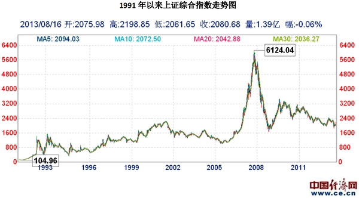
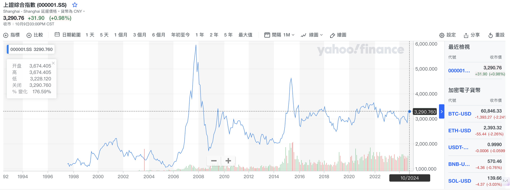

# 【随笔】又是3300，然后呢

9月底中国股市忽然被点爆，新老股民摩拳擦掌的情景是那么的似曾相识。除了大宝更频繁地问我：

> 为什么股票都涨了？
>
> XXX股票要不要买？
>
> XXX股票要不要卖？

其他朋友则都自有主意。

要么兴奋：**机会来了，要大赚一番，贷款也要上；**

要么鄙夷：**这完全是赌场，没有道理可讲，看不懂；**

要么恐慌：**终于有机会止损，赶紧解套拿现金在手，规避风险；**

……

忍过了整个国庆假期，但总还是想写点什么。有朋友劝我，此时此刻，千万不要和别人谈论任何关于大A股市的观点，原因很简单：

> **挡人财路，如杀人父母！**

不管是急着入市的，还是忙着止损的，说不准我的哪句只言片语，在对方看起来都是「拦着人家发财」，那可就不开心了！更糟糕的是，到了将来，因为各种变化，对方或许有了新的观点，再想起我曾经说过的话来，却又全是另一种「曾经拦着人家发财」的巨大罪过！

可惜，我这人有点不听劝，打算还是趁着节后股市调整到3300点的时机，聊聊自己曾经经历过的那几个「大牛市」的经历与感悟。

## 1994年的政策大牛市

1991年发布上证指数之后，老八股的暴涨以及随后的暴跌我是在后来才从各种故事里知道的。不知具体啥时候，父亲开始入市了。家里有一本《证券分析》的书，不是后来价值投资者奉为经典的那本，而是一个台湾人写的关于技术分析的书，厚厚一大本，详细描述了什么是K线，什么是趋势线，什么是成交量，还有MCAD等等各种技术指标的意义……关于证券市场的基础知识，我就是从这本书开始的。

到了1994年，熊了多年之后，忽然连续出台了三大利好消息救市。这时，母亲也进入了股市。读书的我也能感受到她赚钱的兴奋，那时候曾经跟着父母去过几次他们常去的交易大厅，门口停满的自行车，宽广得犹如火车站的大厅，密密麻麻喧嚣、拥挤如菜市场的人群，还有大屏幕上跳动着的红色/绿色数字，让我记忆深刻！

记得母亲和我说，再等几天，这个假期我们坐飞机回老家！

然而，那个假期我们没有坐飞机回去。母亲在那牛市里赚了多少，后面的熊市中就亏了多少，甚至只有更多。这个牛市给我这个近距离旁观者的教训是：

==想要再多赚一点，结果可能是全部亏回去==

## 1999年的519行情

等到了1999年，绩优股的理念已经流行很久了。深发展、四川长虹、深科技这些业绩极好的龙头股让人记忆深刻。记得那时候看过一篇股市的小说，里面讲到主角从参与炒作，到自己做庄，再到看云识天气，最后意识到身体强健的人，其实无惧天气的变化，似乎已经有了一些价值投资的理念。

当时受《穷爸爸、富爸爸》影响的我，把自己工作后不多的积蓄投入了股市。但我还是热衷于趋势、波段和技术指标，买了江苏春兰和小天鹅做各种波段。

跟随着5.19波澜壮阔的牛市，渐渐地，我把所有的钱都放到了股市上。然后伴随着2245点到998点的漫漫熊途，我这个新股民也变成了老股民，手里的钱也经历了腰斩再腰斩的过程。这个牛市给我的教训是：

==绩优股也可能不再绩优，下跌趋势不止损会亏光全部==

## 2007年的大牛市

其实这个牛市从2005年底、2006年就开始了，到了2006年底我忽然发现，自己买的某南方系股票基金竟然一年收益超过了30%还多。对股市的热情再一次被点燃，而我一面继续研究技术与趋势分析，一面也从当时最著名的两个私募基金经理但斌、李驰那里满满接受到一些价值投资的理念，开始了解巴菲特与芒格的体系。

而且，在那之前，因为公司的关系，我已经开始了小额的美股交易尝试。

等到了2007年，大家都开始再次疯狂起来的时候，我也跟着再次大举入市。慢慢地，自己投入越来越多，甚至将手中唯一的一套房子抵押后，把贷款也投入了A股。同时，在美股市场也开足了Margin。

在A股，我重仓了招行银行，在美股，我重仓了中移动和中石油。

那一年里，所有人都喜笑颜开，似乎身边所有人都在赚钱，赚大钱，一直赚大钱；美好的时光似乎可以一天又一天，一周又一周，一个月又一个月地永远持续下去，直到2008年！

招商银行跌回原位，我及时清仓算是勉强还清贷款，在这大A股的创世纪大牛市里，自己一分没赚到，倒是帮银行赚了不少利息。美股则没这么幸运了，中移动和中石油的持续暴跌最终触发了Margin的红线被自动平仓，分文不剩，美股账户只剩下放在网易上的一点零头，资产缩水了98%！！！

这个牛市给我的教训是：

==融资能迅速放大收益，也能巨额放大亏损乃至难以翻身==

在那之后，我开始埋头工作，远离股市，同时也更深入地了解巴菲特、芒格、段永平那一套价值投资的理论，并且完全放弃了技术与趋势分析的体系。

并且，开始逐渐认清自己作为普通人的事实，开始实践普通人最容易把握的股市投资方法：==定投ETF==

以上，就是我过去三次大牛市的感悟。

现如今，又是3300点，或许又是一轮史诗级大牛市的开端。且站在这里，回忆一下过往，重新回味一下曾经品尝过的「果子」，继续前行吧！

