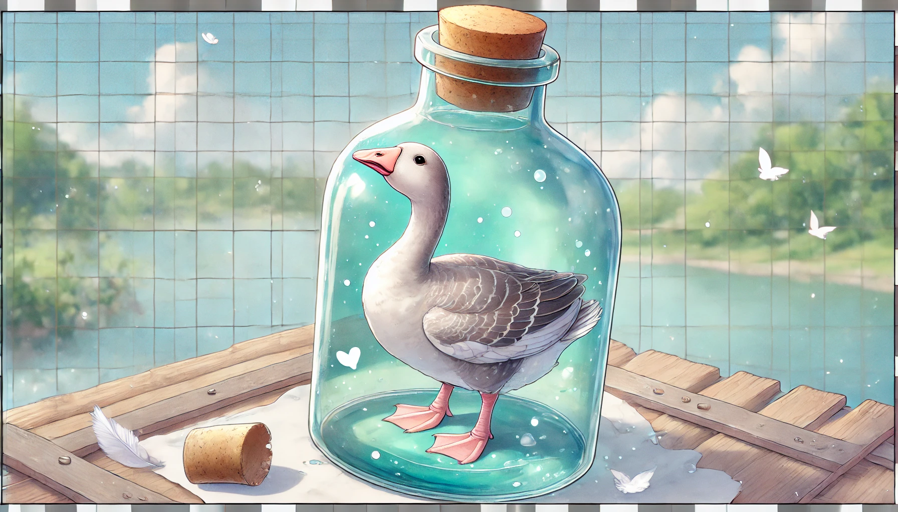

# 【生命⋅修行】解救瓶中之鹅

那天工作的事情上有些可能发生的变化，我转头就和大宝说了。然后，感觉她表情怪怪的……

我追问她怎么了，她却反问我：

> 你现在感觉怎么样？

我感觉了一下，回答说：

> 还行，但也不是特别好。

于是她说：

> 那就算了，等你状态好时再说。

我问：

> 可是，明明感觉你有情绪？

她说：

> 是的，是有情绪、有焦虑、有恐惧，但是现在和你说了，可能只会让两个人都不好！

于是乎，我就放弃了，但是，那种「她」的情绪因我而起的感觉，让我心里的感觉也变得更不好了……

没过几分钟，大宝忽然找我说话：

> 不行，我忍不住了。我本来想学蔡志忠的父母那样，不过问你的事，让你自己解决问题。但是，太难受了，根本憋不住，还是得和你说……

接着噼里啪啦两三句话讲完了她的焦虑和担心，有意思的是，刚说完她就好些了，而我也感觉好多了。

早上，大宝又想起这件事，似乎又陷入一点点中年焦虑的情绪状态，便问我能不能开解她。我说了些自己常常挂在嘴边的道理，表示人类关于生活的焦虑通常毫无意义，比我们生活艰难得多的先人，还有那些动物们，比如生活在大草原上的猎豹，吃了这顿就不一定下顿在哪里，它们依然会吃饱后快乐地找个地方去睡觉。

大宝说，讲这些道理没用！我便想起前两天才看的《瓶中之鹅》的故事来。便讲给她听：

> 宣州刺史陆亘大夫问南泉：古人瓶中养一鹅，鹅渐长大，出瓶不得。如今不得毁瓶，不得损鹅，和尚怎么生出得？
>
> 泉召：大夫！
>
> 陆应诺。
>
> 泉曰：**出也！**
>
> 陆从此开解，即礼谢。

她说不明白，让我再解释一下。我说：

> 以前唐朝有个刺史，相当于现在的一个市长吧。问和尚说，古人在瓶子里养鹅，结果鹅长大后出不来了。如果不能把瓶子毁掉，也不能弄伤鹅，你有什么办法把鹅弄出来吗？
>
> 和尚大声喊了他一声。
>
> 那个刺史条件反射地答应了一声。
>
> 和尚说：你看，这不是出来了吗？

她说，还是不懂。我只好继续掰扯：

> 就是说，你的问题与烦恼和这个养鹅的瓶子一样，都是自己想出来的。只要你想它，你就陷在这个解决不了的问题里。不去想它，你就不用陷在这个问题中了！

她说：

> 可是现实的问题还在呀！

我说：

> 现实的问题和你的烦恼是两回事儿啊。现实中有无数的问题需要我们面对，有些我们能解决，有些我们不能解决。大概率上，大部分问题我们都能解决；然后遇到那些解决不了的问题，最终也没什么大不了，不是吗？
>
> 就好像幼儿园老师说，我们家大鱼不肯参与和小朋友们集体跳操的那个问题一样。

大宝点了点头，又摇了摇头，说：

> 还是不懂，不过，心情好了一点点。虽然不是云开雾散那种……

我说，好吧，我的力量也止于此了。我自己也要时时刻刻留心不要掉进这瓶子里出不来呢……

