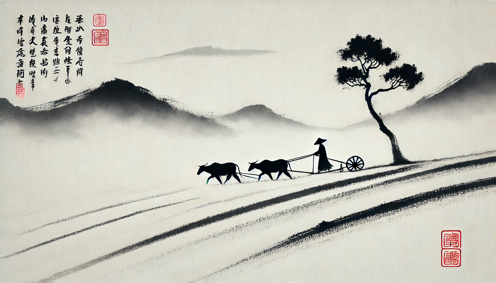

# 【生命⋅修行】还是要修个心安

看到林曦老师公开课的文章《[种自己的「福田」](https://mp.weixin.qq.com/s/PX4WP-VktcjARLt0YVAvFg)》，文章里介绍了一本书，是爱马仕总裁的回忆录，叫做《奢侈》。书中说：

> 我认为奢侈的事情就是我按照自己的节奏来。

记得那首[卓别林的诗](20181130【随笔】查理⋅卓别林的诗（十）  .md)里有这么一句：

> As I began to love myself I quit stealing my own time, and I stopped designing huge projects for the future. Today, I only do what brings me joy and happiness, things I love to do and that make my heart cheer, and I do them in my own way and in my own rhythm. Today I call it **SIMPLICITY**.
>
> 当我开始爱自己，我不想再偷走自己的时间，我停下来不再去为将来构想庞大的计划。今天，我只做那些能带给我快乐与幸福的事情，那些我热爱并且能让我心为之欢呼的事情，并且只用我自己的方式、自己的节奏去做这些事情。今天我管这叫做**简单**。

所以，原来「简单」就是真正的「奢侈」啊！

林糊糊老师分享她「养自己」的方法是三位一体的这三样：

养生——静坐

学问——读书

功夫——写字、画画

她说得特别好的一点就是：

> 养生最后展现出来的，是一个有生命力的、活泼泼的「形」，生命力其实是内在「气」的外在表现；而气的最高境界就是要「顺」；气想要「顺」则需要神「安」，也就是内心安定了，气才不乱跑乱堵。而最重要的是，这会形成一个重要的循环。
>
> **你的神需要安定下来，神定下来气顺了，人活泼生动了，然后就会产生一个东西，叫做兴致，它重新滋养你的心神。**——**兴致可以养神**

于是，结合这兴致所在，再辅以学问 + 功夫，就完成了更大的「养生」循环。看起来，这也正好是《庄子•养生主》中庖丁所说的养生之道呢。

想起最初在网上听说林糊糊时，她还是一名十几岁，刚以书画出名的天才少年。不知不觉，如今她已经成了几个孩子的妈妈，桃李天下的一方明师，真的是以技入道的典范，值得学习。

对我而言，也要继续实践这类似的体系吧：

长养心神，修个心安是根本，养身与做事是两方面的手段。而这两方面，又各自有一阴一阳两个互补的方法：

养身：静坐 （睡眠）+ 运动

做事：读书学习 + 工作实践

每日每月、每时每刻，如此而已！

