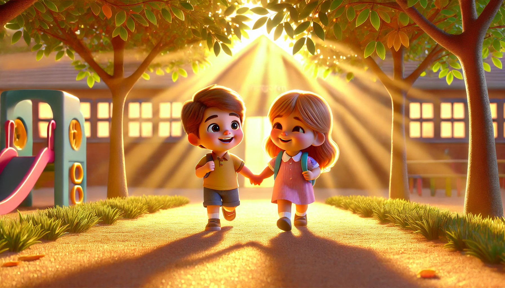

# 【随笔】我想要拉屎——大鱼趣事儿

早上还没出门，大鱼似乎就露出那么一丝丝不太乐意去幼儿园的意思。我让他拿着玩具先去楼下乒乓球台玩，他也就忘记了自己的不乐意，拿起两辆玩具小汽车就跟着我下楼了。等妈妈把阿宝送到学校，骑着电动车折返回来，大鱼兴奋地冲向妈妈，乖乖地戴上头盔就出发了。

谁曾想，等快到了幼儿园门口等时候，大鱼忽然露出不开心的表情，抱着妈妈说：

> 我不想要上幼儿园！

我们问：

> 为什么呢？

他说：

> 我想要拉屎！

妈妈说：

> 那，我们赶快进幼儿园去拉屎。

他停下来不肯走，嘴角和眉毛耷拉下来，眼看着就要哭出来了：

> 我不要去幼儿园拉屎！

妈妈拉着他的手，想牵着他继续往前走：

> 没事的，妈妈带你进去。

他却使劲拖着妈妈，看那表情，下一秒可能就要大哭出来。我心里暗想，糟了，这个早上可能要哭着进去了！

正在这时，身后传来一个清脆的女声：

> 这不也是你们班的吗？是XXX对不对？

回头一看，一位妈妈牵着一个小女孩站在我们身后，小女孩正可劲儿点着头。那位妈妈接着问那个小女孩：

> 那你们要不要一起去幼儿园啊？

小女孩点点头，大鱼也跟着点头，原本正要哭泣的表情说没就没了。小女孩走到了大鱼身边，她妈妈继续说：

> 那你们牵着手一起去吧……

我也跟着鼓励道：

> 那你们拉着手走吧……

大鱼毫不犹豫地拉起小女孩的手，肩并肩走到了幼儿园门口，连原本每次去幼儿园的必备节目——「亲自打卡」都忘到九霄云外了。这时候，他们班的幼儿园老师已经迎接了出来，大宝赶紧和老师说：

> 老师，大鱼说他想要拉屎呢……

老师听见这话，连忙牵起大鱼的手，想要带着他快步进去。大鱼却转头看了一眼刚放开手的小女孩，说道：

> 我已经不想拉屎了！

老师乐了，松开了大鱼的手，把两个小孩子都揽在自己身边。两个小朋友再次牵起手来，肩并着肩，开心地一起走进了幼儿园。金黄色的阳光穿过树叶的缝隙，灿烂地在他们身后，撒下斑斑点点。

原以为这是一个大鱼会哭泣着上幼儿园的早上，没想到迎来了这样一个神转折😄

