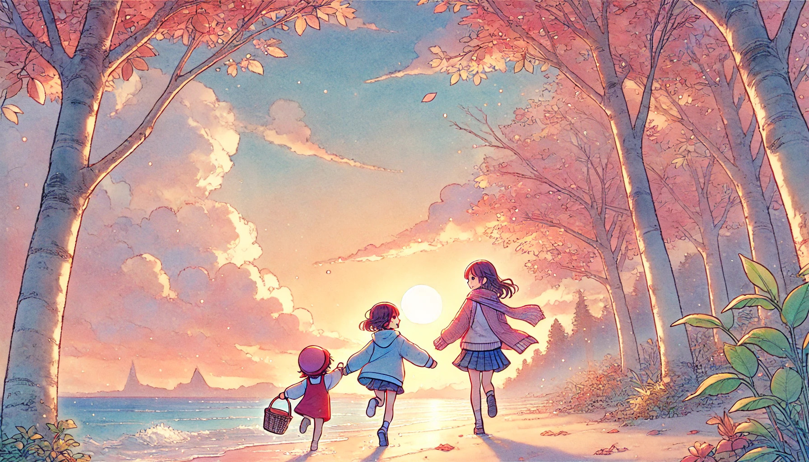

# 【随笔】手机的魔力

下午带着孩子们在深圳湾公园的草坪搭帐篷，刚坐下给大宝和我泡了壶小青柑，喝了两口，还在感叹——「哇，怎么这么好喝」时，娃娃们就嚷嚷着饿了。

一个要吃披萨，一个要吃鸡翅。我问大宝：

> 你之前是在抖音找到的优惠券最划算是吗？

她说：

> 是啊，可是我抖音都删了！你也没装抖音对吗？

我说：

> 是啊，要不我装一下？

她说：

> 那我再装上看看吧……

于是乎，她开始安装抖音，而我则在美团上查了查有什么团购优惠。结果发现，美团比抖音还便宜几块钱，我便直接在美团下单了。

然后，神奇的事情出现了。大宝再也没有放下过手机，甚至直到我们吃饱喝足后，她还把我叫过去，和她一起欣赏「莎头」CP的各种有趣视频。她一边看得不亦乐乎，一边和我分享说：

> 现在的体育明星，比娱乐明星还有意思。
>
> 你看，你看，你看！

于是，我和大宝两人躲在帐篷里乐呵呵地看抖音，两个娃娃则在我们身上爬来爬去，阿宝拼命地往我头上爬，有时候把我手踩的生疼，大鱼拼命地往大宝头上爬。最后我实在累得受不了，宣布不看了！往后一趟，躲在帐篷里喘息了一小会儿，就被大宝叫出来收拾东西准备回去……

正午时分曾经耀眼无比的烈日早已西斜，草坪上又多了许多人，我们身边搭帐篷的人已经换了两波。我把帐篷里的各种杂物慢条斯理地拿出来一一打包，大宝则在旁边练着太极拳，孩子们也不再围着我们打转，自顾自地开始玩各种游戏。

大宝忽然想起什么，和我说：

> 你发现没？我们看手机时，两个孩子就不停地往我们身上爬。
>
> 现在我们不看手机了，他们也就不再不停地围着我们了，反而自己去玩了起来！

我也发现了，忍不住感慨：

> 这手机，还真的好像是有点「魔力」在呢。一种抓取我们「注意力」的魔力。我们看手机时，孩子们就会过来和手机「争夺」我们的注意力。
>
> 现在你打拳，我收拾东西，也没管他们。他们却玩得自由自在……

大宝说：

> 嗯，和老公一起嗑「莎头」CP虽然开心，但是回头想想看，也没什么意义，一下午就过去了。我还是把抖音删了吧……

太阳已经落到了树丛后面，秋日的蓝天显得特别高远。头顶的几朵云彩已经变成了粉红色，草坪上那些「生活市集」的灯光已经亮了起来。我抖了抖帐篷里的灰尘，然后卷好收起来，叫孩子们：

> 走吧，把小螃蟹和小鱼们放回大海，然后回家了！

孩子们拎起小桶，欢呼着牵着大宝的手跑向海边，我连忙拿上几大包杂物和一个巨大的蓝色气球，跟了上去……

