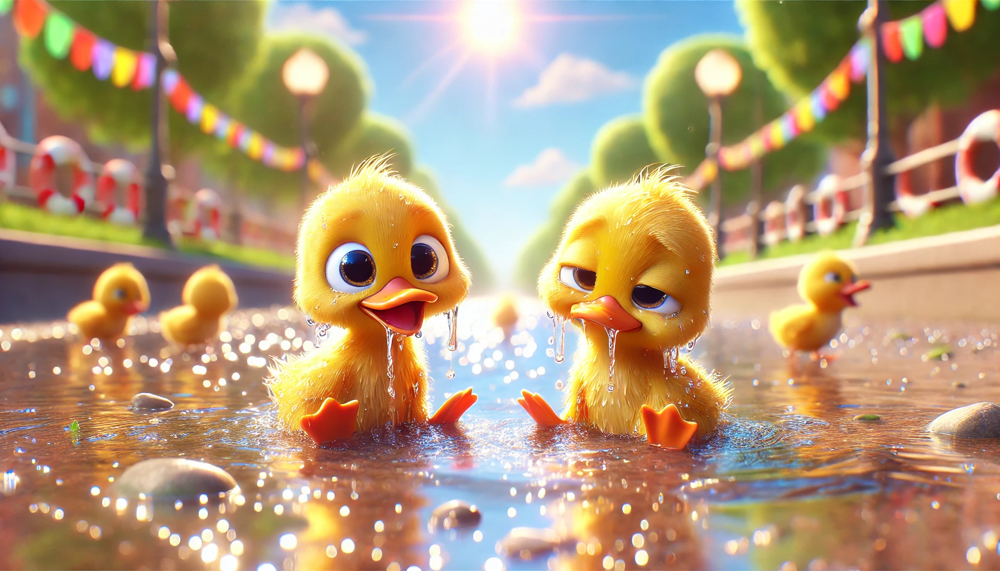
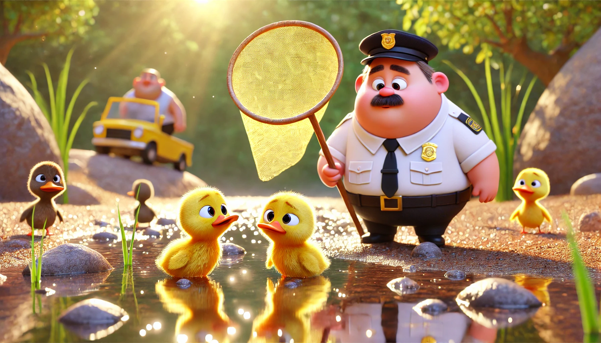

# 【随笔】拯救小鸭子

早上刚到河边，大宝趴在栏杆上，指着河中心对我说：

> 看，小鸭子！

我顺着她指的方向看过去，找了一会儿才发现，真的有两只小鸭子在河里游着泳。小鸭子个头刚刚长大，但身上还都是绒毛。看见人来，它们还积极地凑过来，隔着栏杆，冲我们绕着圈转来转去。我觉得有趣，大宝却说：

> 不知是谁家养的宠物，不想要了扔在这里。可是这条河它们没有上岸的地方，小鸭子没法休息，活不过一天。
>
> 小鸭子是没办法在水里一直游的，你看，它们的绒毛都已经被打湿了。

我仔细看了看，两只小鸭的绒毛果然都已经湿漉漉的了。其中一只湿得更厉害些，明显游得也更吃力，身子更多地沉在水面下，只有脑袋勉强可以露在外面。它们俩一前一后地游着，大部分时候，那只湿得更厉害、沉得更深的小鸭都是紧紧跟在另一只的后面。

那怎么办呢？环顾这条河，两岸全是陡峭的水泥河岸，根本找不到小鸭子可以上岸休息的地方。一直往下游，则是大海，那里有一个坝拦着，它们也过不去。心里一软，我决定还是想办法把它们捞上来。至少让小鸭子先在岸边歇会儿，然后或许放到四海公园去，它们还能有个活路。虽然，在城市里，这么小小的鸭子，面对那些流浪猫流浪狗之类的危险捕猎者，能活多少天也是个未知数。但，至少先捱过今天？

大宝说需要一个大捞网，我找清理河道的清洁工询问未果，决定回家去拿孩子们的捞鱼网来试试。大宝说：

> 其实，我们改变不了什么。鸭子的命运，终究是要被人类或炖或烧啊……

我一面去骑车，一面回头说：

> 人的命运也一样啊，每个人终究都要面对死亡！

……

拿来了两个捞鱼网，绑起来才勉强够到水面。小鸭子已经在这里游了好几圈，看见我们招呼它们，它们就会热情地游过来。显然是被人养熟了的小宠物。但我们一挥舞捞网，它们就害怕地躲开。唉，鸭子这愚蠢又胆小的天性，还真是没办法，它们完全无法理解，这捞网是来帮助它们的工具。

大宝告诉我，鸭子最蠢了。老家养的鸭子，每次想要赶会鸭棚都要费老大劲儿。刚刚，那白色的水鸟从头顶飞过，它们俩还吓得钻到水下去躲起来呢。

保安看我们在这里使劲捞，也凑过来询问。我们告诉他们，这鸭子太小，这河里没有歇脚的地方，它们活不下去。其中一个胖胖的保安说，可以捞回去和他的两只小鸡养在山上一起做伴。我问：

> 你还有养两只小鸡？

他说：

> 是啊，养在宿舍那里。

我说：

> 那最好了，你可以把它们捞回去养起来。

胖胖的保安招呼正在附近清理河道的清洁工：

> 老廖！老廖！
>
> 过来帮忙把这两个水鸭子捞上来！！！

老廖应声而来，可是，今天他没有开往日里那艘机动船过来，只是划了一个充气筏过来。他挥舞着大捞网，想要抓住它们，小鸭子害怕地唧唧叫着，绕过它的筏子，向远处游去。很明显，小鸭子们虽然看起来没了多少力气，但老廖用捞网当作船桨，操控着这个笨拙的充气阀，根本追不上它俩。老廖表示无奈，只好继续在河里捞树叶……

我们也有些没办法，不时有路人被小鸭子吸引，围观一会儿又离开。可是小鸭子游来游去，疲惫得不行却始终没能靠近到我们可以轻松把它俩捞起来的距离。

正在我们准备放弃的时候，胖保安带着一个黄色的大网兜，骑着电动车又回来了。问我们：

> 鸭子还在吗？

大宝指了指河的下游：

> 刚才往那边游，现在看不到了！

胖保安往远处瞅了一眼，说看到了。就骑车奔了过去。我戴上眼镜，使劲儿瞅，只见河面波光粼粼，清晨的阳光照在河水上，晃得有些睁不开眼睛。但是，鸭子在哪里，根本看不见。大宝也表示惊奇：

> 他就看见了，眼睛是5.0 啊！

过了一会儿，大宝也看见了，但我依然没找到小鸭子在哪里。唉，近视眼真是可怜！

……

没多久，我就听见河对岸传来唧唧唧唧的叫声，胖保安成功的捞上来一只。然后一脸焦头烂额，想抓另外一只，可是抓上来那只一点不老实，总是想逃跑。远远地，都能看到他忙得一脸汗水，无奈的样子。河边运动河散步的路人们，也纷纷好奇地围了过去……

我和大宝相视一笑：

> 估计，这胖保安一定能把小鸭子都捞上来，带回去吧。
>
> 起码，他家里已经养了两只小鸡；而且，我们已经告诉过他，这小鸭子已经湿漉漉，在这河里其实活不了多久。他看起来也相信了我们。不管这两只小鸭子最终的命运如何，今天的生命危机应该可以安然渡过了！

