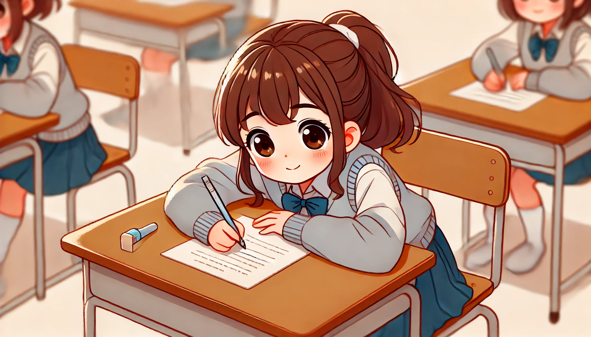

# 【生命•故事】（122）何处春江无月明

想必读初中的年纪，正是青春期的开始。再不像小时候，整天故意和女孩子对着干。反而，有许多带着微妙青春期情愫的有趣记忆。记得有一次，我们在班级上组织「卡拉OK」的活动，便一个又一个地说服同学们参加。

有些同学天性落落大方，毫不犹豫地就报名了。但有些同学则犹豫半天，需要一再鼓起勇气。记得那次有一个和我们关系不错，姓Z的女孩，她报名唱了一首姜育恒的《再回首》。想必，当众演唱就好像当众演讲一下，是需要非常大的勇气吧。那首歌她唱得真的非常好听！可是，等她唱完歌走下讲台，我们才发现，她早已经紧张加害羞，脸庞涨得通红……

后来又有一天，不记得是什么原因了，我的好朋友ZK和她争执起来，她说ZK有啥事情错怪了她，不依不饶地要求他一定要说清楚。于是，一直在那里嚷嚷着：

> 不行，你一定要和我澄清！
>
> 一定要和我澄清！
>
> 一定要和我澄清！

她嚷着，嚷着，我们这些看热闹的忽然听出歧义，不由得取笑起来：

> 什么？
>
> 为啥要一定和他成亲？

她猛然反应过来，又一次把脸羞了个通红，埋着头把大伙儿推开，冲出教室去了。

……

还有一个女孩儿，好像有很长一段时间一直坐在我后面还是前面，只记得她成绩挺好的，而且也是我们团支部的成员，那时我对她一直有一种默默的好感。有时会在和朋友聊天时忍不住提起她来。因为她名字中有一个「明」字，ZK有时会故意地、有些意味深长地冲我念那句「滟滟随波千万里，何处春江无月明」。我总是假装不懂，不予理会。

有一次考试，应该是地理。有一个填空题她不会，忍不住偷偷问我。我悄声告诉她：

> 爱琴海。

她没听清，我只好稍微大声地重复：

> 爱琴海！

结果，她还是没弄明白，也不知是紧张，还是不明白我所说的意思，脸刷地红到了脖子根。我只得一遍又一遍地压低低声音，靠近她的耳边重复着：

> 爱琴海！爱～琴～海！！！

终于，她好像搞明白了，轻轻地哦了一声，动笔写起来。脸和脖子依旧通红，头几乎迈到了桌子底下。我猛然意识到「爱琴」与「爱情」的谐音，不禁也心神荡漾一下，怀疑她是因此羞红了脸，不由得暗自有些小小的得意起来。

……

还有两个女孩，坐在我后面，其中一个我们语文老师专门点名批评过，说她不应该化妆到学校来。大约因为成绩不是太好，而那时我海依然有些成绩的偏见，和她们交谈不多。然而有一次，我忽然发现，自己随手在纸片上写过的一个「夢」字，竟然被其中一个姓Y的女孩郑重其事地收藏在来笔盒里。问她为什么，她只说这个字写得好看。

自己写的字，竟然被女生收藏，小小少年的虚荣心，又被悄悄填满了好几分。

……

那时候，ZK比我大两岁，正儿八经地谈了一个女朋友。有一次，他带着女友，和我另外两个朋友到我家玩。不记得聊得是什么，她女朋友夸了我一句：

> 没想到你还挺幽默的！

被女孩子这么夸奖，虽然是好兄弟的女友，我还是忍不住飘飘然了许久。甚至忍不住对ZK充满了羡慕，如果我也能像他一样，交个女朋友该多好……可惜，那时候的我，一直是小个子乖乖好学生的人设，「谈女朋友」这种典型的「大逆不道」举动，对我来说是想都不敢想的事情。于是，这个念头就只能在自己脑子里转了一圈又一圈，不好意思让任何人知道。