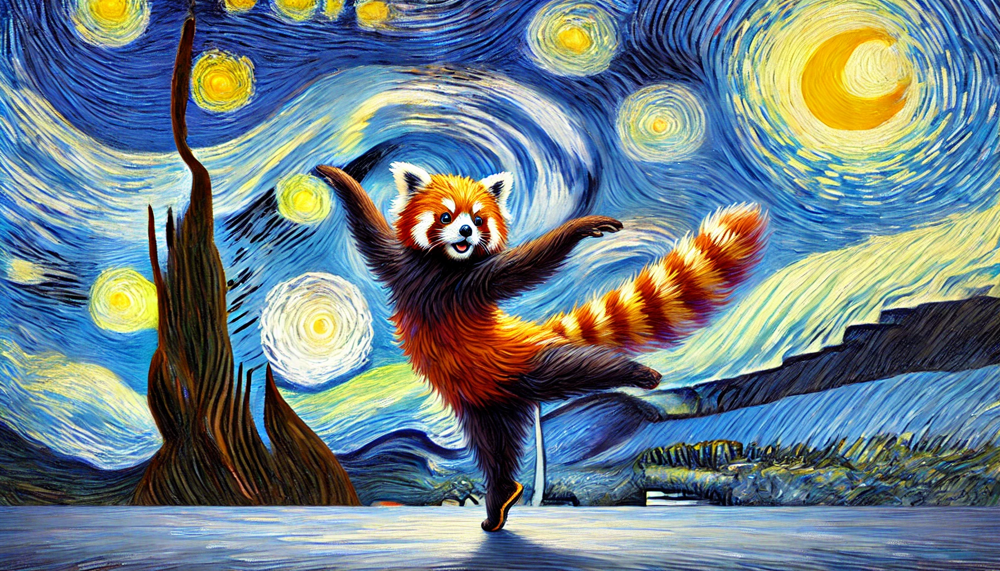

# 【生命⋅修行】生活的艺术

前几天，看到李银河公众号文章《[生命的狂欢](https://mp.weixin.qq.com/s/bTxBbeAbQQOXt6oRzEmbJg)》和《[人的生活应当是艺术品](人的生活应当是艺术品)》时，就想起李小龙的那本《[生活的艺术家](https://m.douban.com/book/subject/3052671/)》来。

这本书买来应该有好几年了，记忆中是单身的那段时间读过它。这会儿它正默默躺在阿宝的书架上，与两套郭老师写的《陈氏太极拳》系列和一本《老子》比邻做伴。旁边还有一本来自[莫迪默•J•艾徳勒](https://zh.wikipedia.org/wiki/%E8%8E%AB%E8%92%82%E9%BB%98%C2%B7%E6%9D%B0%E5%B0%94%E5%A7%86%C2%B7%E9%98%BF%E5%BE%B7%E5%8B%92)的《[如何听 如何说](https://m.douban.com/book/subject/3115238/)》。

和众人的看法不同，李小龙虽然热爱功夫与电影，但他自认为自己是一名哲学家，是一名用全部生命来实践自己哲学的——生活的艺术家。一如庖丁，作为知名厨师，却说：

> 臣之所好者，道也，進乎技矣。

所以，昨晚阿宝问我：

> 爸爸，你为什么总喜欢讲道理？道理又是什么？

我竟然无言以对，尝试着解释了两句，她依然不明白，只说：

> 反正，我不喜欢你讲道理，听了就犯困！

……

道理真没什么用——如果不能把它们活用在自己生活里！而生活，是艺术！生命，是狂欢！！！而艺术与狂欢，本质上是如水、如火一般生命力的喷薄流淌，是不会被那些「死」道理所拘束住的。

所以，在西方的哲学体系中，[斯多葛主义](https://zh.wikipedia.org/wiki/%E6%96%AF%E5%A4%9A%E8%91%9B%E4%B8%BB%E7%BE%A9)的主张最是深得我心：

> 在生活中实践「道德」是达成幸福——享受道德生活——的充分必要条件。

[爱比克泰德](https://zh.wikipedia.org/wiki/%E6%84%9B%E6%AF%94%E5%85%8B%E6%B3%B0%E5%BE%B7)还说过：

> 哲学不能为人的外物作出任何保证，否则它就承认了独立于主观物质外的某种东西。木匠的材料是木头，雕刻家的材料是黄铜，而人的生活艺术的材料则是各自的人生。

关于我们自己的生活这件艺术创作，我们拥有的是独一无二的材料，同时，我们也是独一无二的艺术家。

