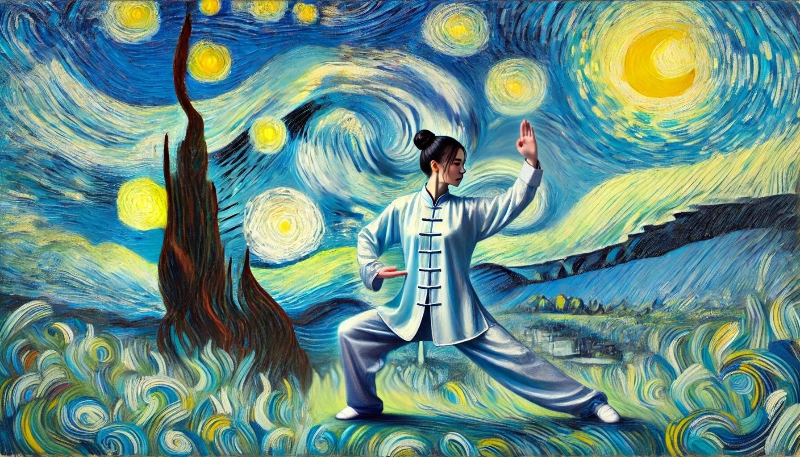

# 【生命⋅修行】做容易的事还是难的事

大宝去找师爷学太极拳已经快一个月了，那天她给我发来一条消息：

> 越学我就觉得越要好好学，我想之后有时间最好能天天来。
>
> 真是好东西！
>
> 不学可惜了！！！

看来，真是好东西。她也真的是越学越开心。这段时间，任何时候，但凡有几分钟空，她就会站在那里，把弓马步一扎，自顾自练习起来。如果我在旁边，她不时还会让我使劲从某个角度推她一把，好体验琢磨那精妙的「缠丝劲」到底练到位没有。

在无数次越来越轻松地破坏我的重心，把我扔出去之后，她感叹道：

> 我领悟到一个道理。
>
> 你看，真的劲儿用对了的时候，我也轻松，你也轻松，大家都舒舒服服的，然后你就被我打出去了。
>
> 如果觉得特别吃力、难受，那一定就是劲儿没用对，哪个地方犯顶了！
>
> 我发现，生活中也一样，如果觉得特别难受，那一定是因为不肯接受事实，和这现实世界犯顶了。比如，前段时间因为「被欺骗」的事情，我特别痛苦；然后现在却舒服多了。区别就在于是否接受事实，是否和这世界「犯顶」。
>
> 带孩子也一样。大鱼3岁以前，当感觉要花很多时间照顾小孩，不能做自己的事情，那种「犯顶」的状态，就会很难受。结果是孩子也没照顾好，自己的事情也做不好。倒不如接受现实，用心陪着孩子，心里来得舒服痛快。等到小家伙上幼儿园了，自己舍不得这曾经亲密黏人的小宝宝忽然不在身边，也会难受。但如果接受了这个事实，就能轻松享受自己自由支配时间，享受做自己热爱的事情那种快乐了！
>
> 所以练拳和生活处事的道理都一样，如果做对了，一定是轻松容易的！！！

我点点头，说：

> 是的，记得《道德经》里就是这么说的。
>
> > 图难乎亓易也，为大乎亓细也，天下之难作于易，天下之大作于细。

说到这里，我却想起常常听说的那句「做难而正确的事情」来。而且，最近正好又看了一篇介绍[Paul Graham](https://paulgraham.com/)观点的文章——《[让我们从不大的生意做起](https://mp.weixin.qq.com/s/w1ng7nYnOAMcenZHmiL5Zg)》，我觉得其中提到要坚持、哪怕是笨办法一步一步获取早期用户、取悦早期用户的观点非常正确。但是，这和前面那个「如果事情做对了，一定是轻松容易的」观点好像有点矛盾啊！

我把这个困惑说给大宝听，她却干脆地回答说：

> 一点都不矛盾啊！
>
> 练拳也是这样。虽然劲儿用对了会很轻松，但是刚开始，你根本不可能用对劲儿不是吗？唯一的解决办法，不就是一遍又一遍地做那些基本动作吗？没有任何捷径，每一次你都会觉得很难，因为你没有做对。但你必须一次又一次地练下去，因为只有练下去，你才有可能做对。
>
> 你说的那篇文章，虽然讲的是创业，但和练拳的路径，不是一模一样的么？

她想了想又说：

> 师爷说了，只有两种人学不会太极拳。
>
> 一种是太聪明的人，练法一听就明白，但是上手却做不到，于是永远在怀疑，总是不肯练，结果永远学不会。
>
> 一种是太笨的人，最基本的练法也听不明白，根本没法正确地开始练习，也是永远学不会。

嗯，我是「太聪明」还是「太笨」呢？话说，这样的「太聪明」，也不过是「自以为聪明」的另一种愚钝吧……

