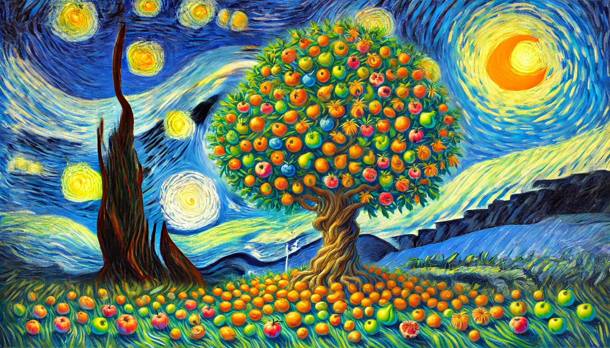

# 【生命⋅修行】牢记二八定律

前天开始写作时，已经是晚上9点过、快到9点半了。我想，按照往常一个小时左右来计划，还是可以赶在10点半前上床睡觉的。

果然，写完约莫一千字左右的文章用了大概不到50分钟，我一看还有时间，就又调整修改了一下。接着打开GPT的网站打算配一张图，之前用梵高的《星空》风格曾经得到过一两张看起来很不错的图片，所以，我打算继续用这个风格画一个打太极拳的女孩。

可是，GPT再一次没把人手处理好，并且，女孩子像是在跳舞而不是打拳。好在GPT现在有局部修改功能，于是乎，一顿修修改改……猛一抬头，才发现，时间已经到了11点半。图片效果依旧只是勉强而已。不得了，这时间可过得太快了！我赶紧结束配图，把文章扔到公众号上。等到上床睡觉，已经接近午夜12点了！

可以说，最初的50分钟，已经把每日写作的任务完成了，至少80分。可是，接下来因为执着地想要提升那么一点点效果，又花掉近一个多小时。如果不是意识到太晚及时打住，恐怕接下去再花一、两个小时，也不过是得到一张效果更好那么一点点的图片而已。而且，还存在一种可能性，就是GPT根本无法画出更好的图片来，得不偿失。

真的就像冯唐所说，一定要警惕完美主义，一旦做到80%的效果，就要坚决停止。这样，5个20%的时间，可以达成400%的成效。如果不停下来，把剩下80%的时间全花在这件事情上，也无非得到一个接近100%的事情效果而已。

牢记、切记！

