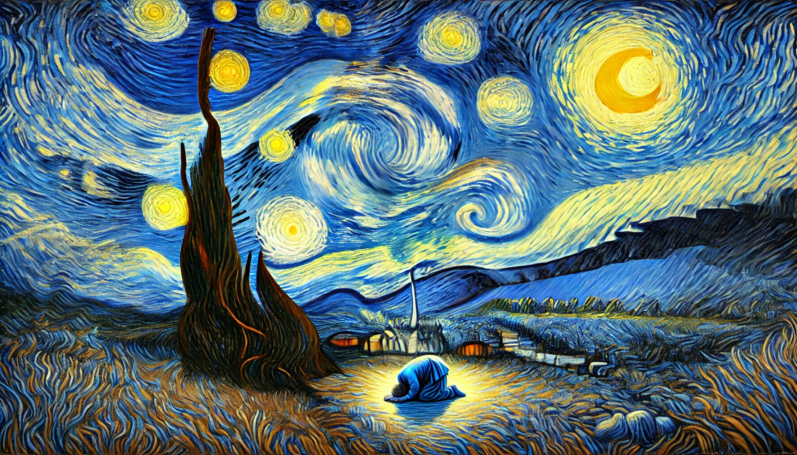

# 【生命⋅修行】进步与退步

最近很长一段时间，我会时不时地怀疑自己是否退步了。以至于，我曾经在鬼脚七的那篇《[写作与修行](https://mp.weixin.qq.com/s/du-EHB8-cXls-1uKbxBq0w)》文章后回复，[不论写作还是修行，自己都有强烈地退步感](20241014【生命⋅修行】写作与修行)。

甚至，我还会时不时地向大宝确认，相比刚认识她的时候，我究竟是退步了，还是有所进步。每一次，我都想听到「自己其实还是在进步」这样肯定的答案，而且也确实会听到。但明显越来越多的情绪波动，以及不时因为严重的情绪导致自己不能动弹的情形，会让我在一段时间之后再次心生疑虑……

昨天，看到勤勤姑娘的这篇文章《[我和《臣服实验》作者本人面基了！](https://mp.weixin.qq.com/s/ovf36oO-CVEz_o5eRHEf3A)》，其中写某人问类似我这种问题时，迈克尔 · 辛格 (Michael Singer) 做了如下回复：

> 从你的描述中可以看到，你看见了你的情绪，这已经特别棒了。大部分人做不到看见，而是成为了情绪 (Most people don't see it; they are busy being it)。
>
> 你当然可以去冥想、呼吸放松等等，有时work，有时情绪还是在那儿。这时**最好的做法，就是be okay with it。**
>
> 这是净化的一部分 (part of your purification)。**一些深藏于潜意识里的伤痕和业力在浮上来。**你的小我在疯狂起反应。
>
> **你可以欣赏和感恩这就是净化必经的过程吗？**(Can you appreciate that this is the process?)
>
> 就像我有个朋友，患了癌症，接受了化疗，很痛苦。你要决定如何面对，是抗拒或抱怨痛苦，还是接纳和感恩它，因为它可以救我的命？
>
> 你能做的最高维度的事情，就是尊重这个过程，而非把它看成坏的或者非灵性的。(The highest thing you can do is to respect the process, instead of seeing it as bad or non spiritual)
>
> 一定是有一些非常深层的东西被激发了，所以制造出这些情绪。我想让这些东西浮上来。我愿意给它它需要的时间，无论多久。
>
> 你要尽最大努力服务于这个属于你的净化时刻。**学着去尊重它，爱它，感恩它** (learn to honor it, respect it, love it, appreciate it)。**如此，你就是在打开，而不是在抵抗** (opening instead of resistance)。**而这，就会改变一切。**

**Can you appreciate that this is the process?** —— 这句话有点击中了我！

是啊，我好像并没有接受自己会经历这样一个过程，一个会被「蜂拥而至」的情绪淹没、影响的过程。而且，我总是执着地想确定——自己是不是走在「正确」的道路上。而这是一种焦虑，同时，这不确定感也同样是另外一个「过程」。

为什么一定要「进步」，又为什么一定要害怕「退步」呢？

生命是一生的旅程，修行也同样将贯穿生命的始终，又何必在意进步或是退步呢？

