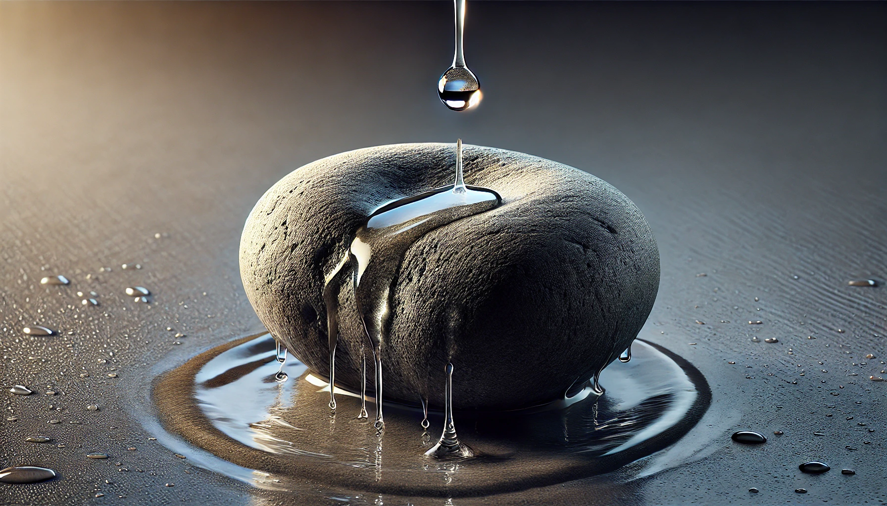

# 【生命⋅修行】正确的练法与身上的功夫

大宝的「周末焦虑症」，伴随着两天周末时光的一去不回，也就莫名烟消云散了。她兴致勃勃地和我分享起最近的成长感悟与收获：比如觉察到自己关于金钱匮乏的错误认知；比如觉察到自己关于读书学习能力的错误认知；以及在这觉察之后，发现自己能够竟然可以平静地面对那些过去会激起自己「愤怒」的事件了。

我能感受到她的开心与兴奋，然而我却卡在一个略略闷闷的情绪中。或许，我这是和她错开了的「周一综合症」？

有时，会和大宝聊起我们理想中的美好生活是什么样子，也会感叹身边有些亲戚朋友似乎不太知道自己想要的生活是什么。她说，我还是很清楚自己想要什么的：

1. 要挣到足够多的钱；
2. 要在深圳买一间属于自己的房子；
3. 要家庭幸福美满，充满快乐与放松的氛围；

我说：

> 其实，第三点已经差不多达到了呢？

她说：

> 是的，其实是卡在你这里。因为前两点还没实现，于是你就没办法放松地享受现在的生活。我是可以放松下来，专心享受当下的生活。因为压力主要承担在你肩上。但是，你担着这压力，就一直放松不下来……

我仔细想了想，确实如此。可是怎样才能在担着这些「现实问题」的同时，还能放松、自在地享受当下的生活呢？放松不了，好像一直是自己的一个大问题来着。我说：

> 我想起来，自己那时候专门去找[林世如](https://m.facebook.com/amano.niten/?fref=nf&locale=zh_HK)老师学习[养生主灵性按摩（**易學按摩**）](https://www.samasati.org/category/%e6%98%93%e5%ad%b8%e6%8c%89%e6%91%a9/)，就是发现自己就算练太极拳很久，也还是不能做到真正的放松。
>
> 然后只学到一招——就是把自己「空」掉，成为「天地」与「被按摩者」的管道。

大宝说：

> 你总是在寻找不同的方法，但其实你只需要一门深入地练下去。
>
> 你已经知道足够多的方法了！
>
> 你所学的那些方法，只要有一个坚持练下去就可以了！

老喻早上发了一篇文章《[最重要的智慧，是让你从此不再他寻](https://mp.weixin.qq.com/s/j-vPLSy8wUG8RqfOy2lX9w)》，说巴菲特的经历向我们揭示了一个深刻的真理：

> 人生中最重要的智慧，并不在于寻找更多的方法或技巧，而在于找到最核心的理念后坚定地实践。
>
> 巴菲特之所以不再“他寻”，是因为他发现了投资的根本逻辑：价值投资。
>
> 这一理念不仅为他带来了丰厚的财富，更为他提供了一种面对市场波动、情绪波动的稳定信念。
>
> 很多人把一生都浪费在不断寻求新的方法、技巧，试图找到一种一劳永逸的“捷径”，殊不知，真正的智慧在于找到适合自己的、经得起时间考验的原则，然后坚定地执行。

感觉，大宝却已然找到属于她自己的「真理」，而我就是「很多人」！

虽然，7、8年前我就开始觉得，自己已然找到了全部的方法，只需要坚持「践行」下去即可。然而，回头看这么多年来，自己一路上依然走得彷徨不已，虽然想要如孔夫子一般做到「四十不惑」，其实至今未遂！

大宝准备出发去找师爷练拳了，临走前，回过头来和我说：

> 其实，我们俩都想错了。
>
> 我想要现在就能和师爷一样，一出手便能发人于无形；你想要现在遇到任何事情，都如庄子一样云淡风轻。
>
> 功夫没下到，这是不可能的妄想！

我说：

> 那怎么办？

大宝说：

> 继续练呗！

是啊，功夫不到，就下功夫继续练呗！

