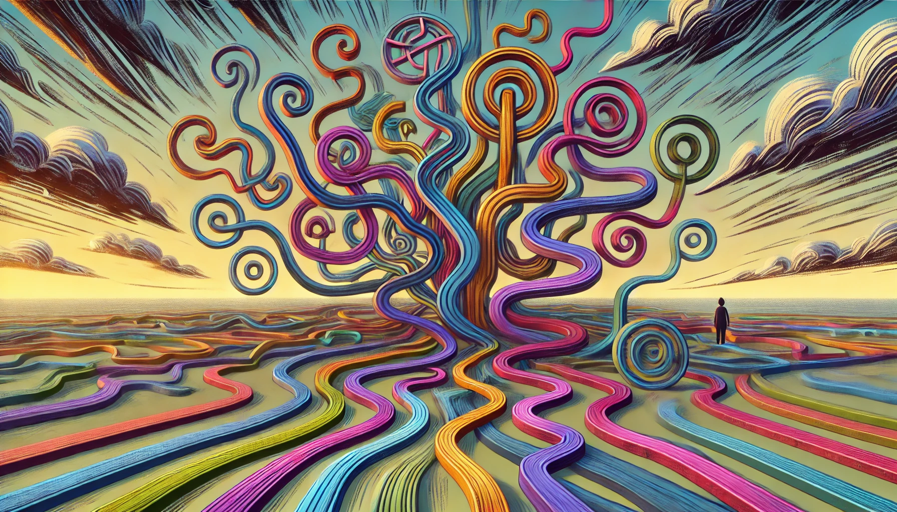

# 【生命⋅修行】成人的ADHD

最早听说成年人也有ADHD是从老Q的朋友圈里（题外话，老Q的朋友圈真的是个宝藏，我是因为[Cubi时间管理器](https://sspai.com/post/77653)才加上老Q微信的），据老Q说，他是正经三甲医院精神科确诊过的，从他身上，我感受到ADHD更像是特点，而不是缺陷。

前两天，[和菜头也提到ADHD](https://mp.weixin.qq.com/s/Zx0ntJdoosp6xBRNYrmjmQ)，在他的文章里是这么说的：

> ADHD患者，或者更准确地说，**具有ADHD特征的思维模式的人**，他们习惯于自上而下学习，先知道轮廓框架，再逐渐填充细节。

这么一看，我觉得自己简直也有点ADHD，虽然我并不觉得自己有什么注意力缺陷，甚至觉得自己有时候挺能专注的，但我真的喜欢先建立大的轮廓框架。如果大的轮廓框架不能先建立起来，我简直无法开始真正的学习和实践。

想到前几天和大宝说，我一直在寻找各种「修行方法」时，其实背后的驱动力就是，我想要找到一套系统的、能够适应我生活中各种情况和变化的修行方法和体系。在2018年我重新开始尝试公开写「博客」时，第二篇就是《[生命至此、修行好像已经画了一个圈](20181122【生命⋅修行】生命至此、修行好像已经画了一个圈（二）.md)》，当时我觉得自己似乎已经拥有了自己全部可用的「修行方法」，内观、太极、《道德经》、《中庸》、第四道、王阳明的心学，似乎接下来只需要持续实践就好了。

然而，这么多年过去，自己还是不停地会困惑，然后不由自主地会想要寻找新的方法，填补上「自我修行系统」中的漏与缺。在这几年里：

* 张至顺老道长传下的「金刚功」代替太极，成了我日常坚持最多的身体锻炼方法；
* 而JT的《庄子白皮书》则给了我两三个日常可操作，至今还在用的基本心法；
* [史蒂芬·科特勒](https://book.douban.com/search/史蒂芬·科特勒)的《[跨越不可能](https://book.douban.com/subject/35650456/)》则给了我最大的希望与冲击，让[我以为自己可以就此拥有完善、系统的整套修行实践体系](20211225【随笔】Super人类成长手册.md)。

当然，这还不算最近两年保罗•格雷汉姆的[干大事指南](https://mp.weixin.qq.com/s?__biz=MzkxMTMwNDQ4Nw==&mid=2247484539&idx=2&sn=a23aafed83c1719795503daf9bb1049d&chksm=c11f7633f668ff252c91923646a09864ddd848ed1edad7454d5bf4ed3663559a4ffc1d1cb759&token=2136841783&lang=zh_CN#rd)、[重读《穷查理宝典》](20240615【生命⋅修行】重温长者的智慧——再读芒格的《穷查理年鉴》（一）.md)、[安德烈•卡帕斯再讲一万小时定律](20240709【生命⋅修行】滚雪球与1万小时定律.md)、[Lex Fridman访谈Pieter Levels](20240913【教程】一个人的公司（五）——产品与服务.md)等等文章、视频给我带来的那些细小、却依然有力的震撼与触动。

但是，当我想到——**要建立一个完整、系统、能够适应我生活中各种情况和变化的修行方法和体系**——这句话时，我的头瞬间「嗡」的一声痛了起来。

看起来，这是一个不可能的任务，至少在我的「功夫」没练到之前，我是不可能把这个系统先行搭建成功的。

我必须学会容忍，在没有一个完美框架的实际情况下，继续前行、继续修行！哪怕要继续容忍这不完美的框架体系和缺陷带给我的「痛苦」与「困惑」。

然后，我也可以更加理解，有许多人，比如大宝，她既不必有我无法建立完整框架的「痛苦」与「困惑」，也不需要拥有了一个「近乎完美」的体系框架之后的「狂喜」与「兴奋」……

人与人就是不一样，每个人都要学会面对自己独一无二的人生与路线！

或许，只有传说中像佛这样，曾经生生世世实践过各种修行路线并最终走通关的开悟者，才能因人施教，传出八万四千法门吧！

