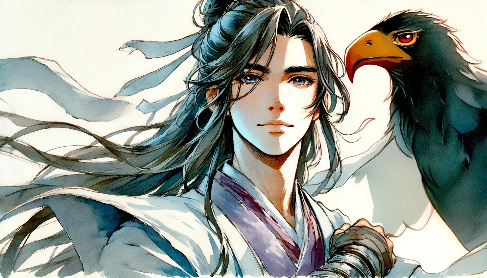

# 【生命⋅修行】黯然销魂掌

大宝照例逮住机会就找我推手试验，可是那天早上因为莫名其妙的原因，心情一直处于颇为低落的状态。往那里一站，深深呼出一口气，忽然产生了一种心灰意冷的感觉。

> 身如槁木，心如死灰。

这两个词自动地不知从哪里蹦了出来，跃入脑海。然后，大宝奇怪地咦了一声：

> 咋回事，怎么练过之后还打不动了？

我心思一动，她再试，我立刻就被轻松地推开了两步。我不由得想到：

> 难道说，刚刚这「心灰意冷」的心态起了莫名的作用？

环顾四周，天阴沉沉的，几片黄叶被偶尔路过的秋风吹着，在我们身边打着旋。我深深吸了一口气，再呼出来，试着再次找到那所谓「心如死灰」的感觉。神奇的事情发生了，大宝竟然再次无法在第一时间撼动我。像这样连试了好几次，发现是真的有用。但每次要进入「状态」却并不容易，长长地叹一口气至少是必须。但心情不可能一直低落，尤其是那种「小得意」劲儿冒上来的时候，立刻就会回到大宝怎么打怎么有的情况。

这让我不由得想起了《神雕侠侣》里杨过的「黯然销魂掌」，他找不到小龙女时发明的这旷世绝招，「老顽童」周伯通怎么也学不会，甚至他自己与小龙女重逢之后，就再也使不出来了——直到濒临绝境才又用出一次。

莫非，这里面真有点什么道理？

大宝很担心我因此喜欢上这「死灰心态」，一再强调，这一切只是因为她正在学习、练习的新用法功夫还不到家。在我放松时能更好地听劲儿，也就更容易捕捉到她此刻螺旋劲儿配合不好的地方。

所以，这只是她刻意练习过程中的正常状态而已。但对于我而言，这两种情况下的区别又确实非常明显。

前几天看过一个故事，[密勒日巴](https://zh.wikipedia.org/wiki/%E5%AF%86%E5%8B%92%E6%97%A5%E5%B7%B4)向玛尔巴学习佛法时，按照老师的指示一次又一次地修建石塔，然后一次又一次的被老师挑出毛病勒令拆掉，还得把石头放回到原来的地方。最后他近乎崩溃，已经要放弃准备自杀时，玛尔巴这才出手阻止了他，并开始正式向他传法。

最终，密勒日巴终于修行有成。可是，他在开始真正修行前，玛尔巴把他打磨到近乎绝望的状态是为什么呢？难道，只有陷入真正的绝望，「自我」才会消除，「真我」才会展现吗？

每个人都有属于自己独一无二的生命之路，这番「黯然销魂掌」的体验，是想告诉我——最近若干年所经历的各种自我情绪折磨，其实也是修行路上的踏脚石吗？

