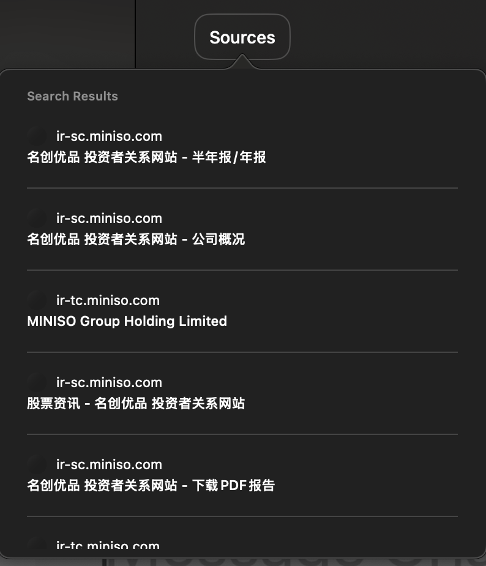

# 【随笔】ChatGPT也推出了搜索功能

其实关于搜索能力，在我印象中ChatGPT已经刷新了两次，第一次是在GPTs里，不同的供应商各显其能；第二次像Code Intepreter 一样作为一个额外功能提供；而这一次，似乎大有不同，看起来是瞄准着 [Perplexity](https://www.perplexity.ai/ ) ，[搜索功能发布宣传页](https://openai.com/index/introducing-chatgpt-search/)上是这么说的：

> ChatGPT 现在能够更高效地搜索网络。您可以快速获得包含相关网页链接的及时答案，之前需要使用搜索引擎才能获取这些信息。这将自然语言界面的优势与最新的体育比分、新闻、股票行情等信息相结合。
>
> ChatGPT 会根据您的提问自动决定是否进行网络搜索，或者您也可以手动点击网络搜索图标来进行搜索。
>
> 
>
> 搜索功能将会在 [chatgpt.com](https://chatgpt.com)（将在新窗口中打开）上线，同时也会在我们的桌面和移动应用程序上提供。所有 ChatGPT Plus 用户、团队用户以及 SearchGPT 等待名单用户今天即可访问。企业和教育版用户将在接下来的几周内获得访问权限。我们将在未来几个月内逐步向所有免费用户开放该功能。

正好，前两天大宝问我名创优品的问题，现在可以直接扔给ChatGPT让他嗖嗖看了。于是我打开ChatGPT的客户端，问道：

> 帮我搜索一下靠谱的名创优品的财务数据，年报，然后用可靠的数据进行一下未来现金流预测

他给出的答案如下：

> ### 名创优品投资者关系网站
>
> https://ir-sc.miniso.com/
>
> 名创优品（MINISO Group Holding Limited，股票代码：MNSO）是一家全球性的生活用品零售商。根据其投资者关系网站提供的财务报告，以下是公司近期的财务数据：
>
> 
>
> **2023年财务数据（截至2023年12月31日的六个月）**：
>
> 
>
> ​	•	**总收入**：约138亿元人民币，同比增长54%。
>
> ​	•	**净利润**：约12亿元人民币，同比增长约60%。
>
> ​	•	**毛利率**：约30%，较上一年度提升2个百分点。
>
> 
>
> **2024年上半年财务数据（截至2024年6月30日的六个月）**：
>
> 
>
> ​	•	**总收入**：约70亿元人民币，同比增长约10%。
>
> ​	•	**净利润**：约6亿元人民币，同比增长约15%。
>
> ​	•	**毛利率**：约31%，较上一年度同期提升1个百分点。
>
> 
>
> 根据这些数据，名创优品在过去一年中表现出稳健的增长趋势，收入和净利润均实现了两位数的同比增长，毛利率也有所提升。
>
> 
>
> **未来现金流预测**：
>
> 
>
> 基于上述财务数据，我们可以对名创优品未来的现金流进行简要预测。假设公司未来三年的收入和净利润继续保持10%的年均增长率，毛利率保持在31%左右。
>
> 
>
> ​	•	**2025年**：预计总收入约为154亿元人民币，净利润约为13.2亿元人民币。
>
> ​	•	**2026年**：预计总收入约为169亿元人民币，净利润约为14.5亿元人民币。
>
> ​	•	**2027年**：预计总收入约为186亿元人民币，净利润约为16亿元人民币。
>
> 
>
> 请注意，这些预测基于当前的增长趋势和假设，实际结果可能会受到市场环境、竞争状况和公司战略等多种因素的影响。
>
> 
>
> 如需更详细的财务数据和分析，建议查阅名创优品的官方财务报告或咨询专业的财务顾问。

同时还在下面给出了详细的来源清单：

我接着追问了好几个问题，他都能搜索不同的网站给出相对清晰的回答。最后我有些迷糊了，想让他总结一下：

> 把你所有关于我提问名创优品的回答整理、总结。有不一致的地方再查询确认。再整理一篇完整的回答给我

他也豪不啰嗦地完成了我的要求：

> 名创优品（MINISO）是一家全球知名的生活用品零售商，近年来在财务表现和市场布局方面取得了显著进展。以下是对其财务数据、全球门店数量、单店营收、利润增长情况，以及未来5年自由现金流（FCF）和每股自由现金流预测的综合分析。
>
> 
>
> **一、财务数据回顾**
>
> 
>
> 根据名创优品的财务报告，近几年的关键财务指标如下：
>
> 
>
> **财年（截至6月30日）**	**总收入（亿元人民币）**	**净利润（亿元人民币）**	**毛利率（%）**
>
> 2019	93.9	8.4	25.7
>
> 2020	89.2	4.7	26.0
>
> 2021	90.0	4.8	22.4
>
> 2022	94.7	7.0	26.0
>
> 2023	114.7	18.5	38.7
>
> 
>
> *数据来源：名创优品财报*
>
> 
>
> **二、全球门店数量及单店营收**
>
> 
>
> 截至2024年6月30日，名创优品在全球拥有6868家门店，其中中国内地4115家，海外2753家。2024年上半年，海外市场收入为27.32亿元人民币，同比增长42.6%，同店销售增长16.3%；国内市场收入为50.27亿元人民币，同比增长17.2%。平均客单价同比增加0.9元至38.5元，平均售价为14.6元。 ([New QQ News](https://new.qq.com/rain/a/20240312A06PM900))
>
> 
>
> **三、利润增长情况**
>
> 
>
> 2024年上半年，名创优品实现净利润12.4亿元人民币，同比增长18%，调整后净利润率为16.0%。毛利率从去年同期的39.6%提高到43.7%，增加了4.1个百分点，创历史新高。 ([New QQ News](https://new.qq.com/rain/a/20240312A06PM900))
>
> 
>
> **四、未来5年自由现金流预测**
>
> 
>
> 基于上述数据，假设名创优品未来5年收入和净利润保持10%的年均增长率，毛利率维持在43.7%，并考虑资本支出和营运资金需求，预测未来5年自由现金流如下：
>
> 
>
> **财年**	**预计总收入（亿元人民币）**	**预计净利润（亿元人民币）**	**预计自由现金流（亿元人民币）**
>
> 2025	126.2	13.6	12.0
>
> 2026	138.8	15.0	13.2
>
> 2027	152.7	16.5	14.5
>
> 2028	167.9	18.2	15.9
>
> 2029	184.7	20.0	17.5
>
> 
>
> **五、每股自由现金流预测**
>
> 
>
> 根据最新数据，名创优品的总股本约为12.59亿股。基于此，未来5年每股自由现金流预测如下：
>
> 
>
> **财年**	**预计自由现金流（亿元人民币）**	**总股本（亿股）**	**每股自由现金流（元人民币）**
>
> 2025	12.0	12.59	0.95
>
> 2026	13.2	12.59	1.05
>
> 2027	14.5	12.59	1.15
>
> 2028	15.9	12.59	1.26
>
> 2029	17.5	12.59	1.39
>
> 
>
> **六、投资分析与目标价**
>
> 
>
> 多家知名机构对名创优品的投资前景持积极态度。例如，国泰君安证券在2024年3月的研究报告中，重申对名创优品的“增持”评级，维持目标价为60.30港元。中金公司也将目标价上调至44.6港元，认为名创优品在全球范围内的业务扩张，以及持续的产品创新和IP合作，将推动其业绩增长。 ([Futunn](https://www.futunn.com/stock/09896-HK/analysis))
>
> 
>
> **七、最新股价及估值指标**
>
> 
>
> 截至2024年11月1日，名创优品在美股和港股的最新股价及相关财务指标如下：
>
> 
>
> **美股（NYSE: MNSO）**
>
> 
>
> ​	•	**最新股价**：$19.92
>
> ​	•	**市盈率（P/E）**：14.96
>
> ​	•	**市净率（P/B）**：2.98
>
> ​	•	**每股收益（EPS）**：$1.33
>
> ​	•	**每股自由现金流（FCF）**：$1.20
>
> 
>
> **港股（HKEX: 9896）**
>
> 
>
> ​	•	**最新股价**：HK$38.85
>
> ​	•	**市盈率（P/E）**：18.21
>
> ​	•	**市净率（P/B）**：3.20
>
> ​	•	**每股收益（EPS）**：HK$2.13
>
> ​	•	**每股自由现金流（FCF）**：HK$1.92
>
> 
>
> **八、结论**
>
> 
>
> 综合以上分析，名创优品在全球业务扩张、产品创新和财务表现方面展现出强劲的增长势头。未来5年的自由现金流和每股自由现金流预计将持续增长，投资前景被多家机构看好。然而，投资者在决策时应综合考虑

----

以上，就是这第一次试用的经过！

怎么说呢，个人感觉体验比Perplexity 还要好一些，当然也可能是我本身用Perplexity 并不多的缘故。但是，依然会觉得「差一口气」，自己的问题总是不能得到最终的解答。

这主要是因为ChatGPT的语言对话能力之强，让我经常会期待他和真人一样，能够直接解决我的问题。但显然，这在目前是极不现实的。

其实，即便是面对真正的人类也是一样的，过高、不准确的期望是常常发生的事情，而沟通中的各种误解与障碍更是层出不穷。以前计算机或者说程序的输出总是稳定的，而现在，有了LLM，他也变成了一个能力更强，但是更「不稳定」的系统。

从这个角度看，还真是离「人类」的「智能」更近了一步呢。

总之，正如当年吴恩达在一个课程里说的，大模型的进化，就好像在启动中的火车头一样。许多今天看起来很不错的应用创新，只因为正好在火车头前面，一转眼就变得「毫无意义」了。不知道接下来，还有哪些AI领域的应用，一步一步走向和当年智能手机上的各种手电筒APP一摸一样的命运终局呢？

