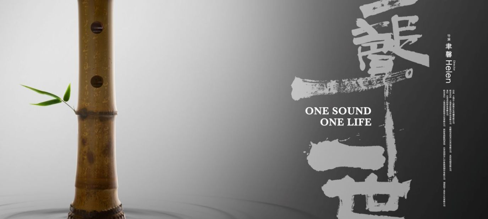

# 【随笔】尺八啊尺八

上次吃过晚饭，陪着孩子们出门散步，实在忍不住就又把尺八又抓在了手里。走几步，吹两声，不知不觉逛到楼下新开的玩具店门口。

孩子们嚷嚷着要去店里逛逛，于是乎我也跟了进去。谁曾想，店老板对逛店的孩子们不以为然，却眼神放光地看着我手中的尺八，迎来上了：

> 你这是尺八，对吗？

我有点吃惊，点了点头。

由于我经常不以为意地拎着尺八到处逛，总有大人小孩好奇这是个什么东西，什么乐器。但能一眼认出这是「尺八」的，这位老板是第二个！问过我的人，应该早超过了20个人，这是第二个知道这是「尺八」的。

真不容易！

老板兴奋地和我攀谈起来，原来他也吹过尺八，后来发现这玩意和箫总是互相干扰，于是乎就放弃了。但他学习笛、箫已经有很多年了，最早是从90年代开始。而且，他还学了陶笛、塤……聊得高兴，他把自己老婆叫出来看着商店，自己跑上楼把珍藏的各种乐器搬了下来，一一摆弄。其中有一支名家制作的竹箫，我看见阿宝好奇过来拿时，他眼神一紧。我赶紧把竹箫从阿宝手里接了过来，重新放回到桌子上。

 and xiao flutes displayed on a table. The flutes are made from different materials, inc.webp)

接着，他随便向我演示了一下，不同材质、不同规格的箫，以及一支陶笛。真没想到，他自学的箫还有陶笛可以吹得那么好听。他甚至还告诉我，正在自己学着制作笛子。

然后，他一本正经地劝我，既然其他乐器从来没有学过，最好不要先学这么高难度的尺八。这有点像从没开过车，上来就学开赛车一样。

他找出一支和我尺八有着同样切口的箫，递给我，说：

> 你可以先练这个，八孔。和你的尺八切口一样，这样很快能学会，也容易找到人一起交流。

我试了试那支箫，能吹响，但控制起来并不容易。不同指法也需用重新熟悉。

听说这位老板现在还在北大研究生院教书画课程，而他的书画竟然也是自学成才的。我问道：

> 你是自学后转行的吗？

他说是啊。我又问：

> 这尺八、笛箫、书画，像我这般年纪这么大了，还可能学会吗？

他说：

> 只要真想学，当然能学会啊！

我不禁在心里给他默默点了32个赞，但是，想一想自己总是「不够用的时间」，竟然产生了一种苏星河遇见无崖子的感觉。对这些所有的技艺都向往至极，只可惜天赋不够，又不专心。至今一样未曾学会。

告别老板，我摩挲着我的尺八。不禁再一次心心念念地想：

> 是不是到了应该去找个师傅学习的时候呢？

我心目中的老师，是在武汉音乐学院教尺八的蔡鸿文，可是，我并没有他的联系方式。又或者，可以给[海山 john kaizan neptune](https://www.jneptune.com/)发个邮件？至少他的网站上有联系方式。可是，又担心自己依然只是一时兴起，并不能真正地投入足够的时间练习！

唉，尺八呀尺八！

