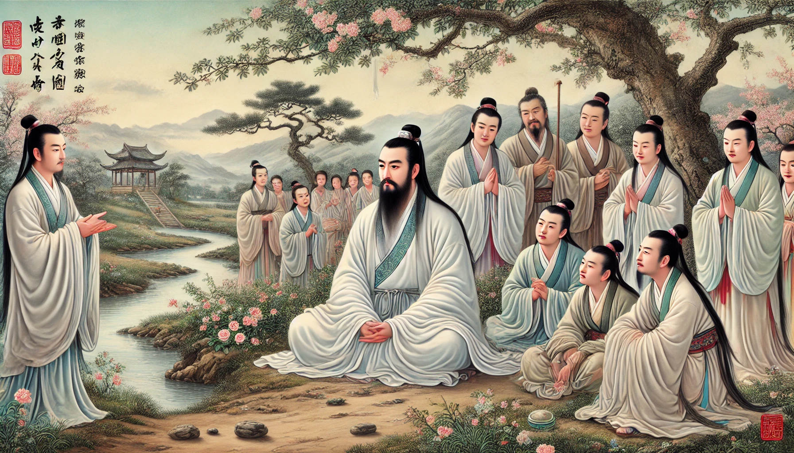

# 【生命⋅修行】大动其心

以前听过王阳明的这么一个故事：

> 说是王阳明讲课时，有一老农求见，因缺钱想要把家中的地卖给王阳明。王阳明不想趁人之危，拒绝了这买卖，而是借钱给老农让他渡过难关。
>
> 事后与学生游玩时，看到一块风水宝地。学生告诉他这正是前几天他推辞的那块田地，王阳明不由得懊恼一声。
>
> 随即就地静坐良久，然后告诉学生说，那懊恼便是动了「心」。此刻，这「私欲」总算已然廓清了！

我一直觉得这故事演绎得有点太夸张，实在无法想象，晚年并不推崇静坐的王阳明，怎么会在游玩途中，突然置周围学生不顾，兀自静坐「廓清私欲」。

然而前几天，我却经历了一场类似却又不同的「大动其心」。

那是在吃饭前，我一面往餐厅走，一面拿起手机。却看到了一条同事发来的消息。瞬间，我从开心快乐准备享用美味晚餐的状态，一秒跌落到烦闷不爽的心境。我试着向大宝求救，她表示无能为力，无论是我工作的问题，还是我的情绪，她都没有任何办法可以帮到我。

郁闷地吃完饭后，我在屋子里团团乱转。大鱼想要我陪他玩，我也无心响应，只觉得孩子们吵吵闹闹，颇为烦心。但我也知道，自己不能把这情绪发给他们，想要找个地方化解。

大宝躲到房间开始睡觉，阿宝躲进自己的书房，大鱼在客厅没人陪他玩，伤心地哭起来。我稍微试了试，发现自己无法把心思放到当下，陪好大鱼，便决定出门去调整一下心情。但是，转念一想，又想起自己还有很多应该完成的工作还需要在状态调整好之后继续。

像无头苍蝇一样转了几圈之后，我拿上笔和本子、电脑，还有一把小凳子，把自己关在了卧室外面的阳台上。

静坐了好一会儿，也许是半个小时，也许是40分钟。阿宝和大鱼似乎来到阳台门口看过我一眼，然后又离开了；几只蚊子围着我悄悄咬了几口，吃饱后也离开了。我烦闷的情绪，随着自己一点一点安静下来，也渐渐地如云雾般散去。

虽然，我并没有完全想清楚，自己是哪些 / 哪个错误的观念和看法带了这轰轰烈烈、莫名其妙的情绪。但总之是哪里搞错了的想法，以及几十分钟的静坐，也让自己平静了下来。

我打开电脑，开始工作，两个小时之后，竟然全部完成了那天计划中13件事情！看来，13件事，120个Box（10小时），确实是我最近工作效率的极限值了……

「全部完成」，这让我心情更加舒畅起来。回到房间，发现阿宝带着大鱼在客厅正玩得不亦乐乎，而大宝早已睡着。后来大宝告诉我，在我静坐一小会儿之后，本来对我把「怨气」在所有房间「喷洒」的行为极为愤怒的她，也就安静了下来，很快就睡着了。

原来，「大动其心」时，「静坐」还依然是一个可能管用的「对治」之道呀……

