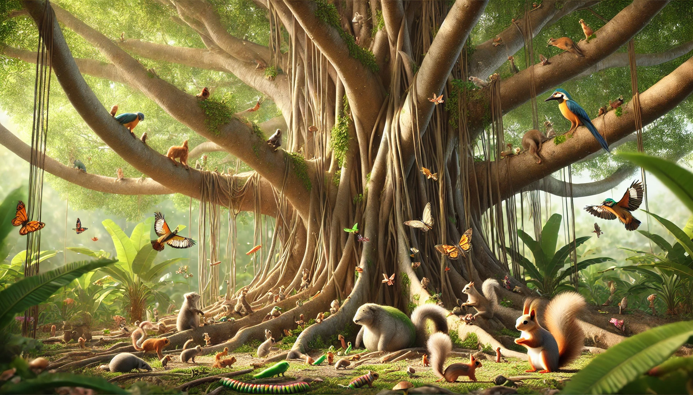

# 【生命⋅修行】恐惧与勇气

前两天，大宝刷到了一个「专家」的视频，这位「专家」说，不要让孩子变成啃老族。聊到许多人的孩子被养废只会啃老，而他的家传就是长大了自己就得管自己，住在父母家可以，但是要交房租和伙食费，交不起可以打白条。

我和大宝都被这段视频给说服了。觉得这人说得很有意思，也很有道理。

于是乎，某天早上，不记得因为什么事情机缘巧合，大宝告诉阿宝和大鱼：

> 你们现在要读书，学会自己照顾自己。等你们18岁了，就要离开父母家，自己养活自己。
>
> 如果住在父母家里，就要交房租。

我补充道：

> 交不起可以先打欠条。

可是，阿宝表示，很不喜欢这样，她说：

> 我觉得，你们这样就是不爱我了！

大鱼更是对自己长大了还得离开父母充满了忧虑。

等把两个孩子分别送到幼儿园和学校，大宝对我说：

> 我想了想，感觉不太好呀！
>
> 不是说要对孩子「无条件的爱」吗？这样对孩子，岂不是变成「有条件」的爱了？
>
> 你看，阿宝都觉得我们这样是「不爱她」了！

我也有类似的感觉，说：

> 确实，现在仔细想想，我更喜欢蔡志忠家那样，无条件地接受孩子，爱孩子。

大宝说：

> 嗯，那我晚上得和阿宝说说。

我说：

> 好的，找机会和阿宝把这事情说清楚。

大宝说：

> 晚上见到阿宝我就要说，我不能让这个错误的想法，这个让阿宝感觉「我们会不爱她」的想法在她心里酝酿太久！
>
> 这就像种子一样，这是一颗坏种子，既然发现了，我们就得早早把她挖出来。

我觉得大宝想得对！

晚饭时，大宝就告诉了阿宝我们新的想法，表示我们认为早上的说法是错误的，阿宝很开心。大鱼也在一边确认：

> 所以长大了也不需要离开爸爸妈妈吗？

我们点头，表示：

> 长大了，意味着，你们可以自由自在地想去哪里就去哪里。
>
> 但是，只要你们想回来，只要爸爸妈妈还在，还有能力，爸爸妈妈的家里就永远有你们的一张床，一双筷子……

大鱼兴奋地「耶✌️」了一声。

我看着阿宝，又补充说：

> 家就像大树一样。小鸟可以自由地飞翔，但只要小鸟需要，永远可以回到大树下，让大树为它遮风挡雨。

阿宝笑着说：

> 对，小鸟可以躲在大树下。

大鱼说：

> 还有毛毛虫！

我说：

> 是的，毛毛虫也可以躲在大树下。

一家人开心地吃起饭来！

……

晚上，阿宝又聊起这个话题，她问我：

> 那，二十几岁，也可以继续待在爸爸妈妈家里吗？

我说：

> 是的。只要爸爸妈妈还有能力，或者说有资源，你永远都可以待在爸爸妈妈家里。100岁都可以。

阿宝惊叹：

> 哇，100岁吗？那你们多大了？

我说：

> 如果你们100岁，我们就是100多岁了呀。现在科技这么发达，说不定我们可以活到100多岁呢。反正，活多久是老天爷说了算。我们每个人自己负责快乐地活着！
>
> 想象一下，你和弟弟。两个100多岁的老头和老太，各自带着自己的一大家子人，来到爸爸妈妈的家里，那是一件多么开心的事情啊！

> 100多岁的老头和老太？

阿宝被这个想法逗得哈哈大笑起来……

----

其实，仔细想想。我们被那个「专家」的论调暂时说服，其实是被把「孩子养成废物般的啃老族」这个「恐惧」攫住了心神。

[《跨越不可能》](https://book.douban.com/subject/35650456/)[这本书](20211217【随笔】一本人类高效使用手册.md)中提到，即便是像[莱尔德•汉密尔顿](https://m.douban.com/movie/subject/27064673/)这样公认的极限运动之王，硬汉中的硬汉，也会感到恐惧。他也会讨厌自己有这种恐惧。只不过，他学会了利用恐惧来缓解恐惧。

恐惧是常态，但如何面对恐惧则是可以练习的。所谓「勇气」，正是在这过程中可以习得的珍宝。

更进一步。「恐惧」可以作为我们行动的指南针。我们不仅不要被「恐惧」赶着跑，而要把「恐惧」当作路标。触发恐惧的深渊里，藏着我们想要探索的真正宝藏。

《道德经》里所谓「反者，道之动」，恐怕也说的就是这层意思吧！

----

阿宝在我身边渐渐越睡越沉，听着她的呼吸越来越深长，软软的小身子靠着我随着呼吸轻轻地起伏着。我想起多年前的冬夜，在湘西大山里的火坑边，就着噼啪燃烧的柴火读书的情景。

那燃烧的火焰，和劈劈啪啪随着火焰升到半空又消失的小火星，给人一种无限安静又温馨的感觉。大自然两种最神秘而又矛盾的力量象征：燃烧的柴火（熵增）与我的生命（熵减），在那个时刻默默交汇、默默地各自前行。

有一个声音在我脑海中浮现：

> 你敢完全接受和放手，让孩子们自由成长，成为他生命本来的样子吗？无论那会是什么模样？
>
> 你敢完全接受和放手，让自己的生命自由成长吗？无论自己会变成什么模样？

遥远的恐惧在内心深处战栗着，让我无法回答……