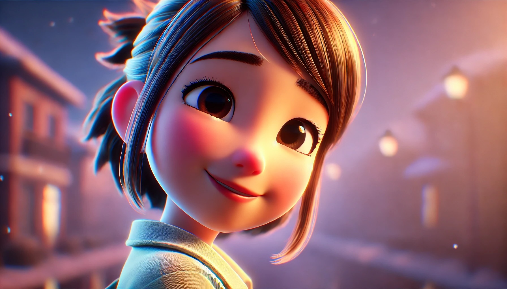

# 【生命•故事】（123）「似sì乎」、「似shì的」

高中时，有一个曾经做过我同桌的女同学L。她来自北京，说着一口特别标准的普通话。她总是扎着一个短短小马尾，戴着一个弧形的彩色塑料发卡。我记得她的脸蛋圆乎乎的，总是显得特别可爱。

因为她的普通话标准，每当遇到有拿不准的拼音，尤其是武汉人天生的短板——卷舌音和平舌音，我一定会问她拿主意。一些比较难的发音，老师也常常会点名让她来示范。有一次，我问她：

> 「似乎」的「似」到底应该读 sì还是shì。

她笑着，转过头对着我，用非常标准的普通话，清楚又缓慢地告诉我：

> 
>
> 「似sì乎」、「似shì的」

从此以后，我总算分清了这个多音字在不同场合的读音，也牢牢记住了那个画面。

……

谁曾想，造化弄人。这么可爱的女孩子，她竟然得了白血病。开始越来越多的请病假，到了高二后半学期，她就再也没有回来上过课了。只听去看过她的同学说，她病得很重，要做化疗。

大约高三，正在准备高考的激烈间隙。班主任贴心地为我们组织了一次包饺子的活动。就在饺子蒸熟，准备端上桌时，班主任来告诉我们说：

> 有一个神秘的老朋友，要来看你们了！

L 出现在教室门口，想必是刚刚做完化疗，她还剃着光头。大家惊喜地把她迎了进来，女孩子们围着她问长问短，男孩子们也开心地围在一旁。因为身体的原因，这次她没有待多久就离开了。后来，似乎还来看过我们一次，似乎又没有。

反正，我记得她当时很遗憾，不能和我们一次参加高考。我们鼓励她说，没关系。明年你就可以参加了！当然，第二年的高考，她也没有参加，她再也没能恢复健康。

从此以后，每当读到「似乎」或者「似的」这个词，脑子里对它们的发音有些犹豫时，那清脆、标准、优美的女声就会回到我的脑海里，就好像那个脸蛋圆乎乎，扎着短马尾的小女孩又微笑着转过头来，对我说：

> 「似sì乎」、「似shì的」!

