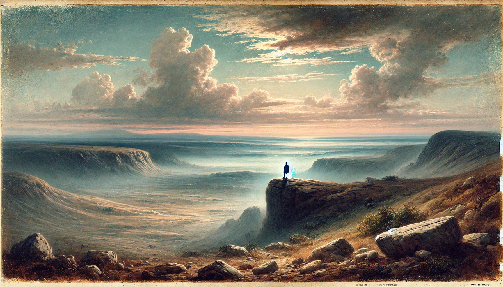

# 【随笔】天地悠悠

> **登幽州台歌**
>
> 唐•陈子昂
>
> 前不见古人
>
> 后不见来者
>
> 念天地之悠悠
>
> 独怆然而涕下

早上起床，心里感觉总有些怪怪的。算起来，这是一个特别的日子，我刚刚流露出一点莫名的伤感，就被大宝喝止：

> 不许搞那些莫名奇妙的情绪，要开心点！

我挤出一个笑容，对已经起床的两个孩子说：

> 嗯，要开开心心的，祝爸爸生日快乐！

大鱼和阿宝大声喊着「爸爸，生日快乐！」，然后很快就变成了大声的尖叫，笑闹成一团。

阿宝嘱咐我说，她在家里藏了礼物给我，但是现在不许找，要等到晚上吃生日蛋糕时再说。然后，她就开开心心地去上幼儿园了。

这一天，工作特别多；这一天，还要去找阿宝学校的老师谈一谈；这一天，我忽然不知道自己应该用Timeboxing的方法来继续安排，还是选择放假的状态随意翱翔一下……

妈妈照例给我发了一个红包，199元。我开心地收下，心想：

> 这是要祝我活到199岁吗？那太好了，算起来还有100多年呢！

C也从远远的大洋彼岸给我发了条祝福过来。

接着，我有意识地忽略了来自各种商家的生日祝福。

最终，不知不觉就到了晚饭时间，考虑到阿宝和大鱼喜欢不同口味，于是大宝制作了两个生日蛋糕，花了整整一天时间。阿宝也精心为我摆盘，弄出一盘专属的生日饭。

快乐地享受完生日晚宴和家人的祝福，又忙忙碌碌一个电话接一个电话，一个会议接一个会议，眨眼竟然就到了晚上10点多。

……

晚上，竟然失眠了。眼睁睁看着时钟从10点转到12点，再转到1点、2点、3点半，这新的一岁的第一天，本命年的生日，就这么渡过了？

……

不仅仅那些无聊地、让我忙碌的工作，转瞬就会变得毫无意义；即便就是身边的亲人、爱人，也会在时光中渐渐老去；哪怕是那些我们执着着的「伟业」，或许在生命中能留下或多或少的印记，但最终还是会如沙滩上的画作，迟早归于虚无……

等到50亿年后，太阳膨胀吞噬地球的那一刻，我这短短一生中所留下的所有痕迹，怕早就烟消云散，连半点儿灰尘都不剩了罢。

无怪乎陈子昂说：

> 念天地之悠悠，独怆然而涕下……

