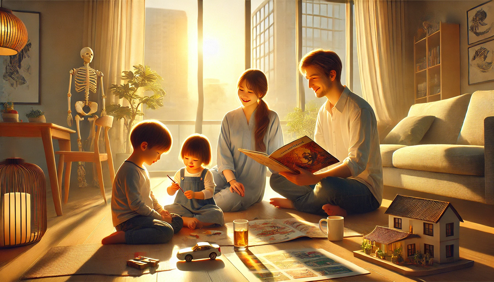
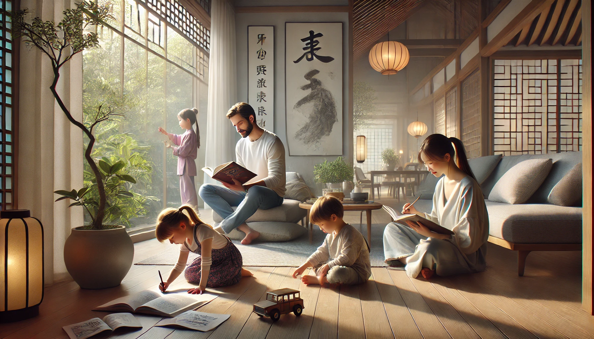

# 【随笔】我现在生活的样子

据说现在网上流行一个游戏，就是给GPT这样一句话：

> 根据你对我的所知，请绘制一张图，画一下你心目中我现在生活的样子

我忙不迭打开GPT，还特意新开了一个会话，免得之前的聊天历史会限制了它。于是乎，我得到这样的一幅图画：

没想到，一向数不清人数的DALL·E，这次竟然精确地画出了一家四口。时间感觉也对。绘图的提示词是这样的：

> A harmonious and fulfilling scene of a family living a balanced, joyful life. A father, mother, and two young children (a 6-year-old daughter and a 2.5-year-old son) share a warm, sunlit space. The father, with an aura of wisdom and calm, is reading a storybook to the children, who listen attentively. The mother, gently observant and supportive, engages in another activity close by, perhaps studying investment or language materials. The children’s personalities shine through: the daughter drawing creatively and the son playing with a toy car. The setting suggests a peaceful, supportive environment, with subtle elements of modern technology and global culture reflecting the family's open-minded approach to learning and growth. A tranquil background hints at interests in Tai Chi or other mindful practices. Overall, the scene captures a sense of warmth, health, unity, and joy.

虽然明确告诉了DALL·E 姐姐和弟弟的年龄，还是被画成了哥哥和妹妹。然而，爸爸手里捧着书，妈妈温柔地看着孩子们，地上还有玩具小汽车，以及一个房屋模型。奇怪，前段时间，阿宝也制作了一个纸板的房子模型呢，但这个我好像从来没问过GPT才对呀。

我喜欢这阳光从阳台、窗外洒进房间的温馨感觉。也喜欢那几个简约现代中式的装饰与家具。只是不太明白，墙边的骷髅架是干什么的。我和大宝可都不是医生，为啥一定要放个骷髅显示Open-mined 呢？估计，DALL·E 也没搞懂GPT 说的 interests in Tai Chi 是什么玩意。

但不管怎么说，这感觉还真是那么回事儿。

以前做电商时感慨，为了广告和销售，我们把越来越多的用户数据贡献给了Facebook和Google，现在，不知不觉地，我们把更多的个人数据也贡献给了Open AI。这是一个根本停不下来的趋势，我此刻坚定不移地相信，AI的发展已经没有什么势力可以阻挡了！

那么此时此刻，我们人类可以做些什么呢？

我忍不住又让GPT给我画了一张图，可是并不如上一张满意：

DALL·E 明明就是搞不定汉字！却总是弄些方块字来糊弄我，唉！！！