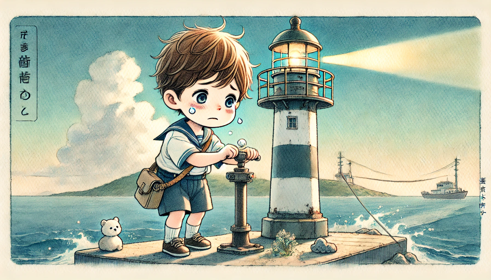

# 【随笔】很久以前曾经有过一个光棍节

那时候，我还是个单身汉，或者说「单身狗」。不知怎么的，大家就开始戏谑地称11月11日为「光棍节」了。那时候，记得华侨城和蛇口还有许多酒吧，年轻的光棍朋友们有不少是泡吧爱好者。而我，会在这天被撺掇着跟他们一起跑去酒吧，虽然震耳欲聋的音乐大多数让我不明就里，但依然会有那么几首歌，可以让我装作陶醉的样子；而同时，只需要一杯啤酒，就可以真正地进入不陶也「醉」的状态，可以让自己一直晕晕乎乎到散场……

但总体而言，我情愿自己躲在屋子里听音乐。

有一个同事，比我们大上几岁，颇会生活的帅小伙，常常带着我们这几个年轻的后辈玩。有一次，他打算买套音响，找了个周末，就带着我们几个光棍一起去了一家音响店。我们舒舒服服地坐在试音室的沙发上，老板问明白需求后，先为我们先接上一对儿300元左右的喇叭，听了一、两首我们熟悉的音乐；然后换成500元左右的，接着再换成6、700元的，1000多的。

我惊奇地发现，音响这玩意，果然没有最好（最贵），只有更好（更贵）。听过1000多的喇叭，就发现之前那6、700元的，居然就听不入耳了。还好那个同事相当冷静，果断喊停，然后入手了那对600多的喇叭。

他叹着气告诉我们说，原来其实没得选，一切取决于预算而已！

然后眼见着「长辈们」谈恋爱，结婚，「后辈」们也开始有人谈恋爱，有人则继续自嘲「孤独是可耻的」……

身边的光棍越来越少。然后，忽然之间，淘宝生造了一个双十一购物节，就再也没有了「光棍节」……

----

昨晚，给孩子们读宫崎骏的绘本——《悬崖上的波妞》，忽然意识到，这不就是儿童版「海的女儿」吗？读完了一遍，孩子们又让我读第二遍，读到宗介说：

> 理莎，别哭了。我都没有哭呢。
>
> 我本来，答应过波妞，说要保护她。
>
> 波妞……她会不会在哭啊？

宗介觉得没能遵守对波妞的承诺，这让任何事情都让宗介难过。

我也跟着难过起来。

不管是一个小男孩还是一个男人，如果不能遵守对自己所爱之人的承诺，这确实比任何事情都让人难过。

----

又是一年双十一，却不再是光棍节！

