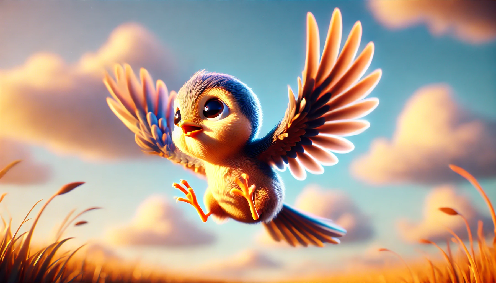

# 【随笔】教育的本质是什么

阿宝进入二年级已经半学期了，越来越多地向我们抱怨：

> 上学太无聊了！
>
> 我不喜欢上学！

她曾经喜欢的班主任语文老师换成了另一个严厉的老师，不知不觉，她对语文的兴趣也几乎消失殆尽。前几天做了一个教育部门组织了一个心理测试，提示说：

> 你生活的幸福感不够高，并且主要是因为学校生活的原因。

……

我们决定去找老师聊聊，想和老师讲讲孩子的近况，听听她的想法。然而，聊了一会儿我们发现，班主任最最关注和操心的，还是孩子们的功课。二年级学业繁重，担心孩子们跟不上。同时学校活动也多，她怕课程进度受影响加快了授课进度，于是乎孩子们压力会更大。跟不上的孩子们，自然会接受到来自老师的巨大压力与潜在的焦虑情绪。同时，学校并不鼓励课间休息孩子们出教室「疯跑」，一向听话的阿宝索性就不出门了。

老师没有时间和精力去理解每一个不一样的孩子，而不深入理解，那些想当然的「帮助」反而会适得其反。

她唯一的出口，变成了和同桌讲小话聊天，不分上课下课。我能感受到老师对此心中颇有微词，只不过碍于我们之前和老师说过，这是她新学年交到的唯一一个好朋友，点到即止没有说透而已。

体制内的学校中，这样的老师想来是大多数，她们是正常的、称职的老师。毕竟做好一份工作，最重要的是领导安排下来的KPI：成绩要好、不能出事。这样想想，一年级遇到的那位能用心关注每个孩子特点，因材施教、细心引导、耐心等待的班主任实在是难得一见的好运气。所以，到底也不能奢望这样的好运一直在……

对于学校而言，教育是一项社会交给这个机构的政治任务。然而，对于我们而言，教育却是孩子成长中至关重要的一环。

AI来临，时代在迅速变化，教育机构的变革，哪怕再积极，也注定是会落后时代的。我们在其中应该做些什么呢？

我想，必须要回归本质，小孩子要长大后能自己生活，需要的东西不多，无非以下几点：

1. 生存能力
   1. 自己安排自己日常生活的能力（包括设定自己的目标，安排自己的时间、精力、能量，安排周边一切可能调动的资源、包括金钱等等）
   2. 自主学习的能力（包括了解自己的学习特点，寻找最适合自己的学习方法、节奏）
   3. 学会赚钱养活自己（学会投资，包括学会投资自己）
2. 找到自我
   1. 多多尝试
   2. 了解自己
   3. 了解世界
   4. 找到自己愿意投入一生的愿景

其实，只有第一点是「教育」可以助力的，第二点，家长能够努力保住孩子本来所拥有的求知欲与好奇心，不压抑、不伤害就万幸了。或许，像梁启超说的，孩子们为新时代挑战所需要做的准备只有两条：强健的身体与精神。

写到这里，我有点想读一读Salman Khan写的那本书——《[教育新语](https://book.douban.com/subject/36873315/)》了。

