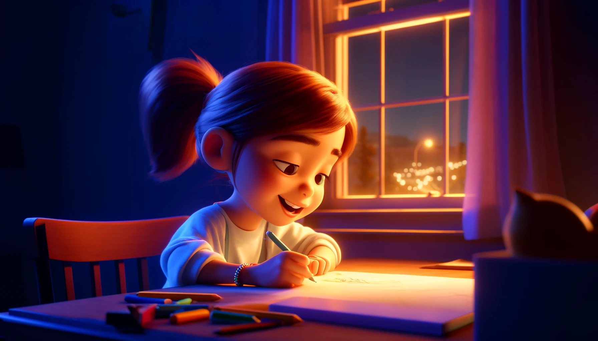

# 【生命⋅修行】为什么叹气

晚上，我一面处理着「不得不处理」的那些公司的杂务，一面在阿宝兴奋地拿着写作本来给我看她刚完成一条「写作作业」时表达表扬和赞赏。

阿宝拿来第一句话给我看时，我的话是发自内心，由衷地赞美与表扬。她兴奋地转头继续写，继续拿过来给我看。我的表扬不知不觉变得勉强了一些，还顺手给她指出了一点需要修改的地方。就这样，第二次、第三次、第四次。当我再一次提出修改意见时，阿宝忽然爆发了。我这才发现，刚开始时她的「兴致勃勃」早已消失不见。

我赶紧改成表扬，但言语中透着大量的虚假与勉强：

> 你是想听爸爸表扬你吗？
>
> **写得好！**
>
> 你不想听爸爸给你的意见吗？
>
> **那我就不说了！**

终于完成了这六条「留言写作练习」，阿宝合上作业本，深深地叹了一口气，说：

> 我不知道我为什么那么不想做作业，
>
> 所有的作业都不想做……

说完，又深深叹了一口气，不多时，又叹一口。

我意识到，这气叹得，和我有些时候，简直一模一样。我不由得担心起来，我可不希望阿宝将来变成像我现在这样！我强打精神，拿起铅笔，让她来计算，我来书写，帮着阿宝迅速完成了一样作业。然后，我嘱咐阿宝赶紧去睡觉，阿宝却再次深深地叹了一口气。我便不再管她，给大宝发了一条消息，表达我的担忧——我好担心自己对「工作」的情绪，会传染给阿宝。

然后，跑到客厅，自顾自地忙起工作来。

等一切忙完，我回到阿宝的书房，发现她正在开心地画画。她兴奋地给我看她的画，然后我问她：

> 现在开心了吗？

她说：

> 开心了！
>
> 刚刚爸爸说让我马上去睡觉，我觉得可难过了！
>
> 现在已经开心了！

……

等我洗漱完，虽然已经接近11点，但我自己的心情也好了不少。阿宝更是开心、满足地和我玩了一会儿魔方，就躺在我身边迅速睡着了……

----

早上起来，我看到了大宝回复我的消息：

> 不怕，她还有个妈妈呢。

是啊，我的担忧其实只不过是我自己的困扰，我的情绪也只是我自己的情绪，这些，都是自我修行的「警示灯」而已。与阿宝，其实并没有多大关系。

她有她自己的生命力，有她自己独一无二的生命历程。外界的一切困难，包括我们这样不成熟、不完美的普通父母给她制造的困扰，终究会成为她成长的阶梯与踏脚石。

我们要做的，与其担忧她，不如埋头于自己的修行好了。

在孙瑞雪的公众号『爱和自由』上，看到一篇来自[史蒂芬•柯维](https://zh.wikipedia.org/zh-hans/%E5%8F%B2%E8%92%82%E8%8A%AC%C2%B7%E6%9F%AF%E7%BB%B4)的[关于父母接纳孩子的文章](https://mp.weixin.qq.com/s/xhjq7JDnILFwfLQTAkrPtA?from=singlemessage&isappinstalled=0&scene=1&clicktime=1731469405&enterid=1731469405)，就连史蒂芬·柯维夫妇，也一样会在接纳孩子这件事情上走弯路。不得不说，这「真正的接纳」，是多么难啊！

不管是接纳孩子，还是接纳自己！

且行且修吧……

