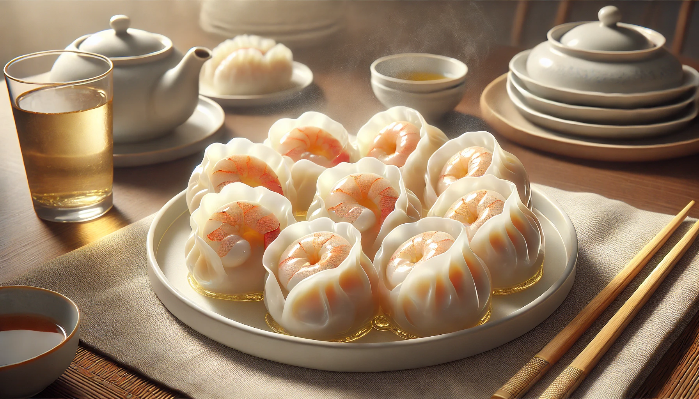

# 【随笔】君子远庖厨

晚上，大宝正在包饺子，门铃响了。

开门一看，原来是叮咚买菜的小哥，送来两包气鼓鼓的东西。仔细一看，原来是一些活的基围虾。大宝说：

> 帮我把虾仁剥出来，我要包几个鲜虾饺子。

塑料袋里充了氧气，打开一看，大部分虾还都是活蹦乱跳的。我看着，不禁开始发怵：

> 就这样直接剥？

大宝点点头。不知道为什么，这次心中升起了一种强烈地不忍。但是，我还是只好硬着头皮开始洗虾。虾不时地从洗菜篮子里蹦出来，我拿着他们在手里许久，还是下不了手。又忍了好一会儿，决定用剪刀把他们先剪断，心想着，这样小虾们死得是不是痛快点？没弄两只，已经给自己整得一头汗。

连阿宝都看出来我的「害怕」了，在厨房跑进跑出，和我说着话。可能是下意识地想要安慰我，她拿着虾告诉我：

> 你看，爸爸，我都不怕！

大宝也嫌弃我矫情，过来帮忙剥了几只，又去忙着包饺子。阿宝继续在我身边，要我给她那些没有脑袋的虾，帮我一起剥虾仁。我看被剪刀剪断的虾米依然要挣扎好一会儿，便咬紧牙关，改用手把基围虾的头扯掉。阿宝在一旁问我：

> 爸爸，你为什么要闭着眼？

我不知道怎么告诉她，总而言之，忍着腹部的筋挛和极度的不适，一只又一只，终于听到大宝说：

> 够了，其它收起来吧。

我一面把剩下的虾扔进冰箱速冻层，一面和大宝说：

> 下次，是不是应该把他们先冻起来？

大宝说：

> 不管是冻，还是蒸，虾的命运，终究是一死。可能直接摘掉脑袋，还痛快一些？

我说：

> 不知道虾是怎么样的感觉，站在人的角度，可能这三种死法，冻死会稍好一点。
>
> 话说，不管怎么样，死亡都是挺痛苦的一件事。
>
> 可能，只有那些有福之人，一觉睡过去的「善终」才是真正的痛快！

……

鲜虾大饺煮熟了，大宝问我要不要吃。我吃完了孩子们吃剩的一盘饺子皮，还是决定尝一个。说实在话，味道真的很清甜，但是，我还没有完全从剥活虾的冲击中缓过来，感觉总是有点怪怪的。

大宝说：

> 我忽然觉得，「君子远庖厨」这句话让我很愤怒！
>
> 凭什么那些所谓「君子」的男人可以不沾染杀鱼虾鸡鸭猪羊这些事情？女人却必须要干这些活？然后还显得你这样的人很慈悲高尚，我这样的却好像很残忍？
>
> 又不是「不吃」，却偏要「远庖厨」，感觉好虚伪！
>
> 我觉得，我内心里，中国女人被压抑上千年的愤怒都要被激发出来了！

我说，其实我更赞同《冰与火之歌》里奈德的做法：

> 如果你要取人性命，至少应该注视他的双眼，聆听他的临终遗言，倘若你做不到这点，那么或许他罪不至死，统治者若是躲在幕后，付钱给刽子手执行，很快就会忘记死亡为何物。
>
> —*艾德·史塔克 《冰与火之歌》*

翻看了一下以前写过的文章（在几乎同样的场景下），发现原来孟子关于「君子远庖厨」的完整原文是这样的：

> 曰：“臣闻之胡龁曰，王坐于堂上，有牵牛而过堂下者，王见之，曰：‘牛何之？’对曰：‘将以衅钟。’王曰：‘舍之！吾不忍其觳觫，若无罪而就死地。’对曰：‘然则废衅钟与？’曰：‘何可废也？以羊易之！’不识有诸？”
>
> 曰：“有之。”
>
> 曰：“是心足以王矣。百姓皆以王为爱也，臣固知王之不忍也。”
>
> 王曰：“然。诚有百姓者。齐国虽褊小，吾何爱一牛？即不忍其觳觫，若无罪而就死地，故以羊易之也。”
>
> 曰：“王无异于百姓之以王为爱也。以小易大，彼恶知之？王若隐其无罪而就死地，则牛羊何择焉？”王笑曰：“是诚何心哉？我非爱其财。而易之以羊也，宜乎百姓之谓我爱也。”
>
> 曰：“无伤也，是乃仁术也，见牛未见羊也。君子之于禽兽也，见其生，不忍见其死；闻其声，不忍食其肉。是以君子远庖厨也。”

虽然，这「不忍」，是所谓「仁」的表现，但我此刻却真的觉得，人不能太远离「田地」、「庖厨」了。

如果总是不知道那些每天养活自己生命的食物究竟从何而来，不能亲手感知它们是怎么从一粒种子、一枚蛋、一只小猪仔、小羊羔，变成了田中的稻谷、圈中的鸡鸭猪羊，再变成了盘中餐，恐怕终究会忘记那些关于「生命」最重要的感觉吧。

……

晚餐后，又喝了些酸奶，然后没多久，竟然拉肚子了！

