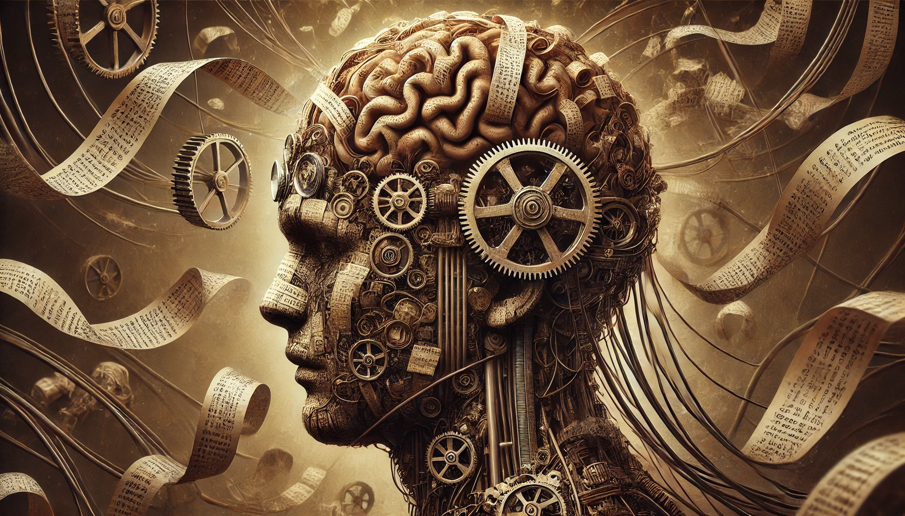

# 【生命⋅修行】被观念束缚

记得《天龙八部》中有这么一段关于虚竹喝水的描写：

> 这僧人二十五六岁个纪，浓眉大眼，一个大大的鼻子扁平下塌，容貌颇为丑陋，僧袍上打了多补钉，却甚是干净。他等那三人喝罢，这才走近清水缸，用瓦碗舀了一碗水，双手捧住，双目低垂，恭恭敬敬的说偈道：“佛观一钵水，八万四千虫，若不持此咒，如食众生肉。”念咒道：“唵缚悉波罗摩尼莎诃。”念罢，端起碗来，就口喝水。
>
> 那黑衣人看得奇怪，问道：“小师父你叽哩咕噜的念什么咒？”
>
> 那僧人道：“小僧念的是饮水咒。佛说每一碗水中，有八万四千条小虫，出家人戒杀，因此要念了饮水咒，这才喝得。”
>
> ……

当时那小僧人虚竹被黑衣人、黄衣人一顿绕，第二口水是怎么也喝不下去了。喝水究竟杀生还是不杀生，我也想不明白。记得有一位朋友W，如今在云南出家为僧，法号智藏，曾经和我说过他当年在内观禅修中心做义工时，死活不肯去做拔草的活。只因为觉得拔草会杀生。还记得有大学同学G，他从记事起就吃不下肉。

我不吃素，但「杀生」这件事儿，我却不知从什么时候起，心里有了疙瘩。甚至一度，内心里会觉得「不杀生」的人，比「杀生」的人更「高尚」，或者说「高级」吧。

然而，昨天，我却意识到，自己还是被这一个「观念」束缚住了。

更重要的是，一个观念和另一个不同的观念相冲突时，怎见得一个就比另一个「高级」呢？这恐怕又是一种「傲慢」而已吧。

……

静下心来，会发现自己的心早已被各种个样的「观念」缠绕成怎么也解不开的一大陀。常常最初的一闪念很快就倏忽不见，紧跟着的是一些经过的事，读过的书，某人说过的话，许许多多的「应该」一拥而上。甚至，这些「观念」之间常常还会互相支撑或互相撕扯。

其实，不止是很久以前的那些事情会变成束缚自己的「观念」。甚至，只是几分钟以前的想法，一不留神都会变成束缚。

上午阿宝说要出门去「观鸟」，我花了好一会儿功夫，收拾好了孩子们可能会用到的干净衣物、食物和水，装了满满一大包。正要出发，阿宝却告诉我，不去「观鸟」了，要去旁边的空地骑自行车。

我楞在门口好一会儿，正觉得别扭和不开心，却看见大宝和孩子们已经出了门。

好吧。全家出门「观鸟」这件事，已经成了过去式。我要还抱着不放，就是自寻烦恼了。

我从背包里拿出水杯，拎上尺八。抬头看了一眼时间，又把馒头也拿上，跟了出去……

